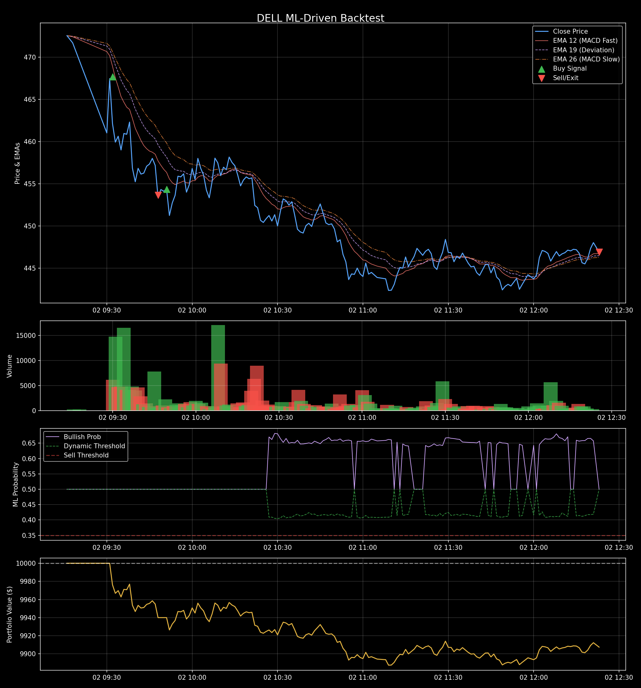

# 📈 DELL (Dell Technologies Inc.) ML Backtest Report

**Date Generated**: 2026-06-02 23:29:39
**Models Used**: {'LGBM_RAW': 'lgbm-20260531', 'LSTM_RAW': 'lstm-3c-20260531'}

## 🏢 Company Profile
- **Sector**: Technology
- **Industry**: Computer Hardware
- **Trailing P/E**: 51.348904
- **Forward P/E**: 22.422762
- **Beta**: 1.062

## 📊 Performance Summary (สรุปผลการทดสอบ)

| Metric (ตัวชี้วัด) | Value (ค่าที่ได้) | คำอธิบาย |
|------------------|-----------------|---------|
| **Total Return** | -0.93% | ผลตอบแทนรวมทั้งหมดตลอดช่วงเวลาที่ทดสอบ |
| **CAGR** | -60.55% | อัตราผลตอบแทนทบต้นต่อปี (หากลงทุนครบปีจะได้กำไรเท่านี้) |
| **Sharpe Ratio** | -1.66 | ความคุ้มค่าของผลตอบแทนเมื่อเทียบกับความเสี่ยง (ควร > 1.0) |
| **Max Drawdown** | -1.12% | จุดที่พอร์ตขาดทุนหนักที่สุดจากจุดสูงสุด (วัดความเสี่ยง) |
| **Win Rate** | 0.00% | ความแม่นยำในการเทรด (สัดส่วนครั้งที่ได้กำไร) |
| **Total Trades** | 2 | จำนวนการเปิด-ปิดออเดอร์ทั้งหมด |
| **Profit Factor** | 0.00 | อัตราส่วนกำไรรวมเทียบกับขาดทุนรวม (ควร > 1.5) |
| **Initial Capital** | $10,000.00 | เงินทุนเริ่มต้นสำหรับการจำลอง |
| **Final Capital** | $9,907.42 | เงินทุนสุทธิหลังจบการจำลอง |

## 📉 Charts

## 🚪 Exit Distribution (สาเหตุการปิดออเดอร์)
| Exit Reason | Count | Percentage |
|-------------|-------|------------|
| Stop Loss | 1 | 50.00% |
| End of Data | 1 | 50.00% |

## 📝 Trade Log (All Transactions)
> **สัญลักษณ์การออก (Exit Indicators):**
> 🎯 = `Take Profit (TP)` | 🛡️ = `Stop Loss (SL) / Breakeven` | 📈 = `Trailing Stop (TS)` | 🤖 = `ML Exit (DMP)` | ⏱️ = `EOD Close` | 🌋 = `Volume Climax`

| Entry Time | Exit Time | Side | Position Size | Entry Price | ATR% | TP% | DMP% | Target (TP) | Stop (SL) | Exit Price (PNL %) | PNL ($) | ML Conf. | Exit Reason |
|------------|-----------|------|---------------|-------------|------|-----|------|-------------|-----------|--------------------|---------|----------|-------------|
| 2026-06-02 09:51 | 2026-06-02 12:23 | **LONG** | 4.3755 | $454.35 | 1.00% | 4.00% | - | 🎯 $472.52 | 🛡️ $440.72 | $446.90 (-1.64%) | **-$32.58** | 0.50 | End of Data |
| 2026-06-02 09:32 | 2026-06-02 09:48 | **LONG** | 4.2763 | $467.69 | 1.00% | 4.00% | - | 🎯 $486.40 | 🛡️ $453.66 | $453.66 (-3.00%) | **-$60.00** | 0.50 | 🛡️ Stop Loss |
