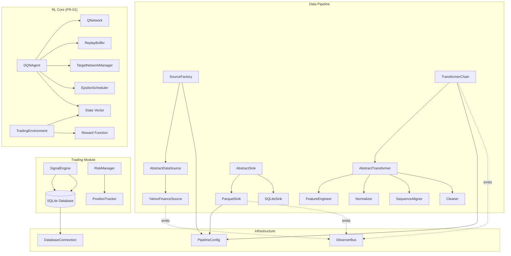

# Deep Q-Network (DQN) — คู่มืออธิบายโครงสร้างโค้ดและหลักการทำงาน

**โครงการ:** ระบบเทรดอัตโนมัติอัจฉริยะด้วย Deep Reinforcement Learning (DRL Trading Agent)  
**ข้อกำหนดอ้างอิง:** FR-01 — RL Core Architecture  
**เวอร์ชันเอกสาร:** 1.0  
**วันที่:** 2026-05-27  

---

## สารบัญ

1. [บทนำและภาพรวมสถาปัตยกรรม](#1-บทนำและภาพรวมสถาปัตยกรรม)
   - 1.1 [ปัญหา State Space มิติสูงในการเทรด](#11-ปัญหา-state-space-มิติสูงในการเทรด)
   - 1.2 [Deep Q-Network คืออะไร](#12-deep-q-network-คืออะไร)
   - 1.3 [แผนภาพสถาปัตยกรรมรวม](#13-แผนภาพสถาปัตยกรรมรวม)
2. [State Space Design และการเตรียมข้อมูลอนุกรมเวลา](#2-state-space-design-และการเตรียมข้อมูลอนุกรมเวลา)
   - 2.1 [องค์ประกอบของ State Vector](#21-องค์ประกอบของ-state-vector)
   - 2.2 [การประมวลผลเบื้องต้นและ Feature Engineering](#22-การประมวลผลเบื้องต้นและ-feature-engineering)
   - 2.3 [การปรับมาตรฐานข้อมูล (Normalization/Standardization)](#23-การปรับมาตรฐานข้อมูล-normalizationstandardization)
   - 2.4 [Sequence Alignment และ Sliding Window](#24-sequence-alignment-และ-sliding-window)
3. [สถาปัตยกรรม Neural Network สำหรับ Q-Function Approximation](#3-สถาปัตยกรรม-neural-network-สำหรับ-q-function-approximation)
   - 3.1 [โครงสร้างเลเยอร์และรายละเอียด](#31-โครงสร้างเลเยอร์และรายละเอียด)
   - 3.2 [ฟังก์ชันกระตุ้น (Activation Functions)](#32-ฟังก์ชันกระตุ้น-activation-functions)
   - 3.3 [การแมปมิติอินพุต–เอาต์พุต](#33-การแมปมิติอินพุต–เอาต์พุต)
   - 3.4 [ตัวอย่างโค้ด PyTorch — Q-Network Class](#34-ตัวอย่างโค้ด-pytorch--q-network-class)
4. [Experience Replay Buffer](#4-experience-replay-buffer)
   - 4.1 [หลักการและเหตุผล](#41-หลักการและเหตุผล)
   - 4.2 [โครงสร้างข้อมูลและการดำเนินการ](#42-โครงสร้างข้อมูลและการดำเนินการ)
   - 4.3 [ตัวอย่างโค้ด Python — ReplayBuffer Class](#43-ตัวอย่างโค้ด-python--replaybuffer-class)
5. [Target Network และกลไกการอัปเดต](#5-target-network-และกลไกการอัปเดต)
   - 5.1 [ปัญหา Instability และการแก้ไขด้วย Target Network](#51-ปัญหา-instability-และการแก้ไขด้วย-target-network)
   - 5.2 [Hard Update vs Soft Update (Polyak Averaging)](#52-hard-update-vs-soft-update-polyak-averaging)
   - 5.3 [ตัวอย่างโค้ด — Target Network Sync](#53-ตัวอย่างโค้ด--target-network-sync)
6. [Loss Function และกลไกการฝึกฝน](#6-loss-function-และกลไกการฝึกฝน)
   - 6.1 [Bellman Equation และ Temporal Difference Error](#61-bellman-equation-และ-temporal-difference-error)
   - 6.2 [Mean Squared Bellman Error (MSBE)](#62-mean-squared-bellman-error-msbe)
   - 6.3 [Gradient Clipping และ Gradient Penalty](#63-gradient-clipping-และ-gradient-penalty)
   - 6.4 [ตัวอย่างโค้ด — Training Step](#64-ตัวอย่างโค้ด--training-step)
7. [Exploration vs Exploitation Strategy](#7-exploration-vs-exploitation-strategy)
   - 7.1 [Epsilon-Greedy Policy](#71-epsilon-greedy-policy)
   - 7.2 [ตารางลดค่า Epsilon (Annealing Schedule)](#72-ตารางลดค่า-epsilon-annealing-schedule)
   - 7.3 [ตัวอย่างโค้ด — Epsilon Scheduler](#73-ตัวอย่างโค้ด--epsilon-scheduler)
8. [โครงสร้างโปรเจกต์และคลาสหลัก](#8-โครงสร้างโปรเจกต์และคลาสหลัก)
   - 8.1 [แผนผังโฟลเดอร์](#81-แผนผังโฟลเดอร์)
   - 8.2 [ตารางสรุปคลาสและหน้าที่](#82-ตารางสรุปคลาสและหน้าที่)
   - 8.3 [แผนภาพความสัมพันธ์ระหว่างโมดูล](#83-แผนภาพความสัมพันธ์ระหว่างโมดูล)
9. [เทคนิคป้องกันความไม่เสถียรระหว่างการฝึก](#9-เทคนิคป้องกันความไม่เสถียรระหว่างการฝึก)
   - 9.1 [Vanishing/Exploding Gradients](#91-vanishingexploding-gradients)
   - 9.2 [Catastrophic Forgetting](#92-catastrophic-forgetting)
   - 9.3 [Reward Scaling และ Return Clipping](#93-reward-scaling-และ-return-clipping)
   - 9.4 [ตารางเปรียบเทียบเทคนิคทั้งหมด](#94-ตารางเปรียบเทียบเทคนิคทั้งหมด)
10. [สรุปและแนวทางพัฒนาต่อ](#10-สรุปและแนวทางพัฒนาต่อ)

---

## 1. บทนำและภาพรวมสถาปัตยกรรม

### 1.1 ปัญหา State Space มิติสูงในการเทรด

ระบบการเทรดอัตโนมัติต้องเผชิญกับ **State Space** ที่มีมิติสูงมาก เนื่องจากข้อมูลตลาดประกอบด้วย:

| ประเภทข้อมูล | ตัวอย่างฟีเจอร์ | จำนวนมิติโดยประมาณ |
|-------------|---------------|-------------------|
| **OHLCV Price Series** | Open, High, Low, Close, Volume (rolling window) | 5 × T |
| **Volume Profile** | VPVR, Point of Control, Value Area | 3–10 |
| **Technical Indicators** | RSI, MACD, Bollinger Bands, ATR, Stochastic | 10–20 |
| **Order Book Imbalance** | Bid/Ask ratio, Depth imbalance | 2–5 |
| **Macro/Regime Signals** | VIX, Interest Rate proxy, Sector momentum | 3–8 |

เมื่อใช้ **Tabular Q-Learning** แบบดั้งเดิม จะไม่สามารถจัดการ State Space ขนาดนี้ได้เนื่องจากต้องสร้างตาราง Q-Table ที่มีขนาดเท่ากับ `|S| × |A|` ซึ่งเพิ่มขึ้นแบบ Exponential กับจำนวนมิติ (Curse of Dimensionality)

### 1.2 Deep Q-Network คืออะไร

**Deep Q-Network (DQN)** เป็นอัลกอริทึม Reinforcement Learning ที่ใช้ **Neural Network** เป็นฟังก์ชันประมาณimator (Function Approximator) สำหรับ Q-Function:

```
Q(s, a; θ) ≈ Q*(s, a)
```

โดยที่:
- `s` คือ State Vector (เวกเตอร์สถานะปัจจุบัน)
- `a` คือ Action ที่เลือก (เช่น Buy, Sell, Hold)
- `θ` คือพารามิเตอร์ (น้ำหนักและไบแอส) ของ Neural Network
- `Q*(s, a)` คือ Optimal Q-Function ตามทฤษฎี Bellman Optimality

DQN แก้ปัญหา Curse of Dimensionality ได้โดยเรียนรู้ **Generalization** ระหว่าง States ที่คล้ายกันผ่าน Representation Learning ของ Neural Network

### 1.3 แผนภาพสถาปัตยกรรมรวม

```
┌─────────────────────────────────────────────────────────────────────────────┐
│                        DRL Trading Agent Architecture                       │
└─────────────────────────────────────────────────────────────────────────────┘

┌──────────────┐     ┌──────────────────┐     ┌──────────────────────────────┐
│  Data        │     │  Transform       │     │  RL Training Pipeline        │
│  Pipeline    │────▶│  Layer           │────▶│                              │
│              │     │                  │     │  ┌─────────────────────────┐ │
│ YahooFinance │     │ Feature Engineer │     │  │   DQN Agent             │ │
│ CSV / SQL    │     │ Normalizer       │     │  │  ├── Q-Network (θ)      │ │
│ REST API     │     │ Sequence Aligner │     │  │  ├── Target Network (θ') │ │
└──────────────┘     └──────────────────┘     │  │  ├── Replay Buffer       │ │
                                              │  │  └── Epsilon Scheduler   │ │
┌──────────────┐                              │  └─────────┬───────────────┘ │
│  Storage     │◀────┐                        │            │                 │
│              │     │                        │            ▼                 │
│ Parquet      │     │                        │  ┌─────────────────────────┐ │
│ SQLite       │     │                        │  │  Trading Environment    │ │
│ Redis Cache  │     │                        │  │  (Gym-compatible)       │ │
└──────────────┘     │                        │  │  State → Action → Reward│ │
                     │                        │  └─────────┬───────────────┘ │
                     │                        └────────────┼─────────────────┘
                     │                                     │
                     │           ┌─────────────────────────┘
                     │           ▼
                     │     ┌──────────────┐
                     └────▶│  Signal      │
                           │  Engine      │
                           │  (Inference) │
                           └──────────────┘
```

---

## 2. State Space Design และการเตรียมข้อมูลอนุกรมเวลา

### 2.1 องค์ประกอบของ State Vector

State Vector `s_t` ที่ป้อนเข้า DQN ประกอบด้วยฟีเจอร์ที่ผ่านการประมวลผลแล้ว โดยจัดเรียงเป็นเวกเตอร์มิติคงที่:

```
s_t = [price_features, volume_features, indicator_features, regime_features]
```

| กลุ่มฟีเจอร์ | รายละเอียด | มิติ | ตัวอย่าง |
|------------|-----------|------|---------|
| **Price Features** | OHLCV แบบ Normalized ใน Window ขนาด T | 5×T | `[open_t, high_t, ..., close_{t-T+1}, ...]` |
| **Volume Profile** | Point of Control, Value Area High/Low | 3 | `[poc_norm, vah_norm, val_norm]` |
| **Technical Indicators** | RSI(14), MACD, BB_position, ATR_ratio | 8 | `[rsi, macd_line, macd_sig, bb_pos, atr_ratio, ...]` |
| **Regime Signals** | Market trend proxy, Volatility regime | 3 | `[trend_signal, vol_regime, vix_proxy]` |

**มิติรวม:** `N_state = 5×T + 14` (เช่น T=20 → N_state = 114)

### 2.2 การประมวลผลเบื้องต้นและ Feature Engineering

การประมวลผลอนุกรมเวลาต้องจัดการกับลักษณะเฉพาะของข้อมูลการเงิน:

#### 2.2.1 Missing Value Handling

```python
import pandas as pd
import numpy as np

def handle_missing_ohlcv(df: pd.DataFrame) -> pd.DataFrame:
    """
    จัดการค่าหายในข้อมูล OHLCV ตามลำดับความสำคัญ:
    1. Forward-fill สำหรับช่วงสั้น (≤3 bars)
    2. Backward-fill สำหรับส่วนที่เหลือ
    3. Drop แถวที่ยังคง NaN (กรณีข้อมูลขาดหายมาก)
    """
    df = df.copy()
    # Forward-fill ด้วยข้อจำกัดจำนวนขั้นสูงสุด
    df = df.ffill(limit=3)
    # Backward-fill สำหรับค่า NaN ที่เหลือ
    df = df.bfill()
    # Drop แถวที่ยังคงมี NaN
    df = df.dropna()
    return df
```

#### 2.2.2 Technical Indicator Computation

```python
def compute_technical_features(df: pd.DataFrame) -> pd.DataFrame:
    """
    คำนวณ Technical Indicators สำหรับ State Vector
    อ้างอิง FR-03: State Space Design
    """
    df = df.copy()
    close = df["Close"]
    high = df["High"]
    low = df["Low"]
    volume = df["Volume"]

    # RSI (14-period)
    delta = close.diff()
    gain = delta.clip(lower=0).rolling(window=14).mean()
    loss = (-delta.clip(upper=0)).rolling(window=14).mean()
    rs = gain / loss
    df["rsi_14"] = 100 - (100 / (1 + rs))

    # MACD (12, 26, 9)
    ema_12 = close.ewm(span=12, adjust=False).mean()
    ema_26 = close.ewm(span=26, adjust=False).mean()
    df["macd_line"] = ema_12 - ema_26
    df["macd_signal"] = df["macd_line"].ewm(span=9, adjust=False).mean()

    # Bollinger Bands Position (0–1 scale)
    sma_20 = close.rolling(window=20).mean()
    std_20 = close.rolling(window=20).std()
    bb_upper = sma_20 + 2 * std_20
    bb_lower = sma_20 - 2 * std_20
    df["bb_position"] = (close - bb_lower) / (bb_upper - bb_lower + 1e-8)

    # ATR Ratio (ATR / Close)
    tr = pd.concat([
        high - low,
        (high - close.shift(1)).abs(),
        (low - close.shift(1)).abs()
    ], axis=1).max(axis=1)
    atr_14 = tr.rolling(window=14).mean()
    df["atr_ratio"] = atr_14 / (close + 1e-8)

    # Rolling Returns (1d, 5d, 20d)
    df["return_1d"] = close.pct_change(periods=1)
    df["return_5d"] = close.pct_change(periods=5)
    df["return_20d"] = close.pct_change(periods=20)

    # Volume Ratio (current / rolling mean)
    df["volume_ratio"] = volume / (volume.rolling(window=20).mean() + 1e-8)

    return df
```

### 2.3 การปรับมาตรฐานข้อมูล (Normalization/Standardization)

การปรับมาตรฐานข้อมูลเป็นขั้นตอน **สำคัญที่สุด** ในการฝึก DQN เนื่องจาก Neural Network ต้องการอินพุตที่มีสเกลใกล้เคียงกันเพื่อป้องกันปัญหา Gradient Instability

#### 2.3.1 Min-Max Normalization (Rolling Window)

```
x_norm = (x - min_window) / (max_window - min_window + ε)
```

```python
from sklearn.preprocessing import MinMaxScaler
import numpy as np

class RollingMinMaxNormalizer:
    """
    ปรับมาตรฐานข้อมูลอนุกรมเวลาด้วย Rolling Window Min-Max Normalization
    ป้องกัน Look-ahead Bias โดยคำนวณสถิติจากข้อมูลในอดีตเท่านั้น
    """

    def __init__(self, window_size: int = 100, feature_columns: list = None):
        self.window_size = window_size
        self.feature_columns = feature_columns or []
        self._scalers = {}

    def fit_transform(self, df: pd.DataFrame) -> pd.DataFrame:
        """Fit และ Transform พร้อมกัน (สำหรับข้อมูลฝึกฝน)"""
        df = df.copy()
        for col in self.feature_columns:
            scaler = MinMaxScaler(feature_range=(0, 1))
            normalized = np.zeros(len(df))
            for i in range(self.window_size, len(df)):
                window = df[col].iloc[i - self.window_size:i].values.reshape(-1, 1)
                # Fill NaN with median for scaler compatibility
                window_clean = np.where(np.isnan(window), 
                                        np.nanmedian(window), window)
                scaler.fit(window_clean)
                val = df[col].iloc[i]
                if not np.isnan(val):
                    normalized[i] = scaler.transform(
                        [[val]]
                    )[0, 0]
            # Fill initial values with forward-fill
            normalized[:self.window_size] = np.nan
            normalized = np.concatenate([
                np.full(self.window_size, 0.5),  # Default midpoint
                normalized[self.window_size:]
            ])
            df[f"{col}_norm"] = normalized
        return df
```

#### 2.3.2 Z-Score Standardization (สำหรับ Indicators)

```
z = (x - μ_rolling) / (σ_rolling + ε)
```

| เทคนิค | สูตร | เหมาะกับ | ข้อควรระวัง |
|-------|------|---------|-------------|
| **Min-Max** | `(x - min) / (max - min)` | ข้อมูลที่มีขอบเขตชัดเจน (เช่น RSI, BB Position) | อ่อนไหวต่อ Outliers |
| **Z-Score** | `(x - μ) / σ` | ข้อมูลแบบ Gaussian-like (เช่น Returns) | ต้องระวังเมื่อ σ ≈ 0 |
| **Robust Scaling** | `(x - median) / IQR` | ข้อมูลที่มี Outliers มาก | ขอบเขตไม่แน่นอน |
| **Log Return** | `ln(P_t / P_{t-1})` | ราคาหุ้นโดยตรง | ไม่ใช้กับค่าลบ |

### 2.4 Sequence Alignment และ Sliding Window

เพื่อจัดการ State Space แบบอนุกรมเวลา DQN ใช้ **Sliding Window Approach** เพื่อสร้าง State Vector ที่มีมิติคงที่:

```python
import numpy as np

def create_sliding_windows(
    df: pd.DataFrame,
    feature_columns: list,
    window_size: int = 20,
    step: int = 1
) -> tuple:
    """
    สร้าง Sliding Windows จากข้อมูลอนุกรมเวลา
    คืนค่า (states, next_rewards_info) สำหรับ RL Training

    Parameters:
        df: DataFrame ที่ผ่านการ Normalization แล้ว
        feature_columns: รายการคอลัมน์ฟีเจอร์ที่จะใช้
        window_size: ขนาดหน้าต่าง (T)
        step: ขั้นการเลื่อนหน้าต่าง

    Returns:
        states: np.ndarray shape (n_samples, window_size, n_features)
        timestamps: list ของ timestamp สำหรับแต่ละ window
    """
    features = df[feature_columns].values
    n_samples = (len(features) - window_size) // step + 1
    states = np.zeros((n_samples, window_size, len(feature_columns)))

    for i in range(n_samples):
        start = i * step
        states[i] = features[start:start + window_size]

    timestamps = df.index[window_size - 1::step].tolist()[:n_samples]
    return states, timestamps
```

**มิติ State Vector หลัง Sliding Window:** `(batch_size, T, N_features)` ซึ่งเหมาะสำหรับป้อนเข้า LSTM/GRU Layer หรือ Flatten เข้า Dense Network

---

## 3. สถาปัตยกรรม Neural Network สำหรับ Q-Function Approximation

### 3.1 โครงสร้างเลเยอร์และรายละเอียด

สถาปัตยกรรม Q-Network ที่ออกแบบสำหรับงานเทรดประกอบด้วยเลเยอร์หลักดังนี้:

```
Input Layer → [Feature Extraction] → [Temporal Processing] → [Q-Value Head] → Output Layer
```

| ลำดับ | เลเยอร์ | Input Shape | Output Shape | พารามิเตอร์ | หน้าที่ |
|------|---------|-------------|--------------|------------|--------|
| 1 | **Input** | `(T, N_features)` | `(T, N_features)` | 0 | รับ State Vector |
| 2 | **Dense + LayerNorm** | `(T, N_features)` | `(T, 128)` | `N_features×128 + 128` | Feature Projection |
| 3 | **ReLU** | `(T, 128)` | `(T, 128)` | 0 | Non-linearity |
| 4 | **Dropout (0.2)** | `(T, 128)` | `(T, 128)` | 0 | Regularization |
| 5 | **LSTM (bidirectional)** | `(T, 128)` | `(T, 128)` | `4×128×(128+128+1)` = 131,072 | Temporal Pattern Learning |
| 6 | **Dense** | `(128)` | `(256)` | `128×256 + 256` | State Aggregation |
| 7 | **ReLU + LayerNorm** | `(256)` | `(256)` | 0 | Non-linearity + Stabilization |
| 8 | **Dropout (0.1)** | `(256)` | `(256)` | 0 | Regularization |
| 9 | **Dense (Output)** | `(256)` | `(N_actions)` | `256×N_actions + N_actions` | Q-Value Estimation |

**รวมพารามิเตอร์:** ≈ 135,000–140,000 (สำหรับ N_features=14, N_actions=3)

### 3.2 ฟังก์ชันกระตุ้น (Activation Functions)

| เลเยอร์ | Activation | เหตุผลในการเลือก |
|--------|-----------|----------------|
| Hidden Layers (Dense) | **ReLU** `f(x) = max(0, x)` | ป้องกัน Vanishing Gradient, คำนวณเร็ว, เป็นมาตรฐานใน DQN |
| Temporal Layer (LSTM) | **Tanh + Sigmoid** (ภายใน Cell) | Tanh สำหรับ Cell Output (-1 ถึง 1), Sigmoid สำหรับ Gate Mechanism |
| Output Layer | **Linear (None)** | Q-Values สามารถเป็นค่าลบได้ (Expected Return ที่ติดลบ) |

#### เปรียบเทียบ Activation Functions

```
ReLU:          f(x) = max(0, x)           → ใช้ใน Hidden Layers
Leaky ReLU:    f(x) = {x if x>0 else αx}  → ป้องกัน Dead Neurons (α=0.01)
Tanh:          f(x) = (e^x - e^-x)/(e^x + e^-x) → ใช้ใน LSTM/RNN Gates
Sigmoid:       f(x) = 1/(1 + e^-x)        → ใช้ใน LSTM Input/Forget Gates
Linear:        f(x) = x                    → ใช้ใน Output Layer (Q-values)
```

### 3.3 การแมปมิติอินพุต–เอาต์พุต

#### Input Mapping

```
State Vector s_t ∈ ℝ^(T × N_features)
    ↓ Flatten หรือผ่าน Temporal Layer
Hidden Representation h ∈ ℝ^H
    ↓ Q-Value Head
Q(s_t; θ) ∈ ℝ^|A|
```

โดยที่:
- `T` = Window Size (เช่น 20 timesteps)
- `N_features` = จำนวนฟีเจอร์ต่อ timestep (เช่น 14)
- `H` = Hidden Dimension (เช่น 256)
- `|A|` = จำนวน Action (เช่น 3 สำหรับ Buy/Sell/Hold)

#### Output Mapping — Action Space

| Index | Action | ความหมาย | Position Change |
|-------|--------|---------|----------------|
| 0 | **HOLD** | รักษาตำแหน่งปัจจุบัน | Δposition = 0 |
| 1 | **BUY** | เปิด/เพิ่มตำแหน่ง Long | Δposition = +size |
| 2 | **SELL** | ปิด/เปิด Short | Δposition = -size |

Agent จะเลือก Action ด้วย Policy: `a_t = argmax_a Q(s_t, a; θ)` (ในโหมด Exploitation)

### 3.4 ตัวอย่างโค้ด PyTorch — Q-Network Class

```python
import torch
import torch.nn as nn
import torch.nn.functional as F


class QNetwork(nn.Module):
    """
    Deep Q-Network สำหรับประมาณค่าฟังก์ชัน Q(s, a; θ)
    
    สถาปัตยกรรม:
        Input → Dense Projection → LSTM → State Aggregation → Q-Value Head
    
    Parameters:
        input_dim: จำนวนฟีเจอร์ต่อ timestep (N_features)
        hidden_dim: มิติ Hidden Layer (H)
        output_dim: จำนวน Action (|A|)
        seq_length: ขนาด Sliding Window (T)
        dropout_rate: อัตรา Dropout สำหรับ Regularization
    """

    def __init__(
        self,
        input_dim: int = 14,
        hidden_dim: int = 256,
        output_dim: int = 3,
        seq_length: int = 20,
        dropout_rate: float = 0.2
    ) -> None:
        super(QNetwork, self).__init__()

        # --- Feature Extraction Block ---
        self.feature_proj = nn.Sequential(
            nn.LayerNorm(input_dim),
            nn.Linear(input_dim, hidden_dim // 2),
            nn.ReLU(),
            nn.Dropout(dropout_rate)
        )

        # --- Temporal Processing Block ---
        self.temporal = nn.LSTM(
            input_size=hidden_dim // 2,
            hidden_size=hidden_dim // 2,
            num_layers=2,
            batch_first=True,
            dropout=dropout_rate,
            bidirectional=True
        )

        # --- State Aggregation Block ---
        self.state_agg = nn.Sequential(
            nn.LayerNorm(hidden_dim),  # bidirectional → hidden_dim
            nn.Linear(hidden_dim, hidden_dim),
            nn.ReLU(),
            nn.Dropout(dropout_rate / 2),
            nn.Linear(hidden_dim, hidden_dim // 2),
            nn.ReLU()
        )

        # --- Q-Value Head ---
        self.q_head = nn.Linear(hidden_dim // 2, output_dim)

        # --- Weight Initialization (Xavier Uniform) ---
        self._initialize_weights()

    def _initialize_weights(self) -> None:
        """Initialize weights using Xavier Uniform for stable training."""
        for module in self.modules():
            if isinstance(module, nn.Linear):
                nn.init.xavier_uniform_(module.weight)
                if module.bias is not None:
                    nn.init.zeros_(module.bias)
            elif isinstance(module, nn.LSTM):
                for name, param in module.named_parameters():
                    if "weight_ih" in name:
                        nn.init.xavier_uniform_(param.data)
                    elif "weight_hh" in name:
                        nn.init.orthogonal_(param.data)
                    elif "bias" in name:
                        nn.init.zeros_(param.data)

    def forward(self, state: torch.Tensor) -> torch.Tensor:
        """
        Forward pass: s → Q(s; θ)

        Args:
            state: Tensor of shape (batch_size, seq_length, input_dim)

        Returns:
            q_values: Tensor of shape (batch_size, output_dim)
        """
        # Feature projection per timestep
        x = self.feature_proj(state)  # (B, T, H/2)

        # Temporal processing via LSTM
        lstm_out, (h_n, _) = self.temporal(x)
        # Use last hidden state from both directions
        # h_n shape: (2*num_layers, B, H/2) → concat forward+backward
        batch_size = state.size(0)
        last_hidden = torch.cat([h_n[-2], h_n[-1]], dim=1)  # (B, H)

        # State aggregation and Q-value estimation
        aggregated = self.state_agg(last_hidden)  # (B, H/2)
        q_values = self.q_head(aggregated)  # (B, |A|)

        return q_values

    def act(self, state: np.ndarray, epsilon: float = 0.0, 
            device: str = "cpu") -> int:
        """
        เลือก Action จาก State ด้วย Epsilon-Greedy Policy

        Args:
            state: numpy array of shape (seq_length, input_dim)
            epsilon: อัตรา Exploration
            device: PyTorch device string

        Returns:
            action: integer index ของ Action ที่เลือก
        """
        with torch.no_grad():
            state_tensor = torch.FloatTensor(state).unsqueeze(0).to(device)
            q_values = self.forward(state_tensor)
            best_action = q_values.argmax(dim=1).item()

        # Epsilon-greedy exploration
        if np.random.random() < epsilon:
            best_action = np.random.randint(0, self.q_head.out_features)

        return best_action
```

---

## 4. Experience Replay Buffer

### 4.1 หลักการและเหตุผล

Experience Replay Buffer เป็นกลไกสำคัญที่ DQN ใช้เพื่อแก้ปัญหาสองประการ:

| ปัญหา | คำอธิบาย | วิธีแก้ไขโดย Replay Buffer |
|-------|---------|--------------------------|
| **Temporal Correlation** | ข้อมูลอนุกรมเวลามีความสัมพันธ์สูงระหว่าง timestep ทำให้ Gradient Update ไม่เป็นอิสระ (Violates i.i.d. assumption) | เก็บ Transitions แล้วสุ่ม Sample Batch ที่ไม่ต่อเนื่องกัน |
| **Data Inefficiency** | แต่ละ Transition ถูกใช้เพียงครั้งเดียวแล้วทิ้ง | ใช้ข้อมูลซ้ำหลายรอบเพิ่ม Data Efficiency |

### 4.2 โครงสร้างข้อมูลและการดำเนินการ

Replay Buffer เก็บ Transition Tuple ในรูปแบบ:

```
Transition = (state, action, reward, next_state, done)
```

| องค์ประกอบ | ประเภท | คำอธิบาย |
|-----------|--------|---------|
| `state` | `np.ndarray (T, N_features)` | State Vector ปัจจุบัน |
| `action` | `int` | Action ที่เลือก |
| `reward` | `float` | Reward ที่ได้รับ |
| `next_state` | `np.ndarray (T, N_features)` | State Vector ถัดไป |
| `done` | `bool` | สัญญาณว่า Episode สิ้นสุดหรือไม่ |

**การดำเนินการหลัก:**

| Operation | ความซับซ้อน | คำอธิบาย |
|-----------|------------|---------|
| `push(transition)` | O(1) | เพิ่ม Transition ใหม่เข้า Buffer |
| `sample(batch_size)` | O(batch_size) | สุ่ม Sample Batch ของ Transitions |
| `__len__()` | O(1) | คืนค่าจำนวน Transitions ใน Buffer |

### 4.3 ตัวอย่างโค้ด Python — ReplayBuffer Class

```python
import numpy as np
import random
from collections import deque
from typing import NamedTuple, List, Optional


class Transition(NamedTuple):
    """โครงสร้างข้อมูลสำหรับเก็บหนึ่ง Transition"""
    state: np.ndarray
    action: int
    reward: float
    next_state: np.ndarray
    done: bool


class ReplayBuffer:
    """
    Experience Replay Buffer สำหรับ DQN Training
    
    เก็บ Transitions ใน Circular Buffer และสุ่ม Sample 
    เพื่อทำลาย Temporal Correlation ของข้อมูลอนุกรมเวลา

    Parameters:
        capacity: ความจุสูงสุดของ Buffer
        batch_size: ขนาด Batch สำหรับการ Sample
    """

    def __init__(self, capacity: int = 100_000, batch_size: int = 256) -> None:
        self.capacity = capacity
        self.batch_size = batch_size
        self.buffer: deque[Transition] = deque(maxlen=capacity)
        self._count: int = 0

    def push(
        self,
        state: np.ndarray,
        action: int,
        reward: float,
        next_state: np.ndarray,
        done: bool
    ) -> None:
        """เพิ่ม Transition ใหม่เข้า Buffer"""
        transition = Transition(state, action, reward, next_state, done)
        self.buffer.append(transition)
        self._count += 1

    def sample(self) -> List[Transition]:
        """
        สุ่ม Sample Batch ของ Transitions
        
        Returns:
            รายการ Transition จำนวน batch_size
        Raises:
            SamplingError: เมื่อ Buffer มีข้อมูลไม่เพียงพอ
        """
        if len(self.buffer) < self.batch_size:
            raise SamplingError(
                f"Buffer has {len(self.buffer)} transitions, "
                f"need at least {self.batch_size}"
            )
        return random.sample(list(self.buffer), self.batch_size)

    def __len__(self) -> int:
        return len(self.buffer)

    @property
    def is_ready(self) -> bool:
        """ตรวจสอบว่า Buffer มีข้อมูลเพียงพอสำหรับการ Sample"""
        return len(self.buffer) >= self.batch_size


class SamplingError(Exception):
    """Exception เมื่อพยายาม Sample จาก Buffer ที่ยังไม่มีข้อมูลเพียงพอ"""
    pass


class PrioritizedReplayBuffer(ReplayBuffer):
    """
    Prioritized Experience Replay (PER) — Schaul et al., 2015
    
    ให้โอกาส Sample Transitions ที่มี TD Error สูงกว่า
    เพื่อเร่งการเรียนรู้จากประสบการณ์ที่สำคัญ

    Parameters:
        capacity: ความจุสูงสุดของ Buffer
        alpha: ตัวควบคุมระดับ Prioritization (0 = uniform, 1 = full prioritization)
        beta: Importance Sampling Weight (anneal from 0 → 1)
        batch_size: ขนาด Batch สำหรับการ Sample
    """

    def __init__(
        self,
        capacity: int = 100_000,
        alpha: float = 0.6,
        beta: float = 0.4,
        batch_size: int = 256
    ) -> None:
        super().__init__(capacity, batch_size)
        self.alpha = alpha
        self.beta = beta
        self.priority_buffer: deque[float] = deque(maxlen=capacity)
        self._tree_capacity = capacity

    def push(self, state, action, reward, next_state, done) -> None:
        """เพิ่ม Transition พร้อม Priority สูงสุดเริ่มต้น"""
        super().push(state, action, reward, next_state, done)
        # Assign maximum priority initially
        max_priority = max(self.priority_buffer) if self.priority_buffer else 1.0
        self.priority_buffer.append(max_priority)

    def sample(self) -> tuple:
        """
        Sample Transitions ตาม Priority พร้อม Importance Sampling Weights
        
        Returns:
            (transitions, indices, weights) tuple
        """
        priorities = np.array(self.priority_buffer)
        probs = priorities ** self.alpha
        probs /= probs.sum()

        indices = np.random.choice(
            len(self.buffer), size=self.batch_size, p=probs
        )
        transitions = [self.buffer[i] for i in indices]

        # Calculate Importance Sampling Weights
        weights = np.array(
            [(len(self.buffer) * probs[i]) ** (-self.beta) 
             for i in indices]
        )
        # Normalize weights
        weights /= weights.max()
        weights = weights.astype(np.float32)

        return transitions, indices, weights

    def update_priorities(self, indices: np.ndarray, td_errors: np.ndarray) -> None:
        """อัปเดต Priority ตาม TD Error ใหม่"""
        for idx, error in zip(indices, td_errors):
            # Add small constant to avoid zero priority
            new_priority = (abs(error) + 1e-4) ** self.alpha
            if 0 <= idx < len(self.priority_buffer):
                self.priority_buffer[idx] = new_priority
```

---

## 5. Target Network และกลไกการอัปเดต

### 5.1 ปัญหา Instability และการแก้ไขด้วย Target Network

ในการฝึก DQN แบบ Naive (ใช้ Network เดียวทั้งสำหรับ Action Selection และ Target Calculation) จะเกิดปัญหา **Moving Target Problem**:

```
Target y_t = r + γ × max_a' Q(s', a'; θ)    ← ใช้ θ เดียวกับ Q(s,a;θ)!
```

เมื่อ `θ` เปลี่ยนแปลงในแต่ละ Step การคำนวณ Target ก็เปลี่ยนแปลงตาม ทำให้:
1. **Correlation between input and target** — Network ไล่ตาม Target ที่เคลื่อนที่ตลอดเวลา
2. **Divergence** — Q-Values พุ่งสูงหรือต่ำเกินจริง (Oscillation)

**Target Network** แก้ปัญหานี้โดยสร้างสำเนาของ Network ชื่อ `θ⁻` (theta_target) ที่อัปเดตช้ากว่า:

```
Target y_t = r + γ × max_a' Q(s', a'; θ⁻)    ← ใช้ θ⁻ ที่คงที่ชั่วคราว
```

### 5.2 Hard Update vs Soft Update (Polyak Averaging)

| วิธี | สูตร | ความถี่ | ข้อดี | ข้อเสีย |
|------|------|--------|-------|--------|
| **Hard Update** | `θ⁻ ← θ` ทุก C steps | ทุก Target Update Frequency (เช่น 1,000 steps) | ง่ายต่อการเข้าใจและดีบัก | อาจเกิด Instability เมื่อ Copy ทันที |
| **Soft Update (Polyak)** | `θ⁻ ← τ·θ + (1-τ)·θ⁻` ทุก step | ทุก Training Step | Smooth Transition, เสถียรกว่า | มี Hyperparameter เพิ่ม (τ) |

#### Soft Update Formula

```
θ⁻_t+1 = τ × θ_t + (1 - τ) × θ⁻_t
```

โดยที่ `τ` (tau) คือ **Interpolation Factor** โดยทั่วไปตั้งค่า `τ ∈ [0.001, 0.01]`

### 5.3 ตัวอย่างโค้ด — Target Network Sync

```python
import copy
from typing import Dict, Any


class TargetNetworkManager:
    """
    จัดการ Target Network พร้อมรองรับทั้ง Hard Update และ Soft Update
    
    Parameters:
        target_update_method: "hard" หรือ "soft"
        update_frequency: จำนวน Steps ก่อน Hard Update (ใช้เมื่อ method="hard")
        tau: Interpolation Factor สำหรับ Soft Update
    """

    def __init__(
        self,
        target_update_method: str = "soft",
        update_frequency: int = 1_000,
        tau: float = 0.005
    ) -> None:
        if target_update_method not in ("hard", "soft"):
            raise ValueError("target_update_method must be 'hard' or 'soft'")
        self.method = target_update_method
        self.update_frequency = update_frequency
        self.tau = tau
        self._step_count: int = 0

    def initialize_target(self, q_network) -> None:
        """สร้าง Target Network เป็นสำเนาของ Q-Network"""
        self.target_network = copy.deepcopy(q_network)
        # Freeze gradients of target network
        for param in self.target_network.parameters():
            param.requires_grad = False

    def update(self, q_network, step: int) -> None:
        """
        อัปเดต Target Network ตาม Method ที่กำหนด
        
        Args:
            q_network: Online Q-Network (กำลังฝึกอยู่)
            step: Training Step ปัจจุบัน
        """
        if self.method == "hard":
            self._hard_update(q_network, step)
        else:
            self._soft_update(q_network)

    def _hard_update(self, q_network, step: int) -> None:
        """Hard Update: คัดลอกพารามิเตอร์ทั้งหมดทุก C steps"""
        if (step + 1) % self.update_frequency == 0:
            self.target_network.load_state_dict(
                q_network.state_dict()
            )

    def _soft_update(self, q_network) -> None:
        """
        Soft Update (Polyak Averaging):
        θ⁻ ← τ·θ + (1-τ)·θ⁻
        """
        target_params = self.target_network.parameters()
        online_params = q_network.parameters()

        for target_param, online_param in zip(target_params, online_params):
            target_param.data.copy_(
                self.tau * online_param.data + 
                (1.0 - self.tau) * target_param.data
            )


# --- Usage Example ---
# manager = TargetNetworkManager(method="soft", tau=0.005)
# manager.initialize_target(q_network)
# for step in range(num_training_steps):
#     # ... training logic ...
#     manager.update(q_network, step)
```

---

## 6. Loss Function และกลไกการฝึกฝน

### 6.1 Bellman Equation และ Temporal Difference Error

พื้นฐานของ DQN คือ **Bellman Optimality Equation**:

```
Q*(s, a) = E[r + γ · max_a' Q*(s', a') | s, a]
```

โดยที่:
- `γ` (gamma) = **Discount Factor** ∈ [0, 1] — น้ำหนักของ Reward ในอนาคต
- `r` = Immediate Reward
- `s'` = Next State
- `max_a' Q*(s', a')` = Optimal Q-Value ของ State ถัดไป

**Temporal Difference (TD) Error:**

```
δ_t = [r_t + γ · max_a' Q(s'_t, a'; θ⁻)] - Q(s_t, a_t; θ)
```

TD Error คือความแตกต่างระหว่าง **Target Value** (คำนวณจาก Target Network) และ **Current Estimate** (จาก Online Network) การฝึก DQN มีเป้าหมายลด TD Error นี้ให้ใกล้ศูนย์

### 6.2 Mean Squared Bellman Error (MSBE)

Loss Function ของ DQN คือ **Mean Squared Bellman Error**:

```
L(θ) = E[(δ_t)²] = E[ (r + γ·max_a' Q(s',a';θ⁻) - Q(s,a;θ))² ]
```

โดยคาดหวัง `E[·]` คำนวณจาก Batch ของ Transitions ที่สุ่มจาก Replay Buffer:

```
L(θ) = (1/N) × Σ_i [(r_i + γ·max_a' Q(s'_i,a';θ⁻) - Q(s_i,a_i;θ))²]
```

#### Derivative สำหรับ Gradient Descent

```
∇_θ L(θ) = E[ δ_t · ∇_θ (-Q(s_t, a_t; θ)) ]
          = E[ -(r_t + γ·max_a' Q(s'_t,a';θ⁻) - Q(s_t,a_t;θ)) · ∇_θ Q(s_t,a_t;θ) ]
```

### 6.3 Gradient Clipping และ Gradient Penalty

เพื่อป้องกัน **Exploding Gradients**:

```python
torch.nn.utils.clip_grad_norm_(model.parameters(), max_norm=1.0)
```

หรือใช้ **Gradient Clipping by Value**:

```python
torch.nn.utils.clip_grad_value_(model.parameters(), clip_value=1.0)
```

### 6.4 ตัวอย่างโค้ด — Training Step

```python
import torch
import torch.optim as optim
import numpy as np
from typing import List


class DQNAgent:
    """
    Agent หลักสำหรับฝึกและใช้งาน DQN
    
    Parameters:
        state_dim: จำนวนฟีเจอร์ต่อ timestep
        action_dim: จำนวน Action ที่ใช้ได้
        seq_length: ขนาด Sliding Window
        learning_rate: อัตราการเรียนรู้ของ Optimizer
        gamma: Discount Factor (γ)
        batch_size: ขนาด Batch สำหรับ Training
        buffer_capacity: ความจุของ Replay Buffer
        target_update_method: "hard" หรือ "soft"
        tau: Interpolation Factor สำหรับ Soft Update
        device: PyTorch Device
    """

    def __init__(
        self,
        state_dim: int = 14,
        action_dim: int = 3,
        seq_length: int = 20,
        learning_rate: float = 1e-4,
        gamma: float = 0.99,
        batch_size: int = 256,
        buffer_capacity: int = 100_000,
        target_update_method: str = "soft",
        tau: float = 0.005,
        device: str = "cpu"
    ) -> None:
        self.gamma = gamma
        self.batch_size = batch_size
        self.device = torch.device(device)

        # Networks
        self.q_network = QNetwork(
            input_dim=state_dim,
            hidden_dim=256,
            output_dim=action_dim,
            seq_length=seq_length,
            dropout_rate=0.2
        ).to(self.device)

        self.target_network_manager = TargetNetworkManager(
            target_update_method=target_update_method,
            tau=tau
        )
        self.target_network_manager.initialize_target(self.q_network)

        # Optimizer (Adam — Adaptive Moment Estimation)
        self.optimizer = optim.Adam(
            self.q_network.parameters(), 
            lr=learning_rate,
            weight_decay=1e-5  # L2 Regularization
        )

        # Replay Buffer
        self.replay_buffer = ReplayBuffer(
            capacity=buffer_capacity,
            batch_size=batch_size
        )

        # Training metrics
        self.total_steps: int = 0
        self.loss_history: List[float] = []

    def select_action(self, state: np.ndarray, epsilon: float) -> int:
        """เลือก Action ด้วย Epsilon-Greedy Policy"""
        return self.q_network.act(state, epsilon=epsilon, device=self.device)

    def store_transition(
        self,
        state: np.ndarray,
        action: int,
        reward: float,
        next_state: np.ndarray,
        done: bool
    ) -> None:
        """เก็บ Transition เข้า Replay Buffer"""
        self.replay_buffer.push(state, action, reward, next_state, done)

    def train_step(self) -> float:
        """
        ดำเนินการ Training Step หนึ่งครั้ง
        
        Algorithm:
            1. Sample Batch จาก Replay Buffer
            2. คำนวณ Q(s, a; θ) สำหรับ Online Network
            3. คำนวณ Target: r + γ · max_a' Q(s', a'; θ⁻)
            4. Apply Loss Function (Huber Loss)
            5. Backpropagation และ Update θ
        
        Returns:
            loss_value: ค่า Loss ของ Batch นี้
        """
        if not self.replay_buffer.is_ready:
            return 0.0

        # Step 1: Sample Batch
        transitions = self.replay_buffer.sample()
        states = torch.FloatTensor(
            np.array([t.state for t in transitions])
        ).to(self.device)
        actions = torch.LongTensor(
            [t.action for t in transitions]
        ).to(self.device)
        rewards = torch.FloatTensor(
            [t.reward for t in transitions]
        ).to(self.device)
        next_states = torch.FloatTensor(
            np.array([t.next_state for t in transitions])
        ).to(self.device)
        dones = torch.FloatTensor(
            [float(t.done) for t in transitions]
        ).to(self.device)

        # Step 2: Current Q-Values
        current_q_values = self.q_network(states)  # (B, |A|)
        # Select Q-values for taken actions
        q_batch = current_q_values.gather(1, actions.unsqueeze(1)).squeeze(1)

        # Step 3: Target Q-Values using Target Network
        with torch.no_grad():
            next_q_values = self.target_network_manager.target_network(
                next_states
            )  # (B, |A|)
            max_next_q = next_q_values.max(dim=1)[0]  # (B,)
            # Bellman Target: r + γ · max_a' Q(s', a'; θ⁻) · (1 - done)
            target_q = rewards + self.gamma * max_next_q * (1 - dones)

        # Step 4: Compute Loss (Huber Loss — robust to outliers)
        loss = torch.nn.SmoothL1Loss()(q_batch, target_q)

        # Step 5: Backpropagation
        self.optimizer.zero_grad()
        loss.backward()

        # Gradient Clipping — prevent exploding gradients
        torch.nn.utils.clip_grad_norm_(
            self.q_network.parameters(), max_norm=1.0
        )

        self.optimizer.step()

        # Update Target Network (Soft Update)
        self.target_network_manager.update(self.q_network, self.total_steps)

        self.total_steps += 1
        self.loss_history.append(loss.item())

        return loss.item()

    def save_model(self, path: str) -> None:
        """บันทึก Model Checkpoint"""
        torch.save({
            'q_network_state_dict': self.q_network.state_dict(),
            'optimizer_state_dict': self.optimizer.state_dict(),
            'total_steps': self.total_steps,
            'loss_history': self.loss_history,
        }, path)

    def load_model(self, path: str) -> None:
        """โหลด Model Checkpoint"""
        checkpoint = torch.load(path, map_location=self.device)
        self.q_network.load_state_dict(checkpoint['q_network_state_dict'])
        self.optimizer.load_state_dict(checkpoint['optimizer_state_dict'])
        self.total_steps = checkpoint['total_steps']
        self.loss_history = checkpoint['loss_history']
        # Re-initialize target network
        self.target_network_manager.initialize_target(self.q_network)
```

---

## 7. Exploration vs Exploitation Strategy

### 7.1 Epsilon-Greedy Policy

Epsilon-Greedy เป็นกลยุทธ์มาตรฐานสำหรับจัดการ Trade-off ระหว่าง **Exploration** (ลอง Action ใหม่) และ **Exploitation** (ใช้ Action ที่ดีที่สุดที่รู้จัก):

```
if random() < ε:
    a = random_action()     # Exploration
else:
    a = argmax_a Q(s, a; θ)  # Exploitation
```

| ค่า Epsilon (ε) | พฤติกรรม | ระยะการฝึก |
|-----------------|----------|-----------|
| ε ≈ 1.0 | สุ่มเลือก Action ทั้งหมด | เริ่มต้น (Exploration Phase) |
| ε ∈ [0.3, 0.7] | ผสมระหว่าง Exploration/Exploitation | กลาง途 (Annealing Phase) |
| ε ≈ 0.01 | ใช้ Greedy Policy เกือบทั้งหมด | ใกล้เสร็จ (Exploitation Phase) |

### 7.2 ตารางลดค่า Epsilon (Annealing Schedule)

ใช้ **Linear Decay** พร้อม Floor Value เพื่อรักษา Exploration ขั้นต่ำ:

```
ε_t = max(ε_min, ε_start - decay_rate × t)
```

#### ตาราง Annealing Schedule ตัวอย่าง

| Epoch | Steps ใน Epoch | ε (Epsilon) | สัดส่วน Exploration | หมายเหตุ |
|-------|---------------|-------------|-------------------|---------|
| 0–5 | 0–5,000 | 1.00 → 0.90 | ~95% | Exploration เต็มรูปแบบ |
| 6–15 | 5,001–15,000 | 0.90 → 0.60 | ~75% | เริ่มเรียนรู้ Pattern |
| 16–30 | 15,001–30,000 | 0.60 → 0.30 | ~45% | Exploitation เพิ่มขึ้น |
| 31–50 | 30,001–50,000 | 0.30 → 0.10 | ~20% | Fine-tuning Policy |
| 51–100 | 50,001–100,000 | 0.10 → 0.01 | ~5% | Exploitation เป็นหลัก |
| 100+ | 100,000+ | 0.01 (floor) | ~1% | Production-ready Policy |

#### แผนภาพ Annealing Curve

```
ε
1.00 │╭
     ││╲
 0.90 ││ ╲
     ││  ╲
 0.80 ││   ╲
     ││    ╲
 0.70 ││     ╲
     ││      ╲
 0.60 ││       ╲
     ││        ╲
 0.50 ││         ╲
     ││          ╲
 0.40 ││           ╲
     ││            ╲
 0.30 ││             ╲
     ││              ╲
 0.20 ││               ╲
     ││                ╲
 0.10 ││                 ╲────
     ││                  ╱╲
 0.01 │╰────────────────╯  └── ε_min (floor)
     └─────────────────────────────► Steps
      0    25K     50K     75K    100K
```

### 7.3 ตัวอย่างโค้ด — Epsilon Scheduler

```python
import numpy as np
from typing import Optional


class EpsilonScheduler:
    """
    จัดการค่า Epsilon สำหรับ Epsilon-Greedy Policy
    
    รองรับ Annealing Strategies:
        - Linear Decay
        - Exponential Decay
        - Constant (no decay)

    Parameters:
        epsilon_start: ค่าเริ่มต้นของ ε
        epsilon_end: ค่าต่ำสุดของ ε (floor)
        decay_steps: จำนวน Steps ที่ใช้ในการลดค่าจาก start → end
        decay_type: ประเภทการลดค่า ("linear", "exponential", "constant")
    """

    def __init__(
        self,
        epsilon_start: float = 1.0,
        epsilon_end: float = 0.01,
        decay_steps: int = 50_000,
        decay_type: str = "linear"
    ) -> None:
        self.epsilon_start = epsilon_start
        self.epsilon_end = epsilon_end
        self.decay_steps = decay_steps
        self.decay_type = decay_type
        self._current_epsilon: float = epsilon_start

    @property
    def epsilon(self) -> float:
        """คืนค่า Epsilon ปัจจุบัน"""
        return self._current_epsilon

    def update(self, step: int) -> float:
        """
        อัปเดตค่า Epsilon ตาม Step ปัจจุบัน
        
        Args:
            step: Training Step ปัจจุบัน
        
        Returns:
            epsilon: ค่า Epsilon ที่อัปเดตแล้ว
        """
        if self.decay_type == "linear":
            self._current_epsilon = max(
                self.epsilon_end,
                self.epsilon_start - 
                (self.epsilon_start - self.epsilon_end) * 
                min(step / self.decay_steps, 1.0)
            )
        elif self.decay_type == "exponential":
            decay_rate = (self.epsilon_end / self.epsilon_start) ** (
                1.0 / self.decay_steps
            )
            self._current_epsilon = max(
                self.epsilon_end,
                self.epsilon_start * (decay_rate ** step)
            )
        elif self.decay_type == "constant":
            self._current_epsilon = self.epsilon_start
        else:
            raise ValueError(
                f"Unknown decay_type: {self.decay_type}. "
                f"Use 'linear', 'exponential', or 'constant'."
            )

        return self._current_epsilon

    def reset(self) -> None:
        """รีเซ็ตค่า Epsilon กลับไปเป็นค่าเริ่มต้น"""
        self._current_epsilon = self.epsilon_start

    def __repr__(self) -> str:
        return (
            f"EpsilonScheduler(start={self.epsilon_start}, "
            f"end={self.epsilon_end}, decay={self.decay_type}, "
            f"current={self._current_epsilon:.4f})"
        )


# --- Usage Example ---
# scheduler = EpsilonScheduler(
#     epsilon_start=1.0,
#     epsilon_end=0.01,
#     decay_steps=50_000,
#     decay_type="linear"
# )
# 
# for step in range(total_training_steps):
#     epsilon = scheduler.update(step)
#     action = agent.select_action(state, epsilon)
```

---

## 8. โครงสร้างโปรเจกต์และคลาสหลัก

### 8.1 แผนผังโฟลเดอร์

```
qdrn/
├── .env.example                    # Template สำหรับ Environment Variables
├── Business-Requirement.md         # เอกสารข้อกำหนดทางธุรกิจ (BRD)
├── DQN-explained.md               # เอกสารนี้ — อธิบาย DQN Architecture
├── main.py                        # Entry Point ของระบบ
├── README.md                      # คู่มือการใช้งาน
├── requirements.txt               # Python Dependencies
├── schema.sql                     # Database Schema (SQLite)
├── system components.md           # เอกสารสถาปัตยกรรมระบบ
│
├── config/
│   └── pipeline.yaml              # Configuration สำหรับ Data Pipeline
│
├── pipeline/                      # Core Package
│   ├── __init__.py
│   ├── config.py                  # Pipeline Configuration Classes
│   ├── errors.py                  # Custom Exception Classes
│   ├── logging.py                 # Structured Logging Setup
│   ├── retry.py                   # Retry Mechanism with Exponential Backoff
│   └── secure_config.py           # Secure Config Management (API Keys)
│
│   ├── core/                      # Pipeline Core
│   │   ├── __init__.py
│   │   └── pipeline_result.py     # Pipeline Result Data Structures
│   │   └── pipeline.py            # Main Pipeline Orchestrator
│
│   ├── database/                  # Database Layer
│   │   ├── __init__.py
│   │   ├── connection.py          # Database Connection Manager
│   │   └── repository.py          # Data Access Repository Pattern
│
│   ├── events/                    # Event Bus (Observer Pattern)
│   │   ├── __init__.py
│   │   └── bus.py                 # Event Publishing/Subscribing
│
│   ├── extract/                   # Extract Layer
│   │   ├── __init__.py
│   │   ├── factory.py             # Source Factory (Factory Pattern)
│   │   └── sources/
│   │       ├── __init__.py
│   │       ├── base.py            # AbstractDataSource Interface
│   │       └── yahoo_finance.py   # Yahoo Finance Implementation
│
│   ├── load/                      # Load Layer
│   │   ├── __init__.py
│   │   └── sinks/
│   │       ├── __init__.py
│   │       ├── base.py            # AbstractSink Interface
│   │       ├── parquet.py         # Parquet Sink Implementation
│   │       └── sqlite_sink.py     # SQLite Sink Implementation
│
│   ├── trading/                   # Trading Module (FR-01 RL Core)
│   │   ├── __init__.py
│   │   ├── position_tracker.py    # ติดตาม Position ปัจจุบัน
│   │   ├── risk_manager.py        # จัดการ Risk Constraints
│   │   └── signal_engine.py       # Rule-based Signal Generator (Baseline)
│
│   └── transform/                 # Transform Layer
│       ├── __init__.py
│       ├── base.py                # AbstractTransformer Interface
│       └── transformers/
│           ├── __init__.py
│           ├── aligner.py         # Sequence Alignment (Sliding Window)
│           ├── cleaner.py         # Missing Value Cleaning
│           ├── feature_engineer.py# Technical Indicator Computation
│           └── normalizer.py      # Data Normalization/Standardization
│
└── tests/                         # Unit Tests
    ├── __init__.py
    ├── conftest.py                # Pytest Fixtures
    ├── test_config.py             # Tests สำหรับ Configuration
    ├── test_database.py           # Tests สำหรับ Database Layer
    ├── test_errors.py             # Tests สำหรับ Error Handling
    ├── test_events.py             # Tests สำหรับ Event Bus
    ├── test_retry.py              # Tests สำหรับ Retry Mechanism
    └── test_transformers.py       # Tests สำหรับ Transformers
```

### 8.2 ตารางสรุปคลาสและหน้าที่

| คลาส | ไฟล์ | หน้าที่ | Design Pattern |
|------|------|--------|---------------|
| `AbstractDataSource` | `pipeline/extract/sources/base.py` | Interface สำหรับ Data Source | Template Method |
| `YahooFinanceSource` | `pipeline/extract/sources/yahoo_finance.py` | ดึงข้อมูลจาก Yahoo Finance | Concrete Strategy |
| `SourceFactory` | `pipeline/extract/factory.py` | สร้าง Data Source ตาม Config | Factory |
| `AbstractTransformer` | `pipeline/transform/base.py` | Interface สำหรับ Transformer | Strategy |
| `FeatureEngineer` | `pipeline/transform/transformers/feature_engineer.py` | คำนวณ Technical Indicators | Concrete Strategy |
| `Normalizer` | `pipeline/transform/transformers/normalizer.py` | ปรับมาตรฐานข้อมูล | Concrete Strategy |
| `SequenceAligner` | `pipeline/transform/transformers/aligner.py` | สร้าง Sliding Windows | Concrete Strategy |
| `AbstractSink` | `pipeline/load/sinks/base.py` | Interface สำหรับ Data Sink | Template Method |
| `ParquetSink` | `pipeline/load/sinks/parquet.py` | บันทึกข้อมูลเป็น Parquet | Concrete Strategy |
| `SQLiteSink` | `pipeline/load/sinks/sqlite_sink.py` | บันทึกข้อมูลลง SQLite | Concrete Strategy |
| `DatabaseConnection` | `pipeline/database/connection.py` | จัดการ Database Connection | Singleton |
| `SignalEngine` | `pipeline/trading/signal_engine.py` | สร้างสัญญาณเทรด (Rule-based Baseline) | — |
| `RiskManager` | `pipeline/trading/risk_manager.py` | ตรวจสอบและจำกัดความเสี่ยง | Guard |
| `PositionTracker` | `pipeline/trading/position_tracker.py` | ติดตามสถานะ Position ปัจจุบัน | State |
| `ObserverBus` | `pipeline/events/bus.py` | Event Publishing/Subscribing | Observer |
| `PipelineConfig` | `pipeline/config.py` | จัดการ Configuration ทั้งหมด | Builder |

### 8.3 แผนภาพความสัมพันธ์ระหว่างโมดูล



---

## 9. เทคนิคป้องกันความไม่เสถียรระหว่างการฝึก

### 9.1 Vanishing/Exploding Gradients

#### สาเหตุ
- **Vanishing Gradient:** Gradient ลดลงจนใกล้ศูนย์เมื่อ Backprop ผ่านเลเยอร์หลายชั้น (พบบ่อยกับ Sigmoid/Tanh)
- **Exploding Gradient:** Gradient พุ่งสูงเกินทำให้ Weight Update ไม่เสถียร (พบบ่อยกับ RNN/LSTM)

#### วิธีแก้ไข

| เทคนิค | การนำไปใช้ | ผลกระทบ |
|-------|-----------|---------|
| **ReLU Activation** | ใช้ใน Hidden Layers แทน Sigmoid/Tanh | ป้องกัน Vanishing Gradient เนื่องจาก Derivative = 1 สำหรับ x > 0 |
| **Layer Normalization** | `nn.LayerNorm()` ก่อน Activation | ปรับ Distribution ของ Activations ให้เสถียร |
| **Xavier/He Initialization** | `nn.init.xavier_uniform_()` | เริ่มต้น Weight ด้วย Variance ที่เหมาะสม |
| **Gradient Clipping** | `clip_grad_norm_(max_norm=1.0)` | จำกัด Norm ของ Gradient ป้องกัน Exploding |
| **Residual Connections** | Skip Connection: `x + f(x)` | ให้ Gradient ไหลผ่านโดยตรง (ใช้เมื่อ Network ลึก) |

```python
# ตัวอย่าง Layer Normalization ใน Q-Network
self.feature_proj = nn.Sequential(
    nn.LayerNorm(input_dim),     # ← Stabilize input distribution
    nn.Linear(input_dim, hidden_dim // 2),
    nn.ReLU(),
    nn.Dropout(dropout_rate)
)
```

### 9.2 Catastrophic Forgetting

#### สาเหตุ
เมื่อ Network เรียนรู้ข้อมูลใหม่ (Market Regime ใหม่) อาจลืม Pattern เก่าที่เรียนรู้ไว้แล้ว เนื่องจาก Weight ถูก Overwrite

#### วิธีแก้ไข

| เทคนิค | คำอธิบาย | การนำไป用在 DQN |
|-------|---------|----------------|
| **Experience Replay** | เก็บ Transitions จากทุก Regime ใน Buffer | ใช้ Buffer Size ใหญ่พอ (≥100,000) เพื่อเก็บประสบการณ์หลากหลาย |
| **Prioritized Replay** | ให้ Priority สูงกับ Transitions ที่มี TD Error สูง | ใช้ `PrioritizedReplayBuffer` แทน Uniform Sampling |
| **Elastic Weight Consolidation (EWC)** | เพิ่ม Penalty สำหรับ Weight ที่สำคัญต่อ Task เก่า | เพิ่ม L2 Penalty: `L_total = L_DQN + λ·Σ_i ω_i(θ_i - θ*_i)²` |
| **Learning Rate Annealing** | ลด Learning Rate เมื่อ Training ก้าวหน้า | ใช้ `ReduceLROnPlateau` หรือ Cosine Annealing Scheduler |

```python
from torch.optim.lr_scheduler import CosineAnnealingLR

# Learning Rate Scheduler
scheduler = CosineAnnealingLR(
    optimizer=agent.optimizer,
    T_max=100_000,          # Total training steps
    eta_min=1e-6            # Minimum learning rate
)

# In training loop:
for step in range(total_steps):
    loss = agent.train_step()
    scheduler.step()  # Anneal learning rate
```

### 9.3 Reward Scaling และ Return Clipping

เพื่อป้องกันปัญหา **Unstable Returns** จากข้อมูลการเงินที่มี Noise สูง:

| เทคนิค | สูตร | เหตุผล |
|-------|------|--------|
| **Reward Clipping** | `r_clipped = clip(r, -1, +1)` | จำกัด Range ของ Reward ป้องกัน Large Updates |
| **Return Scaling** | `r_scaled = r / (σ_r + ε)` | ปรับมาตรฐาน Reward ด้วย Rolling Std Deviation |
| **Huber Loss** | `L_a(x) = {x²/2 if |x|≤a else a·(|x|-a/2)}` | Robust ต่อ Outliers ใน TD Error |

```python
# Reward Clipping Example
def compute_reward(
    current_pnl: float,
    drawdown: float,
    max_drawdown_threshold: float = 0.15,
    clip_range: tuple = (-1.0, 1.0)
) -> float:
    """
    คำนวณ Reward พร้อม Clipping และ Drawdown Penalty
    
    Reward = P&L Return - Drawdown Penalty
    """
    # Base reward from P&L
    reward = current_pnl
    
    # Drawdown penalty
    if drawdown > max_drawdown_threshold:
        reward -= (drawdown - max_drawdown_threshold) * 10.0
    
    # Clip reward to prevent unstable updates
    reward = np.clip(reward, clip_range[0], clip_range[1])
    
    return float(reward)
```

### 9.4 ตารางเปรียบเทียบเทคนิคทั้งหมด

| ปัญหา | เทคนิคป้องกัน | ระดับความสำคัญ | ผลข้างเคียง |
|------|-------------|---------------|----------|
| **Vanishing Gradient** | ReLU Activation | สูง | Dead Neurons (แก้ไขด้วย Leaky ReLU) |
| **Vanishing Gradient** | Layer Normalization | สูง | เพิ่ม Computational Overhead เล็กน้อย |
| **Exploding Gradient** | Gradient Clipping | สูง | อาจจำกัด Learning Speed |
| **Exploding Gradient** | Xavier Initialization | กลาง | ต้องเลือกตาม Activation Function |
| **Catastrophic Forgetting** | Large Replay Buffer | สูง | ใช้ Memory มากขึ้น |
| **Catastrophic Forgetting** | Prioritized Replay | กลาง | เพิ่ม Complexity ในการ Implement |
| **Catastrophic Forgetting** | LR Annealing | สูง | ต้องเลือก Schedule ที่เหมาะสม |
| **Reward Instability** | Reward Clipping | สูง | อาจลด Signal-to-Noise Ratio |
| **Target Instability** | Target Network | สูง | มี Hyperparameter เพิ่ม (τ, C) |
| **Overfitting** | Dropout + Weight Decay | กลาง | อาจ Underfit ถ้า Rate สูงเกินไป |
| **Temporal Correlation** | Experience Replay | สูง | Buffer Warmp-up Period |

---

## 10. สรุปและแนวทางพัฒนาต่อ

### สรุปสถาปัตยกรรม DQN สำหรับ FR-01

ระบบ Deep Q-Network ที่ออกแบบสำหรับงานเทรดอัตโนมัติประกอบด้วยองค์ประกอบหลัก 6 ส่วน:

```
┌─────────────────────────────────────────────────────────────┐
│                    DQN Training Loop                        │
│                                                             │
│  1. State Observation  ← Data Pipeline + Feature Engineering │
│  2. Action Selection   ← Epsilon-Greedy Policy + Q-Network  │
│  3. Environment Step   ← Trading Simulation + Reward Calc   │
│  4. Experience Storage ← Replay Buffer                      │
│  5. Batch Sampling     ← Random / Prioritized               │
│  6. Gradient Update    ← MSBE Loss + Adam Optimizer         │
│  7. Target Sync        ← Soft Update (Polyak Averaging)     │
│                                                             │
│  └── Repeat until Convergence or Budget Exhausted           │
└─────────────────────────────────────────────────────────────┘
```

### แนวทางพัฒนาต่อ (Phase 2–3 ตาม BRD)

| Phase | ฟีเจอร์ | อัลกอริทึม/เทคนิค |
|-------|--------|-------------------|
| **Phase 2** | Double DQN | แยก Network สำหรับ Action Selection และ Value Estimation ป้องกัน Overestimation Bias |
| **Phase 2** | Dueling DQN | แยก Stream เป็น State Value `V(s)` และ Advantage `A(s,a)` เพื่อเรียนรู้ State Importance |
| **Phase 2** | Reward Shaping | ออกแบบ Reward Function ที่รวม Sharpe Ratio, Transaction Cost, Drawdown Penalty |
| **Phase 3** | PPO / SAC | เปลี่ยนเป็น Policy Gradient Algorithm สำหรับ Continuous Action Space (Position Sizing) |
| **Phase 3** | Multi-Asset Portfolio | ขยาย State Space รองรับหลาย Asset พร้อม Correlation-aware Reward |
| **Phase 3** | Online Learning | Incremental Training เมื่อมีข้อมูลใหม่เข้ามา (Market Regime Adaptation) |

### Hyperparameter Reference Table

| Hyperparameter | ค่าเริ่มต้น | ช่วงแนะนำ | หมายเหตุ |
|---------------|-----------|------------|---------|
| Learning Rate | `1e-4` | `[1e-5, 1e-3]` | ใช้ Adam Optimizer |
| Discount Factor (γ) | `0.99` | `[0.95, 0.999]` | น้ำหนัก Future Rewards |
| Batch Size | `256` | `[64, 512]` | ขึ้นกับ GPU Memory |
| Buffer Capacity | `100,000` | `[50K, 500K]` |越大越好 แต่ใช้ Memory มาก |
| Epsilon Start | `1.0` | `[0.8, 1.0]` | Exploration เริ่มต้น |
| Epsilon End | `0.01` | `[0.005, 0.05]` | Floor Value |
| Epsilon Decay Steps | `50,000` | `[25K, 100K]` | ระยะ Annealing |
| Target Update τ | `0.005` | `[0.001, 0.01]` | Soft Update Factor |
| Hidden Dimension | `256` | `[128, 512]` | ขึ้นกับ Complexity ของ State |
| Sequence Length (T) | `20` | `[10, 60]` | Sliding Window Size |
| Dropout Rate | `0.2` | `[0.1, 0.3]` | Regularization Strength |
| Gradient Clip Norm | `1.0` | `[0.5, 5.0]` | ป้องกัน Exploding Gradients |

---

**เอกสารนี้จัดทำขึ้นเพื่อรองรับข้อกำหนด FR-01: RL Core Architecture**  
**อ้างอิง:** Business Requirements Document v1.0, System Components Architecture v1.0  
**ผู้จัดทำ:** DRL Trading Agent Development Team  
**วันที่ปรับปรุงล่าสุด:** 2026-05-27
