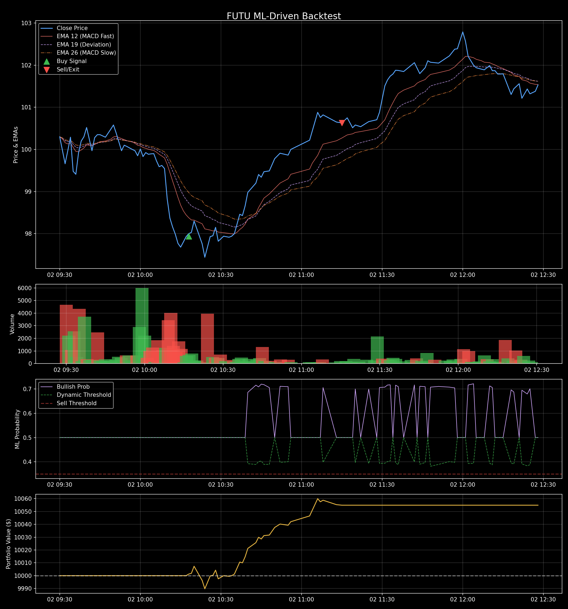

# 📈 FUTU (Futu Holdings Limited) ML Backtest Report

**Date Generated**: 2026-06-02 23:29:44
**Models Used**: {'LGBM_RAW': 'lgbm-20260531', 'LSTM_RAW': 'lstm-3c-20260531'}

## 🏢 Company Profile
- **Sector**: Financial Services
- **Industry**: Capital Markets
- **Trailing P/E**: 11.219337
- **Forward P/E**: 8.226117
- **Beta**: 0.508

## 📊 Performance Summary (สรุปผลการทดสอบ)

| Metric (ตัวชี้วัด) | Value (ค่าที่ได้) | คำอธิบาย |
|------------------|-----------------|---------|
| **Total Return** | +0.55% | ผลตอบแทนรวมทั้งหมดตลอดช่วงเวลาที่ทดสอบ |
| **CAGR** | +72.95% | อัตราผลตอบแทนทบต้นต่อปี (หากลงทุนครบปีจะได้กำไรเท่านี้) |
| **Sharpe Ratio** | 3.00 | ความคุ้มค่าของผลตอบแทนเมื่อเทียบกับความเสี่ยง (ควร > 1.0) |
| **Max Drawdown** | -0.18% | จุดที่พอร์ตขาดทุนหนักที่สุดจากจุดสูงสุด (วัดความเสี่ยง) |
| **Win Rate** | 100.00% | ความแม่นยำในการเทรด (สัดส่วนครั้งที่ได้กำไร) |
| **Total Trades** | 1 | จำนวนการเปิด-ปิดออเดอร์ทั้งหมด |
| **Profit Factor** | inf | อัตราส่วนกำไรรวมเทียบกับขาดทุนรวม (ควร > 1.5) |
| **Initial Capital** | $10,000.00 | เงินทุนเริ่มต้นสำหรับการจำลอง |
| **Final Capital** | $10,054.93 | เงินทุนสุทธิหลังจบการจำลอง |

## 📉 Charts

## 🚪 Exit Distribution (สาเหตุการปิดออเดอร์)
| Exit Reason | Count | Percentage |
|-------------|-------|------------|
| EMA Mean Reversion | 1 | 100.00% |

## 📝 Trade Log (All Transactions)
> **สัญลักษณ์การออก (Exit Indicators):**
> 🎯 = `Take Profit (TP)` | 🛡️ = `Stop Loss (SL) / Breakeven` | 📈 = `Trailing Stop (TS)` | 🤖 = `ML Exit (DMP)` | ⏱️ = `EOD Close` | 🌋 = `Volume Climax`

| Entry Time | Exit Time | Side | Position Size | Entry Price | ATR% | TP% | DMP% | Target (TP) | Stop (SL) | Exit Price (PNL %) | PNL ($) | ML Conf. | Exit Reason |
|------------|-----------|------|---------------|-------------|------|-----|------|-------------|-----------|--------------------|---------|----------|-------------|
| 2026-06-02 10:18 | 2026-06-02 11:15 | **LONG** | 20.4207 | $97.94 | 1.00% | 4.00% | - | 🎯 $101.86 | 🛡️ $95.00 | $100.63 (+2.75%) | **+$54.93** | 0.50 | EMA Mean Reversion |
