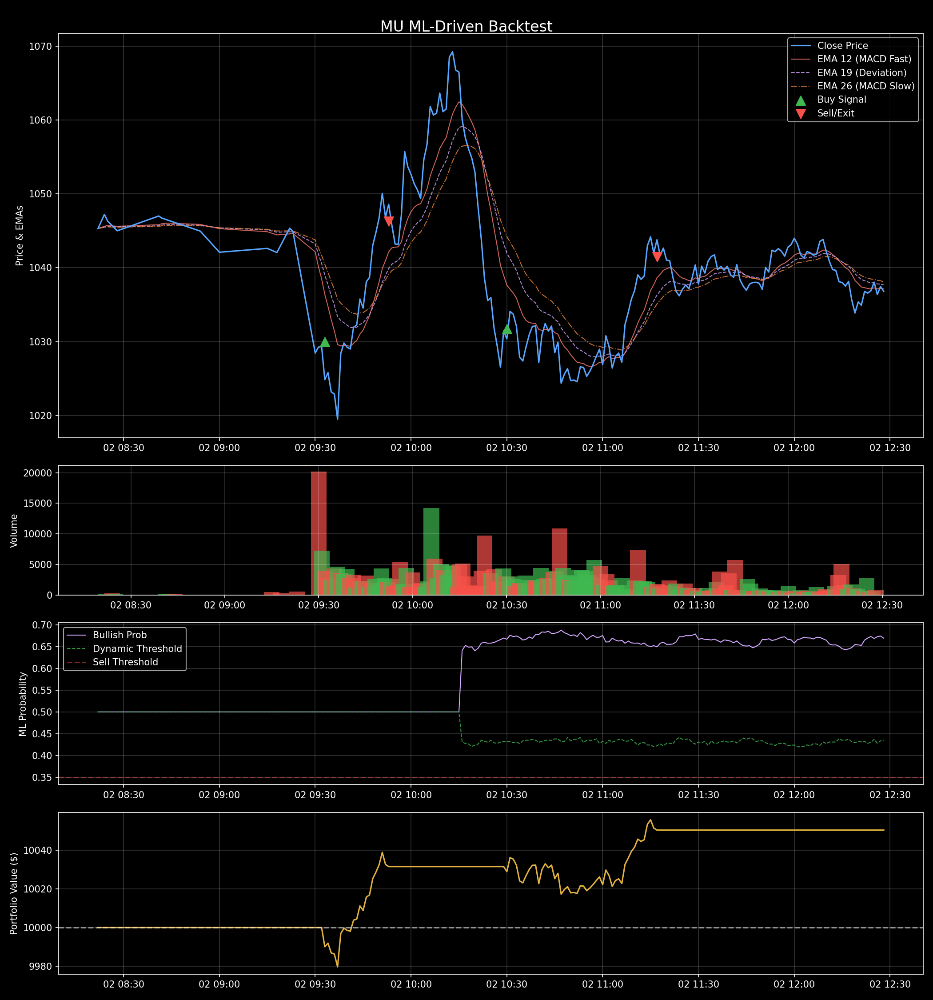

# 📈 MU (Micron Technology, Inc.) ML Backtest Report

**Date Generated**: 2026-06-02 23:29:45
**Models Used**: {'LGBM_RAW': 'lgbm-20260531', 'LSTM_RAW': 'lstm-3c-20260531'}

## 🏢 Company Profile
- **Sector**: Technology
- **Industry**: Semiconductors
- **Trailing P/E**: 48.848804
- **Forward P/E**: 9.850076
- **Beta**: 1.919

## 📊 Performance Summary (สรุปผลการทดสอบ)

| Metric (ตัวชี้วัด) | Value (ค่าที่ได้) | คำอธิบาย |
|------------------|-----------------|---------|
| **Total Return** | +0.50% | ผลตอบแทนรวมทั้งหมดตลอดช่วงเวลาที่ทดสอบ |
| **CAGR** | +65.46% | อัตราผลตอบแทนทบต้นต่อปี (หากลงทุนครบปีจะได้กำไรเท่านี้) |
| **Sharpe Ratio** | 1.41 | ความคุ้มค่าของผลตอบแทนเมื่อเทียบกับความเสี่ยง (ควร > 1.0) |
| **Max Drawdown** | -0.22% | จุดที่พอร์ตขาดทุนหนักที่สุดจากจุดสูงสุด (วัดความเสี่ยง) |
| **Win Rate** | 100.00% | ความแม่นยำในการเทรด (สัดส่วนครั้งที่ได้กำไร) |
| **Total Trades** | 2 | จำนวนการเปิด-ปิดออเดอร์ทั้งหมด |
| **Profit Factor** | inf | อัตราส่วนกำไรรวมเทียบกับขาดทุนรวม (ควร > 1.5) |
| **Initial Capital** | $10,000.00 | เงินทุนเริ่มต้นสำหรับการจำลอง |
| **Final Capital** | $10,050.48 | เงินทุนสุทธิหลังจบการจำลอง |

## 📉 Charts

## 🚪 Exit Distribution (สาเหตุการปิดออเดอร์)
| Exit Reason | Count | Percentage |
|-------------|-------|------------|
| EMA Mean Reversion | 2 | 100.00% |

## 📝 Trade Log (All Transactions)
> **สัญลักษณ์การออก (Exit Indicators):**
> 🎯 = `Take Profit (TP)` | 🛡️ = `Stop Loss (SL) / Breakeven` | 📈 = `Trailing Stop (TS)` | 🤖 = `ML Exit (DMP)` | ⏱️ = `EOD Close` | 🌋 = `Volume Climax`

| Entry Time | Exit Time | Side | Position Size | Entry Price | ATR% | TP% | DMP% | Target (TP) | Stop (SL) | Exit Price (PNL %) | PNL ($) | ML Conf. | Exit Reason |
|------------|-----------|------|---------------|-------------|------|-----|------|-------------|-----------|--------------------|---------|----------|-------------|
| 2026-06-02 10:30 | 2026-06-02 11:17 | **LONG** | 1.9446 | $1,031.72 | 39.55% | 158.20% | - | 🎯 $2,663.87 | - | $1,041.45 (+0.94%) | **+$18.91** | 0.67 | EMA Mean Reversion |
| 2026-06-02 09:33 | 2026-06-02 09:53 | **LONG** | 1.9417 | $1,030.00 | 1.00% | 4.00% | - | 🎯 $1,071.20 | 🛡️ $999.10 | $1,046.26 (+1.58%) | **+$31.57** | 0.50 | EMA Mean Reversion |
