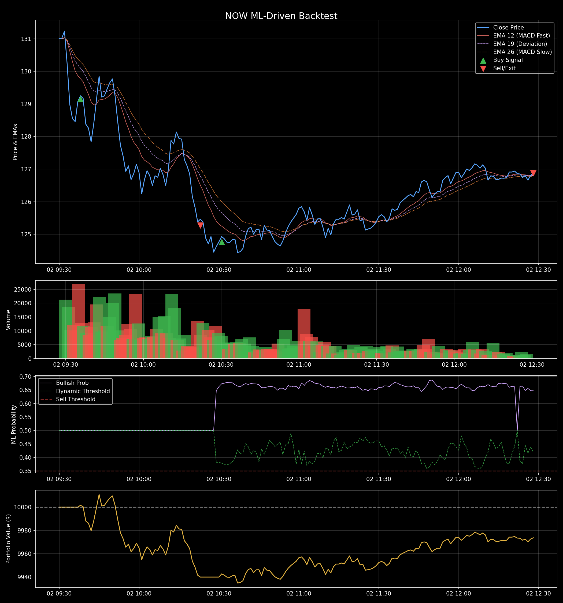

# 📈 NOW (ServiceNow, Inc.) ML Backtest Report

**Date Generated**: 2026-06-02 23:29:44
**Models Used**: {'LGBM_RAW': 'lgbm-20260531', 'LSTM_RAW': 'lstm-3c-20260531'}

## 🏢 Company Profile
- **Sector**: Technology
- **Industry**: Software - Application
- **Trailing P/E**: 75.42857
- **Forward P/E**: 25.209433
- **Beta**: 0.819

## 📊 Performance Summary (สรุปผลการทดสอบ)

| Metric (ตัวชี้วัด) | Value (ค่าที่ได้) | คำอธิบาย |
|------------------|-----------------|---------|
| **Total Return** | -0.26% | ผลตอบแทนรวมทั้งหมดตลอดช่วงเวลาที่ทดสอบ |
| **CAGR** | -23.15% | อัตราผลตอบแทนทบต้นต่อปี (หากลงทุนครบปีจะได้กำไรเท่านี้) |
| **Sharpe Ratio** | -0.57 | ความคุ้มค่าของผลตอบแทนเมื่อเทียบกับความเสี่ยง (ควร > 1.0) |
| **Max Drawdown** | -0.76% | จุดที่พอร์ตขาดทุนหนักที่สุดจากจุดสูงสุด (วัดความเสี่ยง) |
| **Win Rate** | 50.00% | ความแม่นยำในการเทรด (สัดส่วนครั้งที่ได้กำไร) |
| **Total Trades** | 2 | จำนวนการเปิด-ปิดออเดอร์ทั้งหมด |
| **Profit Factor** | 0.56 | อัตราส่วนกำไรรวมเทียบกับขาดทุนรวม (ควร > 1.5) |
| **Initial Capital** | $10,000.00 | เงินทุนเริ่มต้นสำหรับการจำลอง |
| **Final Capital** | $9,973.70 | เงินทุนสุทธิหลังจบการจำลอง |

## 📉 Charts

## 🚪 Exit Distribution (สาเหตุการปิดออเดอร์)
| Exit Reason | Count | Percentage |
|-------------|-------|------------|
| Stop Loss | 1 | 50.00% |
| End of Data | 1 | 50.00% |

## 📝 Trade Log (All Transactions)
> **สัญลักษณ์การออก (Exit Indicators):**
> 🎯 = `Take Profit (TP)` | 🛡️ = `Stop Loss (SL) / Breakeven` | 📈 = `Trailing Stop (TS)` | 🤖 = `ML Exit (DMP)` | ⏱️ = `EOD Close` | 🌋 = `Volume Climax`

| Entry Time | Exit Time | Side | Position Size | Entry Price | ATR% | TP% | DMP% | Target (TP) | Stop (SL) | Exit Price (PNL %) | PNL ($) | ML Conf. | Exit Reason |
|------------|-----------|------|---------------|-------------|------|-----|------|-------------|-----------|--------------------|---------|----------|-------------|
| 2026-06-02 10:31 | 2026-06-02 12:28 | **LONG** | 15.9346 | $124.76 | 36.52% | 146.10% | - | 🎯 $307.03 | - | $126.88 (+1.70%) | **+$33.70** | 0.66 | End of Data |
| 2026-06-02 09:38 | 2026-06-02 10:23 | **LONG** | 15.4859 | $129.15 | 1.00% | 4.00% | - | 🎯 $134.32 | 🛡️ $125.28 | $125.28 (-3.00%) | **-$60.00** | 0.50 | 🛡️ Stop Loss |
