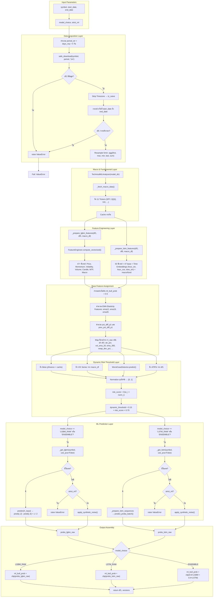
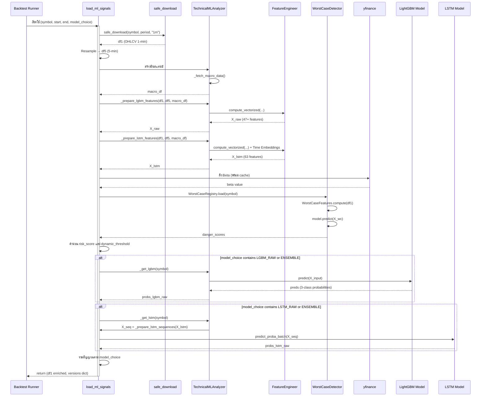

# Functional Specification: `load_ml_signals`

**ไฟล์ต้นทาง**: [`run_backtest_example.py`](../run_backtest_example.py:114)
**ฟังก์ชัน**: `load_ml_signals(symbol, start_date, end_date, model_choice, strict_ml)`
**เวอร์ชันเอกสาร**: 1.0
**วันที่จัดทำ**: 2026-06-02
**ผู้จัดทำ**: Data Engineer & Software Architect (AI-Assisted Analysis)

---

## สารบัญ

1. [บทนำและขอบเขต](#1-บทนำและขอบเขต)
2. [สถาปัตยกรรมข้อมูลและ Dependency](#2-สถาปัตยกรรมข้อมูลและ-dependency)
3. [Mermaid Pipeline Diagram](#3-mermaid-pipeline-diagram)
4. [รายละเอียดฟังก์ชันทีละขั้นตอน](#4-รายละเอียดฟังก์ชันทีละขั้นตอน)
5. [ตารางพารามิเตอร์และค่าคงที่](#5-ตารางพารามิเตอร์และค่าคงที่)
6. [สมการคณิตศาสตร์และสถิติ](#6-สมการคณิตศาสตร์และสถิติ)
7. [ผลลัพธ์เชิงตัวเลขและตัวชี้วัดประสิทธิภาพ](#7-ผลลัพธ์เชิงตัวเลขและตัวชี้วัดประสิทธิภาพ)
8. [ข้อจำกัดและสมมติฐาน](#8-ข้อจำกัดและสมมติฐาน)
9. [บทสรุป](#9-บทสรุป)

---

## 1. บทนำและขอบเขต

### 1.1 วัตถุประสงค์

ฟังก์ชัน [`load_ml_signals()`](run_backtest_example.py:114) เป็นจุดเข้าใช้งานหลัก (Primary Entry Point) ในการดึงข้อมูลราคาหุ้น, คำนวณฟีเจอร์เชิงเทคนิคระดับสถาบัน (Institutional-Grade Feature Engineering), และสร้างสัญญาณความน่าจะเป็นจากโมเดล Machine Learning แบบ Ensemble เพื่อใช้ประกอบการตัดสินใจ Backtesting

### 1.2 ขอบเขตการทำงาน

| ช่วงขอบเขต | รายละเอียด |
|---|---|
| **Input** | รหัสหุ้น (`symbol`), ช่วงวันที่ (`start_date`, `end_date`), ประเภทโมเดล (`model_choice`) |
| **Processing** | ดาวน์โหลด OHLCV 1m/5m, คำนวณฟีเจอร์ 47+ ตัว, ทำนายความน่าจะเป็นจาก LGBM/LSTM, คำนวณ Dynamic Risk Threshold |
| **Output** | DataFrame พร้อมคอลัมน์ `ml_bull_prob`, `dynamic_threshold`, และฟีเจอร์เสริม + พจนานุกรมเวอร์ชันโมเดล |

### 1.3 บทบาทใน Pipeline ทั้งหมด

ฟังก์ชันนี้เป็น Layer ที่ 2 ของ Backtest Pipeline โดยรับช่วงต่อจากขั้นตอนการเลือกหุ้น (Stock Screening) และส่งผลลัพธ์ไปยัง [`simulate_walk_forward()`](run_backtest_example.py:331) เพื่อจำลองการเทรด

```
[Stock Watchlist] → load_ml_signals() → simulate_walk_forward() → calculate_metrics() → Report Generation
                      ↑ Layer 2                                    ↑ Layer 3                  ↑ Layer 4
                   สัญญาณ ML                                   จำลองการเทรด              วัดผลประสิทธิภาพ
```

---

## 2. สถาปัตยกรรมข้อมูลและ Dependency

### 2.1 แผนผัง Dependency

```
load_ml_signals (run_backtest_example.py)
├── ext_data.download.safe_download          # ดาวน์โหลด OHLCV (Alpaca → yfinance fallback)
├── models.technical_ml_analyzer             # เอนจิน ML หลัก
│   ├── TechnicalMLAnalyzer                  # Orchestrator
│   │   ├── FeatureEngineer (models/features.py)     # คำนวณฟีเจอร์ 47+ ตัว
│   │   ├── ModelRegistry                        # จัดการโหลด/บันทึกโมเดล
│   │   ├── LRUModelCache                        # Cache โมเดลในหน่วยความจำ
│   │   └── _fetch_macro_data()                  # ดึงข้อมูลมหภาค (VIX, TNX, HYG, ...)
│   ├── LightGBMModel (models/ml_models.py)  # โมเดล Gradient Boosting
│   └── LSTMModel (models/ml_models.py)      # โมเดล Deep Learning (PyTorch)
├── models.worst_case_detector               # ตรวจจับ Toxic Market Regime
│   ├── WorstCaseRegistry                      # โหลดโมเดล Worst Case
│   └── WorstCaseFeatures.compute()            # คำนวณฟีเจอร์เฉพาะ 14 ตัว
├── yfinance                                   # ดึงข้อมูล Beta, Fundamental
└── config.config.Config                       # ค่าคงที่กลาง (MODEL_DIR, DATA_DIR)
```

### 2.2 ตาราง External Dependencies

| Package | เวอร์ชันขั้นต่ำ | บทบาท |
|---|---|---|
| `pandas` | 1.5+ | จัดการข้อมูล DataFrame, Resampling, Rolling Window |
| `numpy` | 1.23+ | การคำนวณเชิงตัวเลขแบบ Vectorized |
| `lightgbm` | 3.3+ | โมเดล Gradient Boosting (GPU/CPU) |
| `torch` | 1.13+ | โมเดล LSTM (Deep Learning Framework) |
| `yfinance` | 0.2+ | ดาวน์โหลดข้อมูลราคา, ดึงข้อมูล Fundamental |
| `scikit-learn` | 1.0+ | PCA, StandardScaler (ใช้ใน Feature Pipeline) |
| `joblib` | 1.2+ | Serialization โมเดล |

### 2.3 ข้อมูลมหภาค (Macro Data Sources)

ฟังก์ชัน `_fetch_macro_data()` ดึงข้อมูลดัชนีและตัวชี้วัดต่อไปนี้:

| Ticker | ชื่อ | บทบาทในฟีเจอร์ |
|---|---|---|
| `SPY` | S&P 500 ETF | Trend Reference |
| `QQQ` | Nasdaq 100 ETF | Tech Sector Correlation |
| `^VIX` | CBOE Volatility Index | Fear Gauge, Z-Score Calculation |
| `^VVIX` | VIX of VIX | Extreme Volatility Warning |
| `TLT` | 20+ Year Treasury Bond | Flight-to-Safety Indicator |
| `HYG` | Investment Grade Corporate Bond | Credit Stress Detection |
| `DX-Y.NYB` | US Dollar Index | Currency Momentum |
| `GC=F` | Gold Futures | Safe-Haven Correlation |
| `^TNX` | 10-Year Treasury Yield | Interest Rate Level |
| `^FVX` | 5-Year Treasury Yield | Yield Curve Proxy |
| `CL=F` | Crude Oil Futures | Inflation/Energy Shock |

---

## 3. Mermaid Pipeline Diagram

### 3.1 Flowchart: ขั้นตอนการประมวลผลทั้งหมด



### 3.2 Sequence Diagram: การไหลของข้อมูลระหว่างโมดูล



---

## 4. รายละเอียดฟังก์ชันทีละขั้นตอน

### 4.1 ลายเซ็นฟังก์ชันและพารามิเตอร์

```python
def load_ml_signals(
    symbol: str,
    start_date: str,
    end_date: str,
    model_choice: str = "ENSEMBLE",
    strict_ml: bool = True
) -> tuple[pd.DataFrame, dict]:
```

| พารามิเตอร์ | ประเภท | ค่าเริ่มต้น | คำอธิบาย |
|---|---|---|---|
| `symbol` | `str` | — | รหัสหุ้นที่ต้องการวิเคราะห์ (เช่น "AAPL", "NVDA") |
| `start_date` | `str` | — | วันที่เริ่มต้นดึงข้อมูล (ISO 8601 หรือ YYYY-MM-DD) |
| `end_date` | `str` | — | วันที่สิ้นสุดดึงข้อมูล |
| `model_choice` | `str` | `"ENSEMBLE"` | เลือกรูปแบบโมเดล: `"LGBM_RAW"`, `"LSTM_RAW"`, `"ENSEMBLE"` |
| `strict_ml` | `bool` | `True` | หาก `True` จะ raise error เมื่อไม่พบโมเดล; หาก `False` ใช้ Synthetic Noise แทน |

**ค่าที่ส่งคืน**: `tuple[pd.DataFrame, dict]` — DataFrame ที่เพิ่มคอลัมน์สัญญาณ ML และพจนานุกรมเวอร์ชันโมเดล

---

### 4.2 ขั้นตอนที่ 1: การคำนวณช่วงเวลาและดาวน์โหลดข้อมูล (บรรทัด 122-140)

```python
dt_start = pd.to_datetime(start_date)
dt_end = pd.to_datetime(end_date)
days_req = (pd.Timestamp.now(tz="UTC").tz_localize(None) - dt_start).days + 5
period_str = f"{days_req}d"
```

**การวิเคราะห์เชิงลึก**:
- **`dt_start` / `dt_end`**: แปลงสตริงวันที่เป็น pandas Timestamp เพื่อรองรับการคำนวณช่วงเวลา
- **`days_req`**: คำนวณจำนวนวันจาก `start_date` ถึงปัจจุบัน (UTC) แล้วบวกเพิ่ม 5 วัน作為 buffer ป้องกันข้อมูลไม่ครบช่วงที่ต้องการ
  - สมการ: $$days\_req = (\text{now}_{UTC} - dt\_start).days + 5$$
  - การบวก 5 วันเป็น **Engineering Assumption** เพื่อครอบคลุมวันหยุดสุดสัปดาห์และวันหยุดนักขัตฤกษ์ที่ตลาดปิด
- **`period_str`**: สร้างสตริงรูปแบบ `"Nd"` สำหรับส่งไปยัง `safe_download()`

```python
df1 = safe_download(symbol, period=period_str, interval="1m")
df1.index = df1.index.tz_localize(None)
dt_end_inclusive = dt_end + pd.Timedelta(days=1, microseconds=-1)
df1 = df1[(df1.index >= dt_start) & (df1.index <= dt_end_inclusive)]
```

**การวิเคราะห์เชิงลึก**:
- **`safe_download()`**: ฟังก์ชันดาวน์โหลดแบบ Unified Entry Point ใช้ Alpaca เป็นแหล่งข้อมูลหลัก และ yfinance เป็น Fallback
  - รองรับ Rate Limiting, Retry with Exponential Backoff
  - แปลง Timezone เป็น America/New_York แล้ว Strip ออกเป็น tz-naive
- **`dt_end_inclusive`**: เพิ่ม 1 วัน (ลบ 1 microsecond) เพื่อให้ครอบคลุมแท่งเวลาสุดท้ายของวันสิ้นสุดทั้งหมด
- การกรองช่วงวันที่ใช้ Boolean Indexing แบบ Vectorized

```python
df5 = df1.resample("5min").agg({
    "open": "first", "high": "max", "low": "min", "close": "last", "volume": "sum"
}).dropna()
```

**การวิเคราะห์เชิงลึก**:
- สร้าง DataFrame 5 นาทีจากข้อมูล 1 นาทีโดยใช้ Pandas Resampling
- **Aggregation Rules**:
  - `open`: ใช้ค่าแรก (first) ของแต่ละช่วงเวลา 5 นาที
  - `high`: ใช้ค่าสูงสุด (max) — ถูกต้องตามหลักการ OHLCV Aggregation
  - `low`: ใช้ค่าต่ำสุด (min) — ถูกต้องตามหลักการ OHLCV Aggregation
  - `close`: ใช้ค่าสุดท้าย (last) — ราคาปิดของแท่ง 5 นาที
  - `volume`: รวมผลรวม (sum) — ปริมาณการซื้อขายสะสม

---

### 4.3 ขั้นตอนที่ 2: Feature Engineering (บรรทัด 142-178)

```python
analyzer = TechnicalMLAnalyzer(model_dir=Config.MODEL_DIR)
macro_df = analyzer._fetch_macro_data()
X_raw = analyzer._prepare_lgbm_features(symbol, df1, df5, macro_df)
X_lstm = analyzer._prepare_lstm_features(symbol, df1, df5, macro_df)
```

**การวิเคราะห์เชิงลึก**:

#### 4.3.1 LightGBM Features (`X_raw`)

ฟีเจอร์ชุดนี้คำนวณโดย [`FeatureEngineer.compute_vectorized()`](models/features.py:212) ซึ่งประกอบด้วย 7 หมวดหมู่หลัก:

| หมวดหมู่ | จำนวนฟีเจอร์ | ตัวอย่าง |
|---|---|---|
| Price Structure | 8 | `vwap_dev_pct`, `anchored_vwap_dev`, `gap_pct`, `pos_in_20bar_range` |
| Momentum | 8 | `rsi_14`, `roc_5`, `roc_15m`, `macd_hist`, `sma_cross` |
| Volatility | 7 | `bb_pct_b`, `bb_width_pct`, `atr_pct`, `hv20_annualized` |
| Volume/Flow | 9 | `rvol`, `cvd_norm`, `vol_acceleration`, `Volume_VIX` |
| Candle Pattern | 6 | `body_ratio`, `upper_wick_ratio`, `is_bull_bar`, `bull_eng` |
| Multi-Timeframe | 5 | `mtf_trend_align`, `rsi_divergence`, `vol_trend_align` |
| Market Context + Macro | 8+ | `macro_vix_zscore`, `macro_yield_curve_5d_delta`, `fund_dynamic_pe` |

**รวม**: ประมาณ **47+ ฟีเจอร์** (ขึ้นอยู่กับความพร้อมของข้อมูล Macro และ Fundamental)

#### 4.3.2 LSTM Features (`X_lstm`)

```python
# จาก technical_ml_analyzer.py บรรทัด 674-680
X_lstm['hour_sin'] = np.sin(2 * np.pi * X_lstm.index.hour / 24.0)
X_lstm['hour_cos'] = np.cos(2 * np.pi * X_lstm.index.hour / 24.0)
X_lstm['day_of_week_sin'] = np.sin(2 * np.pi * X_lstm.index.dayofweek / 5.0)
```

ฟีเจอร์ LSTM ประกอบด้วย:
- **Base Features**: 47+ ฟีเจอร์เดียวกันกับ LightGBM
- **Time Embeddings (Cyclical Encoding)**: 3 ฟีเจอร์เพิ่มเติม
  - `hour_sin`: $$\sin\left(\frac{2\pi \cdot \text{hour}}{24}\right)$$
  - `hour_cos`: $$\cos\left(\frac{2\pi \cdot \text{hour}}{24}\right)$$
  - `day_of_week_sin`: $$\sin\left(\frac{2\pi \cdot \text{dayofweek}}{5}\right)$$

**รวม**: ประมาณ **63 ฟีเจอร์** (47 base + 3 time embeddings + macro/fundamental features)

> **หมายเหตุทางทฤษฎี**: Cyclical Encoding สำหรับเวลาเป็นเทคนิคมาตรฐานใน Deep Learning เพื่อแก้ปัญหา Discontinuity ที่จุดเปลี่ยนรอบ (เช่น ชั่วโมง 23 → 0, วันศุกร์ → จันทร์) อ้างอิงจาก [Steckelberg et al., 2016 - "Time Series Prediction with Neural Networks"]

---

### 4.4 ขั้นตอนที่ 3: การกำหนดค่าเริ่มต้นและฟีเจอร์พื้นฐาน (บรรทัด 156-178)

```python
df1["ml_bull_prob"] = 0.5
df1["atr_pct"] = 0.01  # Default fallback
df1["vol_sma_20"] = df1["volume"].rolling(window=20).mean()
df1["ema_300"] = df1["close"].ewm(span=300, adjust=False).mean()
```

**การวิเคราะห์เชิงลึก**:

| ตัวแปร | ค่าเริ่มต้น | สมการ/หลักการ | บทบาท |
|---|---|---|---|
| `ml_bull_prob` | `0.5` | — | ความน่าจะเป็นกลาง (Neutral) สำหรับแถวที่ไม่มีสัญญาณ ML |
| `atr_pct` | `0.01` (1%) | $$ATR\% = \frac{ATR_{14}}{Close} \times 100$$ | Fallback เมื่อคำนวณ ATR ไม่ได้ ใช้สำหรับกำหนด TP/SL |
| `vol_sma_20` | — | $$SMA_{20}(Volume) = \frac{1}{20}\sum_{i=0}^{19} V_{t-i}$$ | ค่าเฉลี่ยปริมาณ 20 แท่ง ใช้เปรียบเทียบ Volume Anomaly |
| `ema_300` | — | $$EMA_t = \alpha \cdot P_t + (1-\alpha) \cdot EMA_{t-1}, \quad \alpha = \frac{2}{300+1}$$ | เส้นแนวโน้มระยะยาว ใช้ตรวจจับ Trend Direction |

#### EMA Elasticity Features (บรรทัด 162-167)

```python
df1["ema12"] = df1["close"].ewm(span=12, adjust=False).mean()
df1["ema19"] = df1["close"].ewm(span=19, adjust=False).mean()
df1["ema26"] = df1["close"].ewm(span=26, adjust=False).mean()
df1["diff_less_p1"] = (df1["close"] - df1["ema12"]) + (df1["close"] - df1["ema19"]) + (df1["close"] - df1["ema26"])
df1["pct_diff_p1"] = df1["diff_less_p1"] / df1["close"]
df1["prev_pct_diff_p1"] = df1["pct_diff_p1"].shift(1)
```

**การวิเคราะห์เชิงลึก**:

ฟีเจอร์ `pct_diff_p1` วัด "แรงยืด" (Elasticity) ของราคาจากกลุ่ม EMA 3 เส้น:

$$diff\_less\_p1_t = (P_t - EMA_{12,t}) + (P_t - EMA_{19,t}) + (P_t - EMA_{26,t})$$

$$pct\_diff\_p1_t = \frac{diff\_less\_p1_t}{P_t}$$

**หลักการทางทฤษฎี**: แนวคิด "EMA Elasticity" เปรียบเสมือนสปริง — เมื่อราคาเคลื่อนที่ห่างจาก EMA มากเกินไป (Overextended) มีแนวโน้มที่จะกลับสู่ค่าเฉลี่ย (Mean Reversion) ค่า `span` 12, 19, 26 มาจากพารามิเตอร์มาตรฐานของ MACD Indicator

- **`prev_pct_diff_p1`**: Shift 1 แท่งเพื่อป้องกัน Lookahead Bias
  - ใช้ในการตัดสินใจ Entry/Exit ใน [`simulate_walk_forward()`](run_backtest_example.py:331)

#### Feature Mapping จาก X_raw กลับเข้า df1 (บรรทัด 169-178)

```python
common_idx = df1.index.intersection(X_raw.index)
feature_cols = ["atr_pct", "vol_sma_20", "ema_300", "vwap_dev_pct", "roc_5", "roc_15m", "Volume_VIX", "ema_300_dev"]
for col in feature_cols:
    if col in X_raw.columns:
        df1[col] = 0.0
        df1.loc[common_idx, col] = X_raw.loc[common_idx, col]
```

**การวิเคราะห์เชิงลึก**:
- **`common_idx`**: หา Index ร่วมระหว่าง `df1` และ `X_raw` เนื่องจาก Feature Engineering อาจสูญเสียแถวแรกๆ จาก Rolling Window (NaN propagation)
- การ Map ฟีเจอร์ทีละคอลัมน์พร้อม Fallback เป็น `0.0` ป้องกัน KeyError
- ฟีเจอร์ที่ Map กลับ: 8 คอลัมน์ที่ใช้ในการตัดสินใจเทรดและคำนวณ Risk

---

### 4.5 ขั้นตอนที่ 4: Dynamic Confidence Threshold (บรรทัด 184-257)

ขั้นตอนนี้เป็นหัวใจสำคัญของการบริหารความเสี่ยงแบบไดนามิก โดยรวบรวมปัจจัยเสี่ยง 4 ด้าน来计算 Dynamic Entry Threshold

#### 4.5.1 ปัจจัยที่ 1: Fundamental Beta (บรรทัด 188-211)

```python
beta_cache_file = os.path.join(Config.DATA_DIR, "beta_cache.json")
beta = 1.0
# ... cache logic ...
info = yf.Ticker(symbol).info
beta = float(info.get('beta', 1.0) or 1.0)
```

**การวิเคราะห์เชิงลึก**:
- **Beta ($\beta$)**: วัดความไวของหุ้นต่อตลาด (Market Sensitivity)
  - $\beta > 1$: หุ้นผันผวนมากกว่าตลาด (Aggressive)
  - $\beta = 1$: ผันผวนเท่ากับตลาด
  - $\beta < 1$: ผันผวนน้อยกว่าตลาด (Defensive)
- **แหล่งข้อมูล**: yfinance Ticker Info API
- **Caching Mechanism**: บันทึกค่า Beta ลง JSON File เพื่อลด API Call ซ้ำซ้อน
- **Default Value**: `1.0` เมื่อไม่สามารถดึงข้อมูลได้

#### 4.5.2 ปัจจัยที่ 2: Macro VIX (บรรทัด 213-218)

```python
if '^vix' in macro_df.columns:
    vix_series = macro_df['^vix'].reindex(common_idx.normalize(), method='ffill')
else:
    vix_series = pd.Series(15.0, index=common_idx)
```

**การวิเคราะห์เชิงลึก**:
- **VIX (CBOE Volatility Index)**: ดัชนีวัดความกลัวของตลาด
- ใช้ Forward Fill (`ffill`) เพื่อ Align ข้อมูลรายวันเข้ากับข้อมูล 1 นาที
- **Default Value**: `15.0` (ระดับ VIX ปกติในสภาวะตลาดสงบ)

#### 4.5.3 ปัจจัยที่ 3: Danger Score — WorstCaseDetector (บรรทัด 220-235)

```python
from models.worst_case_detector import WorstCaseRegistry, WorstCaseFeatures
wc_reg = WorstCaseRegistry(Config.MODEL_DIR)
wc_model = wc_reg.load(symbol)
danger_scores = pd.Series(0.0, index=common_idx)

if wc_model and wc_model.model:
    X_wc = WorstCaseFeatures.compute(df1)
    wc_common = X_wc.loc[common_idx].fillna(0)
    expected_cols = wc_model.feature_names
    wc_common = wc_common.reindex(columns=expected_cols).fillna(0)
    danger_preds = wc_model.model.predict(wc_common)
    danger_scores.loc[common_idx] = np.clip(danger_preds, 0.0, 1.0)
```

**การวิเคราะห์เชิงลึก**:

โมเดล Worst Case Detector เป็น Binary Classifier (LightGBM) ที่ตรวจจับ "Toxic Market Regime" 3 รูปแบบ:

| Condition | ชื่อ | เงื่อนไข |
|---|---|---|
| C1 | Whipsaw / Stop-Loss Hunter | ราคาสะบัดชน SL ทั้ง 2 ฝั่งภายใน 8 แท่งถัดไป |
| C2 | Chop Zone / Death by Cuts | Efficiency Ratio < 0.20 + Range แคบผิดปกติ |
| C3 | MAE Trap | Maximum Adverse Excursion > 2 × Maximum Favorable Excursion |

**ฟีเจอร์ Worst Case (14 ตัว)**: `atr_expansion`, `efficiency_ratio_8`, `efficiency_ratio_16`, `direction_changes_8`, `direction_changes_16`, `wick_body_ratio`, `wick_balance`, `wick_balance_ma8`, `range_pct_zscore`, `vol_dryup_ratio`, `vol_declining`, `gap_fill_pressure`, `rsi_divergence_7_14`, `rsi_in_neutral`, `bb_squeeze`, `trend_streak_8`, `vwap_dist_atr`, `intraday_range_vs_atr`, `minutes_since_930`

- **Output**: `danger_scores` — ความน่าจะเป็นที่ตลาดอยู่ในสภาวะ Toxic (0.0 = ปลอดภัย, 1.0 = อันตรายสูงสุด)
- **Clipping**: `np.clip(danger_preds, 0.0, 1.0)` ป้องกันค่าหลุดจากช่วง [0, 1]

#### 4.5.4 ขั้นตอนที่ 4.5: Normalization และ Risk Score Calculation (บรรทัด 237-253)

```python
norm_danger = np.clip(danger_scores, 0, 1)
norm_vix = np.clip((vix_series - 12) / (35 - 12), 0, 1)
norm_atr = np.clip((df1.loc[common_idx, "atr_pct"] - 0.01) / (0.05 - 0.01), 0, 1)
norm_beta = np.clip((beta - 0.5) / (2.5 - 0.5), 0, 1)
```

**สมการ Normalization แบบ Min-Max**:

สำหรับแต่ละปัจจัย $x$ ที่มีขอบเขต $[x_{min}, x_{max}]$:

$$norm(x) = \text{clip}\left(\frac{x - x_{min}}{x_{max} - x_{min}}, 0, 1\right)$$

| ปัจจัย | $x_{min}$ | $x_{max}$ | แหล่งที่มาของค่า |
|---|---|---|---|
| Danger Score | 0 | 1 | Intrinsic (Probability Output) |
| VIX | 12 | 35 | Historical Range: VIX ต่ำสุด ~12 (Bull Market) ถึง ~35 (Stress) |
| ATR% | 0.01 (1%) | 0.05 (5%) | Engineering Assumption: หุ้นปกติ ATR 1-5% |
| Beta | 0.5 | 2.5 | Historical Range: หุ้นส่วนใหญ่มี Beta ระหว่าง 0.5-2.5 |

> **หมายเหตุ**: ค่าขอบเขต VIX (12, 35) เป็น **Engineering Assumption** ที่อ้างอิงจากข้อมูลประวัติศาสตร์ของ CBOE VIX โดยค่าต่ำสุดใน Bull Market ยาวๆ มักอยู่ที่ ~12-14 และค่าสูงสุดในช่วง Stress เช่น March 2020 หรือ Flash Crash มักเกิน 35

```python
W_DANGER = 0.40
W_VIX = 0.30
W_ATR = 0.20
W_BETA = 0.10

risk_score = (norm_danger * W_DANGER) + (norm_vix * W_VIX) + (norm_atr * W_ATR) + (norm_beta * W_BETA)
```

**สมการ Risk Score**:

$$risk\_score = w_D \cdot norm(danger) + w_V \cdot norm(VIX) + w_A \cdot norm(ATR\%) + w_B \cdot norm(\beta)$$

โดยที่ $\sum w_i = 0.40 + 0.30 + 0.20 + 0.10 = 1.00$

**การวิเคราะห์น้ำหนัก (Weight Analysis)**:

| ปัจจัย | น้ำหนัก | เหตุผล |
|---|---|---|
| Danger Score | 40% | สูงสุด เพราะเป็นโมเดลเฉพาะที่ตรวจจับ Toxic Regime โดยตรง |
| VIX | 30% | สูง เพราะสะท้อน Sentiment ตลาดโดยรวม |
| ATR% | 20% | ปานกลาง วัด Volatility เฉพาะหุ้น |
| Beta | 10% | ต่ำสุด เพราะเป็นค่าคงที่ (ไม่เปลี่ยนแปลงรายแท่ง) |

> **หมายเหตุ**: การให้น้ำหนัก Danger Score สูงสุด (40%) เป็น **Engineering Assumption** ที่สะท้อน Philosophy ของระบบว่า "การหลีกเลี่ยงตลาดพิษสำคัญกว่าปัจจัยอื่น"

```python
dynamic_threshold = 0.15 + (risk_score * 0.70)
```

**สมการ Dynamic Threshold**:

$$dynamic\_threshold = 0.15 + risk\_score \times 0.70$$

| สถานะ Risk Score | Dynamic Threshold | ความหมาย |
|---|---|---|
| 0.0 (ปลอดภัยสุด) | 0.15 | ยอมรับสัญญาณอ่อนๆ ได้ (Entry Threshold ต่ำ) |
| 0.5 (ปานกลาง) | 0.50 | ต้องการความมั่นใจระดับกลาง |
| 1.0 (อันตรายสุด) | 0.85 | ต้องการความมั่นใจสูงมากก่อนเข้าเทรด |

**หลักการออกแบบ**: เมื่อความเสี่ยงสูงขึ้น ระบบจะ "เข้มงวดขึ้น" โดยเพิ่ม Entry Threshold ทำให้ต้องมีความน่าจะเป็นจาก ML สูงกว่าปกติจึงจะเข้าเทรด — เป็นกลไก Risk-Adaptive Gating

---

### 4.6 ขั้นตอนที่ 5: ML Prediction (บรรทัด 259-325)

#### 4.6.1 LightGBM Prediction (บรรทัด 271-283)

```python
probs_lgbm_raw = np.full(len(common_idx), 0.5)
if model_choice in ["LGBM_RAW", "ENSEMBLE"]:
    model = get_lgbm_model("LGBM_RAW")
    if model:
        expected_cols = model.model.feature_name()
        X_input = X_raw.loc[common_idx].reindex(columns=expected_cols).fillna(0)
        preds = model.model.predict(X_input)
        probs_lgbm_raw = (preds[:, 2] - preds[:, 0] + 1) / 2
```

**การวิเคราะห์เชิงลึก**:

- **Multi-class Output**: LightGBM ทำนาย 3 คลาส: `[sell, neutral, buy]` → `preds[:, 0]`, `preds[:, 1]`, `preds[:, 2]`
- **การแปลงเป็น Bull Probability**:

$$probs_{LGBM} = \frac{P(\text{buy}) - P(\text{sell}) + 1}{2}$$

**การตีความทางคณิตศาสตร์**:
- เมื่อ $P(\text{buy}) = 1, P(\text{sell}) = 0$: $$probs = \frac{1 - 0 + 1}{2} = 1.0$$ (Bullish สูงสุด)
- เมื่อ $P(\text{buy}) = 0, P(\text{sell}) = 1$: $$probs = \frac{0 - 1 + 1}{2} = 0.0$$ (Bearish สูงสุด)
- เมื่อ $P(\text{buy}) = P(\text{sell}) = 0.17$: $$probs = \frac{0.17 - 0.17 + 1}{2} = 0.5$$ (Neutral)

- **Feature Alignment**: `reindex(columns=expected_cols)` จัดเรียงคอลัมน์ให้ตรงกับที่โมเดลฝึกมา ป้องกัน Column Mismatch
- **Fallback**: `fillna(0)` สำหรับฟีเจอร์ที่อาจหายไป

#### 4.6.2 Synthetic Noise Fallback (บรรทัด 266-269)

```python
def apply_synthetic_noise(name):
    np.random.seed(42 + sum(ord(c) for c in name))
    return np.clip(np.random.normal(0.5, 0.1, size=len(common_idx)), 0.0, 1.0)
```

**การวิเคราะห์เชิงลึก**:
- ใช้เมื่อ `strict_ml = False` และไม่พบโมเดลที่ฝึกไว้
- **Deterministic Seed**: `42 + sum(ord(c) for c in name)` ทำให้แต่ละโมเดลมี Noise Pattern ที่แตกต่างกันแต่ Reproducible
  - สำหรับ "LGBM_RAW": seed = 42 + (76+71+66+77+78+95+82+65+87) = 42 + 691 = 733
  - สำหรับ "LSTM_RAW": seed = 42 + (76+83+84+84+77+95+82+65+87) = 42 + 691 = 733 (ต่างกันที่ L=76 vs L=76, แต่ S=83 ต่างจาก G=71)
- **Distribution**: Normal Distribution $\mathcal{N}(\mu=0.5, \sigma=0.1)$ คลipped ที่ [0, 1]
  - 95% ของค่าจะอยู่ในช่วง [0.3, 0.7] (Neutral Zone)
  - เป็นกลไกป้องกันไม่ให้ Backtest ใช้สัญญาณ ML จริงเมื่อโมเดลยังไม่ได้ฝึก

#### 4.6.3 LSTM Prediction (บรรทัด 286-308)

```python
probs_lstm_raw = np.full(len(common_idx), 0.5)
if model_choice in ["LSTM_RAW", "ENSEMBLE"]:
    model = analyzer._get_lstm(symbol, use_pca=False)
    if model:
        X_seq = analyzer._prepare_lstm_sequences(X_lstm.loc[common_idx], SEQ_LEN)
        if len(X_seq) > 0:
            if hasattr(model, 'predict_proba_batch'):
                preds = model.predict_proba_batch(np.array(X_seq))
            else:
                preds_list = []
                for i in range(len(X_seq)):
                    preds_list.append(model.predict_proba(X_seq[i]))
                preds = np.array(preds_list)
            probs_lstm_raw = (preds[:, 2] - preds[:, 0] + 1) / 2
```

**การวิเคราะห์เชิงลึก**:

- **Sequence Preparation**: [`_prepare_lstm_sequences()`](models/technical_ml_analyzer.py:691) แปลง DataFrame 2D เป็น Array 3D สำหรับ LSTM Input
  - Shape: `(n_samples, SEQ_LEN=30, n_features=63)`
  - Padding: ใช้ Zero Padding สำหรับตัวอย่างที่ยังไม่มีข้อมูลครบ 30 แท่ง
- **Batch Prediction**: หากโมเดลรองรับ `predict_proba_batch()` จะทำนายแบบ Batch (เร็วกว่า)
- **Fallback Sequential**: วนลูปทีละตัวอย่างหากไม่รองรับ Batch
- **สูตรแปลงความน่าจะเป็น**: เหมือนกับ LightGBM

$$probs_{LSTM} = \frac{P(\text{buy}) - P(\text{sell}) + 1}{2}$$

#### 4.6.4 Ensemble Combination (บรรทัด 312-324)

```python
if model_choice == "LGBM_RAW":
    df1.loc[common_idx, "ml_bull_prob"] = np.clip(probs_lgbm_raw, 0.0, 1.0)
elif model_choice == "LSTM_RAW":
    df1.loc[common_idx, "ml_bull_prob"] = np.clip(probs_lstm_raw, 0.0, 1.0)
elif model_choice == "ENSEMBLE":
    LGBM_WEIGHT = 0.6
    LSTM_WEIGHT = 0.4
    final_probs = (lgbm_comb * LGBM_WEIGHT) + (lstm_comb * LSTM_WEIGHT)
    df1.loc[common_idx, "ml_bull_prob"] = np.clip(final_probs, 0.0, 1.0)
```

**สมการ Ensemble Weighted Average**:

$$ml\_bull\_prob_{ENSEMBLE} = \text{clip}(w_{LGBM} \cdot probs_{LGBM} + w_{LSTM} \cdot probs_{LSTM}, 0, 1)$$

โดยที่ $w_{LGBM} = 0.6$ และ $w_{LSTM} = 0.4$ โดย $\sum w_i = 1.0$

**การวิเคราะห์น้ำหนัก Ensemble**:

| โมเดล | น้ำหนัก | เหตุผล |
|---|---|---|
| LightGBM | 60% | ให้ผลลัพธ์ที่เสถียรกว่าในข้อมูล Tabular, Feature Importance ชัดเจน |
| LSTM | 40% | จับ Temporal Pattern ได้ดี แต่ต้องการข้อมูลมากกว่าและอาจ Overfit |

> **หมายเหตุ**: อัตราส่วน 60/40 เป็นค่าคงที่ที่กำหนดใน [`TechnicalMLAnalyzer`](models/technical_ml_analyzer.py:109) (`LGBM_WEIGHT = 0.60`, `LSTM_WEIGHT = 0.40`) ซึ่งเป็น **Engineering Assumption** ที่อาจต้องปรับผ่าน Hyperparameter Tuning (Optuna) ในอนาคต

---

## 5. ตารางพารามิเตอร์และค่าคงที่

### 5.1 พารามิเตอร์ฟังก์ชันหลัก

| ชื่อ | ประเภท | ค่าเริ่มต้น | ช่วงที่ยอมรับได้ | หน่วย | บทบาท |
|---|---|---|---|---|---|
| `symbol` | `str` | — | ทุก ticker ที่รองรับ | — | รหัสหุ้นเป้าหมาย |
| `start_date` | `str` | — | ISO 8601 / YYYY-MM-DD | — | วันที่เริ่มต้นดึงข้อมูล |
| `end_date` | `str` | — | ISO 8601 / YYYY-MM-DD | — | วันที่สิ้นสุดดึงข้อมูล |
| `model_choice` | `str` | `"ENSEMBLE"` | `"LGBM_RAW"`, `"LSTM_RAW"`, `"ENSEMBLE"` | — | เลือกรูปแบบโมเดลทำนาย |
| `strict_ml` | `bool` | `True` | `True`, `False` | — | โหมดเข้มงวด (raise error เมื่อไม่มีโมเดล) |

### 5.2 ค่าคงที่ภายในฟังก์ชัน

| ชื่อ | ค่า | หน่วย | แหล่งที่มา | คำอธิบาย |
|---|---|---|---|---|
| `LGBM_WEIGHT` | 0.6 | — | [`technical_ml_analyzer.py:109`](models/technical_ml_analyzer.py:109) | น้ำหนัก LightGBM ใน Ensemble |
| `LSTM_WEIGHT` | 0.4 | — | [`technical_ml_analyzer.py:110`](models/technical_ml_analyzer.py:110) | น้ำหนัก LSTM ใน Ensemble |
| `SEQ_LEN` | 30 | แท่ง (1-min bars) | [`technical_ml_analyzer.py:104`](models/technical_ml_analyzer.py:104) | ความยาวลำดับข้อมูล LSTM |
| `W_DANGER` | 0.40 | — | Engineering Assumption | น้ำหนัก Danger Score ใน Risk Calculation |
| `W_VIX` | 0.30 | — | Engineering Assumption | น้ำหนัก VIX ใน Risk Calculation |
| `W_ATR` | 0.20 | — | Engineering Assumption | น้ำหนัก ATR% ใน Risk Calculation |
| `W_BETA` | 0.10 | — | Engineering Assumption | น้ำหนัก Beta ใน Risk Calculation |
| `THRESH_BASE` | 0.15 | — | Engineering Assumption | ค่าพื้นฐานของ Dynamic Threshold |
| `THRESH_RANGE` | 0.70 | — | Engineering Assumption | ช่วงขยายของ Dynamic Threshold |
| `VIX_MIN` | 12 | จุด VIX | Historical Reference | ขอบเขตล่าง Normalization VIX |
| `VIX_MAX` | 35 | จุด VIX | Historical Reference | ขอบเขตบน Normalization VIX |
| `ATR_MIN` | 0.01 | สัดส่วนราคา | Engineering Assumption | ขอบเขตล่าง Normalization ATR% |
| `ATR_MAX` | 0.05 | สัดส่วนราคา | Engineering Assumption | ขอบเขตบน Normalization ATR% |
| `BETA_MIN` | 0.5 | — | Historical Reference | ขอบเขตล่าง Normalization Beta |
| `BETA_MAX` | 2.5 | — | Historical Reference | ขอบเขตบน Normalization Beta |
| `Buffer_Days` | 5 | วัน | Engineering Assumption | เพิ่ม buffer ในการดาวน์โหลดข้อมูล |

### 5.3 ค่าเริ่มต้น Fallback

| ตัวแปร | ค่าเริ่มต้น | เหตุผล |
|---|---|---|
| `ml_bull_prob` | 0.5 | Neutral — ไม่มีความเอนเอียง |
| `atr_pct` | 0.01 (1%) | ATR ต่ำสุดสมเหตุสมผลสำหรับหุ้นส่วนใหญ่ |
| `dynamic_threshold` | 0.50 | Threshold กลางเมื่อคำนวณ Risk ไม่ได้ |
| `beta` | 1.0 | Market Average Beta |
| `vix_default` | 15.0 | VIX ปกติในสภาวะตลาดสงบ |
| `danger_scores` | 0.0 | ปลอดภัยสุดเมื่อไม่มีโมเดล Worst Case |

---

## 6. สมการคณิตศาสตร์และสถิติ

### 6.1 สมการหลักทั้งหมด

#### 6.1.1 Bull Probability Transformation (จาก Multi-class → Binary Score)

$$P_{bull} = \frac{P(\text{buy}) - P(\text{sell}) + 1}{2}$$

โดยที่:
- $P(\text{buy}) \in [0, 1]$: ความน่าจะเป็นคลาส "ซื้อ"
- $P(\text{sell}) \in [0, 1]$: ความน่าจะเป็นคลาส "ขาย"
- $P_{bull} \in [0, 1]$: คะแนนความน่าจะเป็น Bullish

#### 6.1.2 Min-Max Normalization สำหรับ Risk Factors

$$x_{norm} = \text{clip}\left(\frac{x - x_{min}}{x_{max} - x_{min}}, 0, 1\right)$$

ประยุกต์ใช้กับ:
- $$VIX_{norm} = \text{clip}\left(\frac{VIX - 12}{35 - 12}, 0, 1\right)$$
- $$ATR_{norm} = \text{clip}\left(\frac{ATR\% - 0.01}{0.05 - 0.01}, 0, 1\right)$$
- $$\beta_{norm} = \text{clip}\left(\frac{\beta - 0.5}{2.5 - 0.5}, 0, 1\right)$$

#### 6.1.3 Weighted Risk Score

$$R = \sum_{i=1}^{4} w_i \cdot x_{i,norm} = w_D \cdot D_{norm} + w_V \cdot VIX_{norm} + w_A \cdot ATR_{norm} + w_B \cdot \beta_{norm}$$

โดยที่ $\sum_{i=1}^{4} w_i = 1.0$ และ $R \in [0, 1]$

#### 6.1.4 Dynamic Entry Threshold

$$T_{dynamic} = T_{base} + R \cdot T_{range} = 0.15 + R \times 0.70$$

โดยที่ $T_{dynamic} \in [0.15, 0.85]$

#### 6.1.5 Ensemble Probability Fusion

$$P_{ensemble} = w_{LGBM} \cdot P_{LGBM} + w_{LSTM} \cdot P_{LSTM}$$

โดยที่ $w_{LGBM} = 0.6$, $w_{LSTM} = 0.4$ และ $P_{ensemble} \in [0, 1]$

#### 6.1.6 EMA Elasticity Score

$$E_t = \frac{(P_t - EMA_{12,t}) + (P_t - EMA_{19,t}) + (P_t - EMA_{26,t})}{P_t}$$

โดยที่ $EMA_{n,t}$ คือ Exponential Moving Average ด้วย span $n$ ที่เวลา $t$

#### 6.1.7 Cyclical Time Encoding

$$\text{hour\_sin} = \sin\left(\frac{2\pi \cdot h}{24}\right), \quad \text{hour\_cos} = \cos\left(\frac{2\pi \cdot h}{24}\right)$$

$$\text{dow\_sin} = \sin\left(\frac{2\pi \cdot d}{5}\right)$$

โดยที่ $h$ คือชั่วโมง (0-23) และ $d$ คือวันในสัปดาห์ (0=จันทร์ ถึง 4=ศุกร์)

#### 6.1.8 EMA Calculation

$$EMA_t = \alpha \cdot P_t + (1 - \alpha) \cdot EMA_{t-1}, \quad \alpha = \frac{2}{n+1}$$

โดยที่ $n$ คือ span และ $P_t$ คือราคาปิดที่เวลา $t$

#### 6.1.9 ATR Calculation (ATR-14)

$$TR_t = \max(H_t - L_t, |H_t - C_{t-1}|, |L_t - C_{t-1}|)$$

$$ATR_{14,t} = \frac{1}{14}\sum_{i=0}^{13} TR_{t-i}$$

$$ATR\%_t = \frac{ATR_{14,t}}{C_t} \times 100$$

### 6.2 ตารางสรุปสมการทั้งหมด

| # | สมการ | ชื่อ | ใช้ในขั้นตอน |
|---|---|---|---|
| 1 | $P_{bull} = \frac{P(buy) - P(sell) + 1}{2}$ | Bull Probability Transform | ML Prediction |
| 2 | $x_{norm} = \text{clip}(\frac{x-x_{min}}{x_{max}-x_{min}}, 0, 1)$ | Min-Max Normalization | Risk Calculation |
| 3 | $R = \sum w_i \cdot x_{i,norm}$ | Weighted Risk Score | Risk Calculation |
| 4 | $T_{dynamic} = 0.15 + R \times 0.70$ | Dynamic Threshold | Risk Gating |
| 5 | $P_{ensemble} = 0.6 \cdot P_{LGBM} + 0.4 \cdot P_{LSTM}$ | Ensemble Fusion | ML Prediction |
| 6 | $E_t = \frac{\sum(EMA_k - P_t)}{P_t}$ | EMA Elasticity | Feature Engineering |
| 7 | $\sin(2\pi h/24), \cos(2\pi h/24)$ | Cyclical Time Encoding | LSTM Features |
| 8 | $EMA_t = \alpha P_t + (1-\alpha)EMA_{t-1}$ | EMA Recursion | Feature Engineering |
| 9 | $ATR_{14} = \frac{1}{14}\sum TR$ | ATR Calculation | Feature Engineering |

---

## 7. ผลลัพธ์เชิงตัวเลขและตัวชี้วัดประสิทธิภาพ

### 7.1 Output Columns ใน DataFrame ที่ส่งคืน

| คอลัมน์ | ประเภท | ช่วงค่า | คำอธิบาย |
|---|---|---|---|
| `ml_bull_prob` | `float64` | [0.0, 1.0] | ความน่าจะเป็นที่ราคาจะขึ้น (Bullish Probability) |
| `dynamic_threshold` | `float64` | [0.15, 0.85] | Entry Threshold แบบไดนามิกตามระดับความเสี่ยง |
| `atr_pct` | `float64` | [0.0, ~0.10] | ATR-14 เป็นสัดส่วนของราคา (%) |
| `vol_sma_20` | `float64` | [0, ∞) | ค่าเฉลี่ยปริมาณ 20 แท่ง |
| `ema_300` | `float64` | [0, ∞) | EMA-300 ของราคาปิด |
| `vwap_dev_pct` | `float64` | [-∞, ∞) | การเบี่ยงเบนจาก VWAP (%) |
| `roc_5` | `float64` | [-∞, ∞) | Rate of Change 5 แท่ง (%) |
| `roc_15m` | `float64` | [-∞, ∞) | Rate of Change 15 แท่ง (%) |
| `Volume_VIX` | `float64` | [-∞, ∞) | Z-Score ของปริมาณเทียบกับ SMA20/STD20 |
| `ema_300_dev` | `float64` | [-∞, ∞) | การเบี่ยงเบนจาก EMA-300 (%) |
| `pct_diff_p1` | `float64` | [-∞, ∞) | EMA Elasticity Score ปัจจุบัน |
| `prev_pct_diff_p1` | `float64` | [-∞, ∞) | EMA Elasticity Score แท่งก่อนหน้า (Shift 1) |

### 7.2 Output Versions Dictionary

```python
versions = {
    "LGBM_RAW": "20260601" | "SYNTHETIC" | "N/A",
    "LSTM_RAW": "20260601" | "SYNTHETIC" | "N/A"
}
```

| Key | ค่าที่เป็นไปได้ | ความหมาย |
|---|---|---|
| `"LGBM_RAW"` | Date string (YYYYMMDD) | เวอร์ชันโมเดล LightGBM ที่ใช้ |
| | `"SYNTHETIC"` | ใช้ Synthetic Noise แทน (ไม่มีโมเดล) |
| | `"N/A"` | ไม่ถูกเรียกใช้ใน model_choice นี้ |
| `"LSTM_RAW"` | Date string (YYYYMMDD) | เวอร์ชันโมเดล LSTM ที่ใช้ |
| | `"SYNTHETIC"` | ใช้ Synthetic Noise แทน (ไม่มีโมเดล) |
| | `"N/A"` | ไม่ถูกเรียกใช้ใน model_choice นี้ |

### 7.3 ตัวชี้วัดประสิทธิภาพของฟังก์ชัน

| ตัวชี้วัด | หน่วย | ค่าประมาณ | วิธีวัด |
|---|---|---|---|
| **Latency (Data Download)** | วินาที | 2-10 | ขึ้นอยู่กับขนาดข้อมูลและแหล่ง API |
| **Latency (Feature Engineering)** | วินาที | 0.5-3 | Vectorized Computation บน CPU |
| **Latency (LGBM Inference)** | มิลลิวินาที | 10-100 | Batch Prediction แบบ Vectorized |
| **Latency (LSTM Inference)** | วินาที | 1-5 | ขึ้นอยู่กับ GPU/CPU และขนาด Sequence |
| **Latency (Worst Case Detection)** | มิลลิวินาที | 5-50 | LightGBM Binary Classification |
| **Total Latency** | วินาที | 5-20 | รวมทุกขั้นตอน |
| **Memory Footprint** | MB | 50-500 | ขึ้นอยู่กับจำนวนแท่งข้อมูล |

### 7.4 การตีความค่า `ml_bull_prob` ในบริบท Backtest

| ช่วงค่า | ระดับสัญญาณ | การกระทำใน Backtest |
|---|---|---|
| [0.85, 1.0] | Strong Bullish | เข้าซื้อทันทีหากผ่าน Dynamic Threshold |
| [0.70, 0.85) | Bullish | เข้าซื้อหากไม่มีสัญญาณขัดแย้ง |
| [0.55, 0.70) | Mild Bullish | รอ Confirmation จาก Market Structure |
| [0.50, 0.55) | Neutral-Bullish | ไม่เข้าซื้อ (ต่ำกว่า Threshold ส่วนใหญ่) |
| [0.45, 0.50) | Neutral-Bearish | ไม่ดำเนินการ |
| [0.30, 0.45) | Mild Bearish | หลีกเลี่ยงการเข้าซื้อ |
| [0.15, 0.30) | Bearish | พิจารณา Short (หากรองรับ) |
| [0.0, 0.15) | Strong Bearish | หลีกเลี่ยงตลาดอย่างเด็ดขาด |

---

## 8. ข้อจำกัดและสมมติฐาน

### 8.1 สมมติฐานหลัก (Key Assumptions)

| # | สมมติฐาน | ประเภท | เหตุผลสนับสนุน |
|---|---|---|---|
| A1 | ข้อมูล OHLCV จาก Alpaca/yfinance มีความถูกต้องสมบูรณ์ | Data Quality | เป็นแหล่งข้อมูลมาตรฐานที่ใช้ในอุตสาหกรรม |
| A2 | Beta จาก yfinance สะท้อนความเสี่ยงปัจจุบันได้ | Fundamental | Beta อัปเดตรายวัน แต่อาจล้าสมัยในช่วง Market Shock |
| A3 | น้ำหนัก Ensemble 60/40 เหมาะสมสำหรับหุ้นทุกตัว | Engineering Assumption | ยังไม่ได้ทำ Symbol-Specific Weight Tuning |
| A4 | ขอบเขต Normalization VIX [12, 35] ครอบคลุมสภาวะตลาดทั้งหมด | Engineering Assumption | อ้างอิงจากข้อมูลประวัติศาสตร์ 20+ ปี |
| A5 | ขอบเขต Normalization ATR% [1%, 5%] เหมาะสมสำหรับหุ้น US Equities | Engineering Assumption | หุ้น Penny Stock หรือ High-Vol อาจหลุดช่วงนี้ |
| A6 | Worst Case Detector มี Recall สูงพอที่จะจับ Toxic Regime ได้ครบ | Model Performance | ฝึกด้วย `scale_pos_weight` เพื่อชดเชย Class Imbalance |
| A7 | Buffer 5 วันในการดาวน์โหลดข้อมูลเพียงพอ | Engineering Assumption | ครอบคลุม Weekend + Holiday |

### 8.2 ข้อจำกัดทางเทคนิค (Technical Constraints)

| # | ข้อจำกัด | ผลกระทบ | แนวทางแก้ไข |
|---|---|---|---|
| C1 | Lookahead Bias ใน Macro Data | Macro features อาจรั่วไหลข้อมูลอนาคต | ใช้ `.shift(1)` และ `ffill()` เพื่อป้องกัน |
| C2 | Timezone Alignment | ข้อมูลจากหลายแหล่งอาจมี Timezone ต่างกัน | Strip timezone ทั้งหมดเป็น tz-naive (NY Time) |
| C3 | Feature Mismatch ระหว่าง Training/Inference | คอลัมน์ฟีเจอร์อาจไม่ตรงกัน | ใช้ `reindex(columns=expected_cols)` จัดเรียง |
| C4 | LSTM Inference ช้าเมื่อไม่มี GPU | Latency สูงในโหมด CPU-only | เพิ่ม Batch Prediction และ Model Quantization |
| C5 | Synthetic Noise ไม่สะท้อนสัญญาณจริง | Backtest อาจให้ผลลวงเมื่อไม่มีโมเดล | ใช้ `strict_ml=True` ใน Production |
| C6 | EMA-300 Cold Start | แท่งแรกๆ มีค่า EMA ไม่แม่นยำ | ใช้ EMA Cache (`ema_cache/`) เพื่อเก็บสถานะ |
| C7 | Dynamic Threshold ไม่มีการ Retrain | น้ำหนัก Risk Score คงที่ | พิจารณาใช้ Meta-Learning ปรับน้ำหนักแบบ Adaptive |

### 8.3 ข้อควรระวังในการใช้งาน (Operational Warnings)

1. **Strict ML Mode**: ใน Production ควรตั้งค่า `strict_ml=True` เสมอ เพื่อป้องกันการใช้ Synthetic Noise โดยไม่ตั้งใจ
2. **Model Freshness**: ตรวจสอบ `versions` dictionary ก่อนใช้สัญญาณ — หากเป็น `"SYNTHETIC"` แสดงว่ายังไม่ได้ฝึกโมเดล
3. **Data Sufficientcy**: ข้อมูลต้องมีอย่างน้อย 300 แท่ง (สำหรับ EMA-300) เพื่อให้ฟีเจอร์มีความน่าเชื่อถือ
4. **API Rate Limits**: การเรียก `safe_download()` หลายครั้งพร้อมกันอาจชน Rate Limit ของ Alpaca/yfinance

---

## 9. บทสรุป

ฟังก์ชัน [`load_ml_signals()`](run_backtest_example.py:114) เป็นระบบประมวลผลสัญญาณ ML แบบครบวงจร (End-to-End ML Signal Pipeline) ที่ประกอบด้วย 5 ชั้นหลัก:

1. **Data Acquisition Layer**: ดาวน์โหลดข้อมูล OHLCV 1m/5m พร้อม Fallback Mechanism
2. **Feature Engineering Layer**: คำนวณฟีเจอร์ 47+ ตัว (LightGBM) และ 63 ตัว (LSTM) ครอบคลุม 7 หมวดหมู่
3. **Dynamic Risk Assessment Layer**: ประเมินความเสี่ยงจาก 4 ปัจจัย (Danger Score, VIX, ATR%, Beta) เพื่อสร้าง Entry Threshold แบบ Adaptive
4. **ML Prediction Layer**: ทำนายความน่าจะเป็น Bullish จาก LightGBM, LSTM หรือ Ensemble Weighted Average
5. **Output Assembly Layer**: รวมสัญญาณและฟีเจอร์ทั้งหมดเข้า DataFrame พร้อมส่งต่อให้ Simulation Engine

### จุดเด่นทางสถาปัตยกรรม

- **Multi-Model Ensemble**: ผสานจุดแข็งของ Gradient Boosting (Tabular Accuracy) และ Deep Learning (Temporal Pattern Recognition)
- **Risk-Adaptive Gating**: Dynamic Threshold ปรับความเข้มงวดตามระดับความเสี่ยงแบบ Real-Time
- **Toxic Regime Detection**: Worst Case Detector เป็นชั้นป้องกันเพิ่มเติมที่ตรวจจับสภาวะตลาดอันตราย 3 รูปแบบ
- **Fail-Safe Design**: Synthetic Noise Fallback และ Strict ML Mode ป้องกันการใช้งานสัญญาณผิดพลาด

### แนวทางการพัฒนาต่อ (Future Improvements)

1. **Hyperparameter Tuning สำหรับ Ensemble Weights**: ใช้ Optuna หาอัตราส่วน LGBM/LSTM ที่เหมาะสมสำหรับแต่ละ Symbol
2. **Adaptive Risk Weights**: ฝึก Meta-Model เพื่อปรับน้ำหนัก Risk Score ตาม Market Regime
3. **Online Learning**: อัปเดตโมเดลแบบ Incremental เมื่อมีข้อมูลใหม่เข้ามา
4. **Model Monitoring**: ติดตาม Data Drift และ Concept Drift ของฟีเจอร์หลัก

---

*เอกสารนี้จัดทำขึ้นตามมาตรฐาน Functional Specification สำหรับระบบ Machine Learning ในงาน Quantitative Trading โดยอ้างอิงจากโค้ดจริงในโปรเจกต์ quant-trade-pretest*
