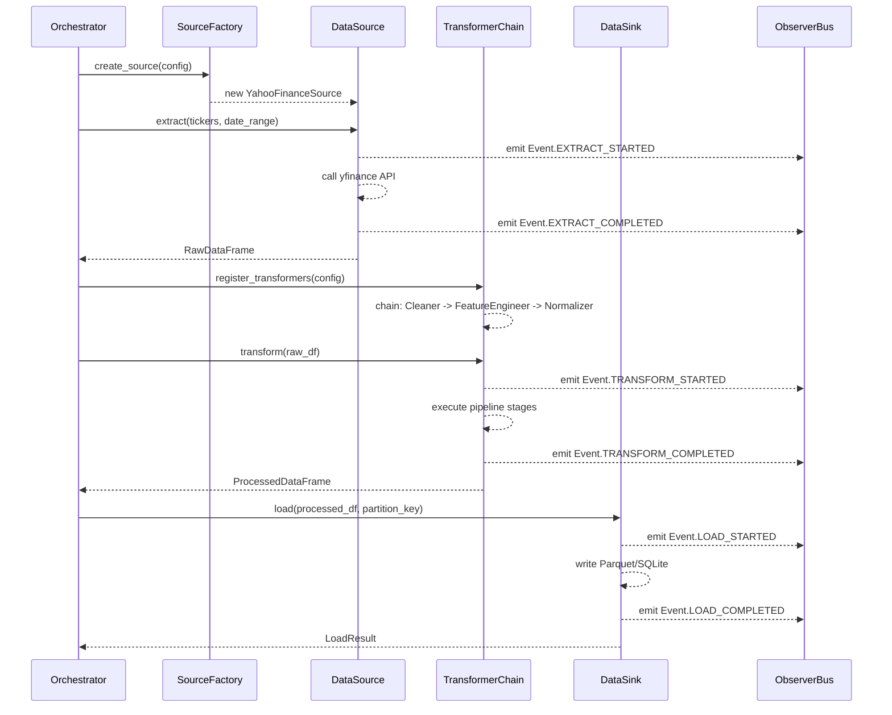
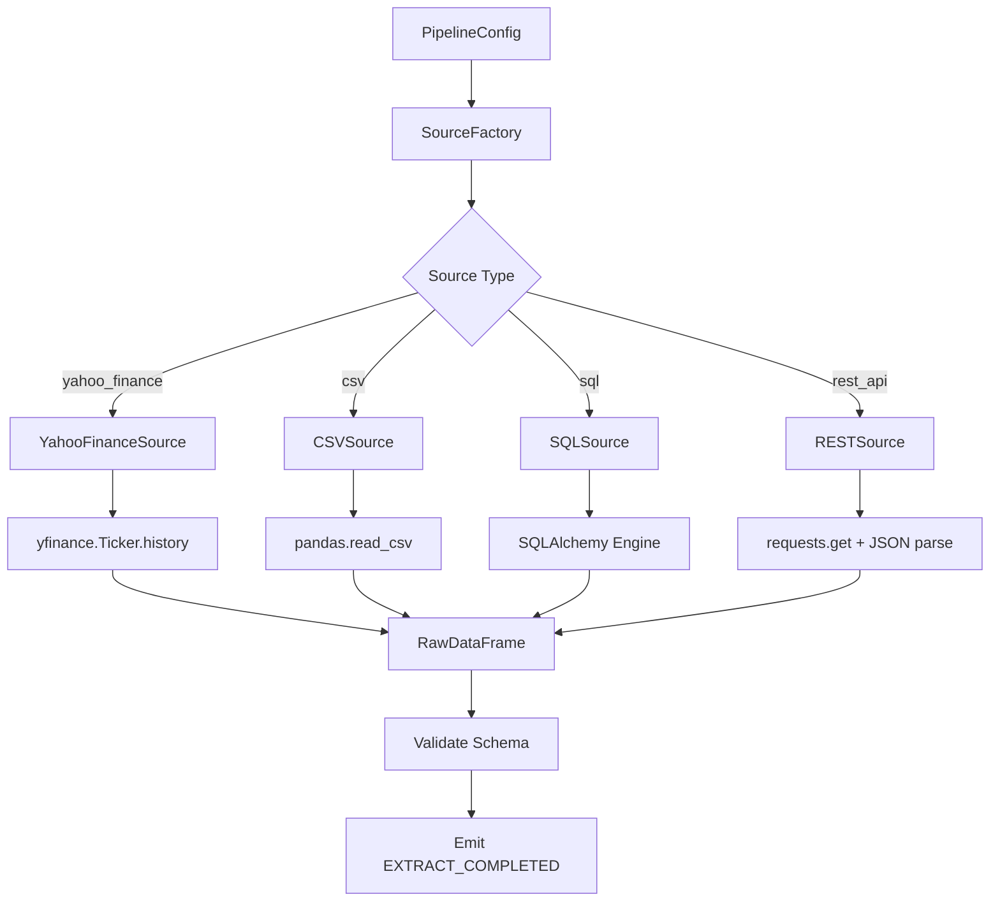
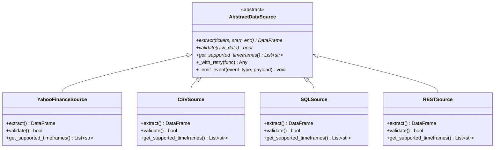
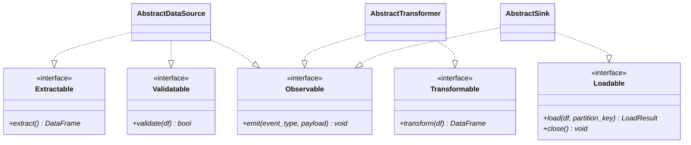
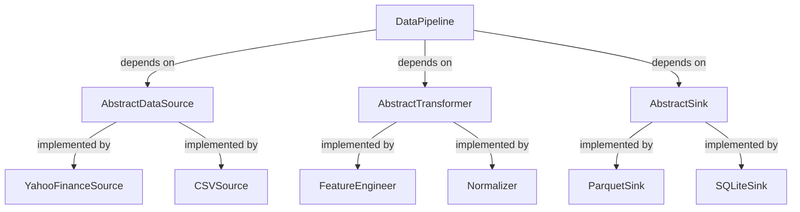
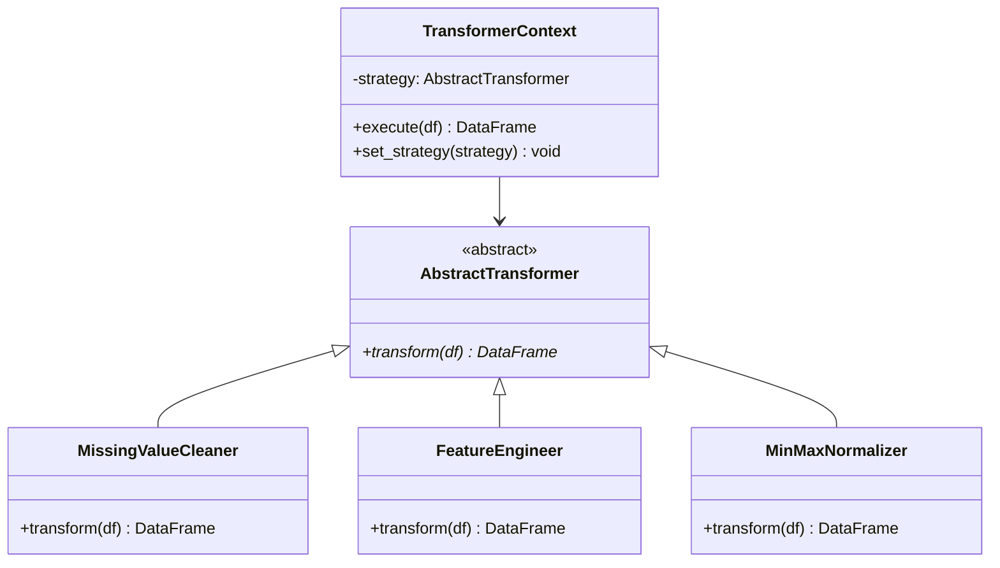
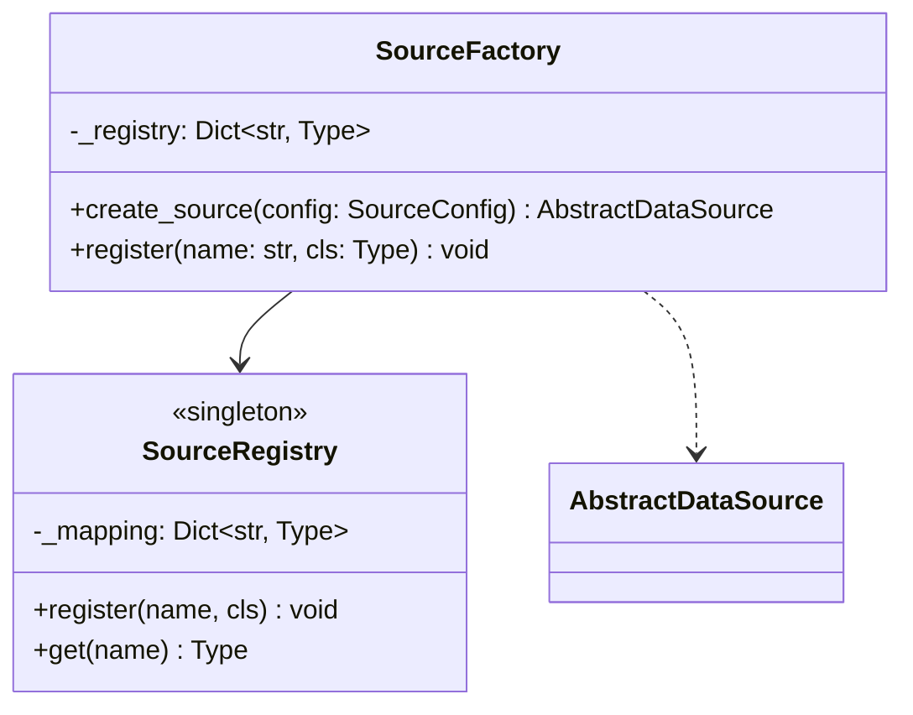
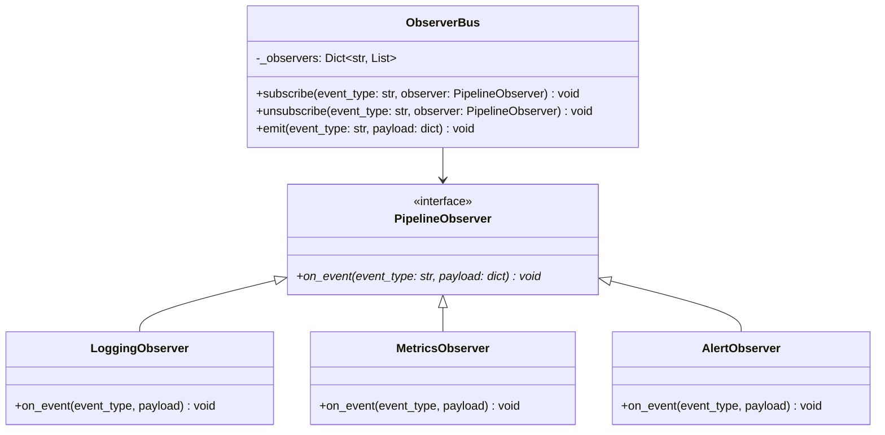
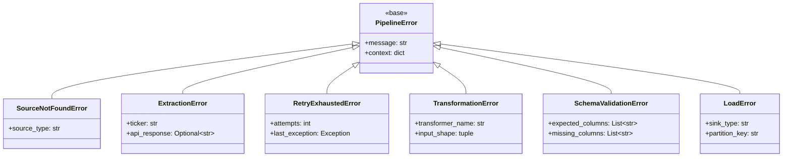
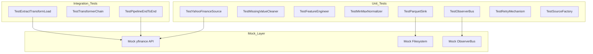

# System Components — Production-Ready Data Pipeline Architecture

**Project:** DRL Trading Agent — Data Ingestion & Feature Engineering Pipeline  
**Version:** 1.0  
**Date:** 2026-05-26  

---

## Table of Contents

1. [Executive Summary](#1-executive-summary)
2. [System Architecture Overview](#2-system-architecture-overview)
3. [ETL/ELT Workflow Design](#3-etlelt-workflow-design)
4. [Component Specification](#4-component-specification)
5. [SOLID Principles & Class Hierarchy](#5-solid-principles--class-hierarchy)
6. [Design Patterns Integration](#6-design-patterns-integration)
7. [Enterprise-Grade Mechanisms](#7-enterprise-grade-mechanisms)
8. [Production Code Reference](#8-production-code-reference)
9. [Testing Strategy](#9-testing-strategy)
10. [Orchestration Recommendations](#10-orchestration-recommendations)
11. [Configuration Management](#11-configuration-management)
12. [Directory Structure](#12-directory-structure)

---

## 1. Executive Summary

This document defines the technical architecture for a **Production-Ready Data Pipeline** supporting the DRL Trading Agent system described in the Business Requirements Document (BRD v1.0). The pipeline is responsible for:

| Capability | Description |
|---|---|
| **Data Ingestion** | Pull OHLCV, Order Book, and Macro signals from Yahoo Finance via `yfinance` library |
| **Extensibility** | Abstract interfaces enabling new sources (CSV, SQL, NoSQL, REST) without modifying existing code |
| **Transformation** | Feature engineering, normalization, sequence alignment, bias mitigation |
| **Storage** | Write cleaned data to Parquet/SQLite for downstream RL training and backtesting |
| **Orchestration** | DAG-based scheduling via Apache Airflow / Prefect / Dagster |

The architecture enforces **SOLID Principles**, applies **GoF Design Patterns** (Strategy, Factory, Observer), and integrates **Enterprise-Grade mechanisms** (Structured Logging, Retry with Exponential Backoff, Comprehensive Error Handling).

---

## 2. System Architecture Overview

### 2.1 High-Level Architecture Diagram

```
┌─────────────────────────────────────────────────────────────────────────────┐
│                        Orchestration Layer                                  │
│                  (Airflow / Prefect / Dagster)                              │
└──────────────┬────────────────────────────────────────┬──────────────────────┘
               │                                        │
               ▼                                        ▼
┌──────────────────────────┐              ┌──────────────────────────────────┐
│     Extract Layer        │              │      Configuration Store         │
│  ┌────────────────────┐  │              │  (YAML / ENV / DB)              │
│  │  Source Factory    │  │              └──────────┬───────────────────────┘
│  │  ┌──────────────┐  │  │                         │
│  │  │ YahooFinance │  │  │                         │ Dependency Injection
│  │  │ CSVSource    │  │  │                         ▼
│  │  │ SQLSource    │  │  │              ┌──────────────────────────────────┐
│  │  │ RESTSource   │  │  │              │      Transform Layer             │
│  │  └──────────────┘  │  │              │  ┌────────────────────────────┐  │
│  └────────────────────┘  │              │  │ Strategy Router            │  │
│                         │              │  │  ┌──────────────────────┐  │  │
│     Observer Events ────┼──────────────┼───►│  │ Feature Engineers   │  │  │
│       (Logging,         │              │  │  │  ┌────────────────┐  │  │  │
│        Metrics)         │              │  │  │  │ Cleaners        │  │  │  │
└─────────────────────────┘              │  │  │  │ Normalizers     │  │  │  │
                                         │  │  │  └────────────────┘  │  │  │
                                         │  │  └──────────────────────┘  │  │
                                         │  └────────────────────────────┘  │
                                         └──────────────┬───────────────────┘
                                                        │
                                                        ▼
                                         ┌──────────────────────────────────┐
                                         │        Load Layer                │
                                         │  ┌────────────────────────────┐  │
                                         │  │ ParquetSink                │  │
                                         │  │ SQLiteSink                 │  │
                                         │  │ RedisCacheSink             │  │
                                         │  └────────────────────────────┘  │
                                         └──────────────────────────────────┘
```

### 2.2 Layer Responsibilities

| Layer | Responsibility | Key Classes |
|---|---|---|
| **Orchestration** | DAG scheduling, dependency resolution, retry coordination | `PipelineDAG`, `TaskRunner` |
| **Extract** | Data acquisition from heterogeneous sources | `AbstractSource`, `YahooFinanceSource` |
| **Transform** | Cleaning, feature engineering, normalization, alignment | `AbstractTransformer`, `FeatureEngineer` |
| **Load** | Persist processed data to storage backends | `AbstractSink`, `ParquetSink` |
| **Configuration** | Centralized config management with type safety | `PipelineConfig`, `SourceConfig` |
| **Observability** | Logging, metrics, event notification | `StructuredLogger`, `PipelineObserver` |

---

## 3. ETL/ELT Workflow Design

### 3.1 Workflow Sequence Diagram



### 3.2 Extract Phase Specification

| Aspect | Detail |
|---|---|
| **Primary Source** | Yahoo Finance via `yfinance` library (stable, well-maintained Python package) |
| **Data Types** | OHLCV (Open, High, Low, Close, Volume), Adjusted Close, Dividends, Splits |
| **Timeframe Support** | 1m, 5m, 15m, 30m, 60m, 1d, 1wk, 1mo |
| **Rate Limiting** | Configurable delay between requests (default: 1 second) |
| **Retry Policy** | Up to 3 retries with exponential backoff (base=2s, max=60s) |
| **Output Format** | `pandas.DataFrame` with standardized column schema |

#### Extract Phase Data Flow



### 3.3 Transform Phase Specification

| Stage | Transformer | Purpose | BRD Reference |
|---|---|---|---|
| **T1** | `MissingValueCleaner` | Forward-fill then backward-fill NaN values in OHLCV | NFR-02 Data Integrity |
| **T2** | `DuplicateTimestampRemover` | Drop duplicate index entries after resampling | NFR-02 Data Integrity |
| **T3** | `SurvivorshipBiasGuard` | Flag delisted tickers, prevent look-ahead bias | NFR-02 Data Integrity |
| **T4** | `TechnicalFeatureEngineer` | Compute RSI, MACD, Bollinger Bands, ATR, Rolling Returns | FR-03 State Space Design |
| **T5** | `VolatilityProfileEngineer` | Compute rolling volatility, volume profile metrics | FR-03 State Space Design |
| **T6** | `MinMaxNormalizer` | Scale features to [0, 1] range using rolling window | FR-03 Sequence Alignment |
| **T7** | `SequenceAligner` | Create fixed-length sliding windows for RL state input | FR-03 State Space Design |

### 3.4 Load Phase Specification

| Sink Type | Format | Use Case |
|---|---|---|
| `ParquetSink` | Apache Parquet (columnar) | Primary storage for training data, partitioned by ticker and date |
| `SQLiteSink` | SQLite relational DB | Metadata catalog, ticker registry, pipeline run history |
| `RedisCacheSink` | Redis in-memory cache | Hot data for low-latency inference (NFR-01: <= 100ms) |

---

## 4. Component Specification

### 4.1 Extract Components

#### AbstractDataSource Interface

```
AbstractDataSource (ABC)
├── Attributes
│   ├── config: SourceConfig
│   └── logger: Logger
├── Abstract Methods
│   ├── extract(tickers: List[str], start: datetime, end: datetime) -> DataFrame
│   ├── validate(raw_data: DataFrame) -> bool
│   └── get_supported_timeframes() -> List[str]
├── Concrete Methods
│   ├── _with_retry(func, *args, **kwargs) -> Any
│   └── _emit_event(event_type: str, payload: dict) -> None
```

#### YahooFinanceSource

```
YahooFinanceSource extends AbstractDataSource
├── Attributes
│   ├── rate_limit_delay: float = 1.0
│   └── yfinance_proxy: Optional[str] = None
├── Methods
│   ├── extract(tickers, start, end) -> DataFrame
│   │   └── Uses yfinance.Ticker(ticker).history(period, interval)
│   ├── validate(raw_data: DataFrame) -> bool
│   │   └── Checks OHLCV columns presence, non-empty, valid dtypes
│   └── get_supported_timeframes() -> List[str]
│       └── Returns ["1m","5m","15m","30m","60m","1d","1wk","1mo"]
```

### 4.2 Transform Components

#### AbstractTransformer Interface

```
AbstractTransformer (ABC)
├── Attributes
│   ├── config: TransformerConfig
│   └── logger: Logger
├── Abstract Methods
│   ├── transform(df: DataFrame) -> DataFrame
│   └── get_name() -> str
├── Concrete Methods
│   ├── _validate_input(df: DataFrame) -> None
│   └── _emit_event(event_type: str, payload: dict) -> None
```

#### TransformerChain (Composite Pattern)

```
TransformerChain extends AbstractTransformer
├── Attributes
│   ├── transformers: List[AbstractTransformer]
├── Methods
│   ├── add(transformer: AbstractTransformer) -> None
│   ├── transform(df: DataFrame) -> DataFrame
│   │   └── For each transformer in order: df = transformer.transform(df)
│   └── get_name() -> str
│       └── Returns "Chain:[t1, t2, ...]"
```

### 4.3 Load Components

#### AbstractSink Interface

```
AbstractSink (ABC)
├── Attributes
│   ├── config: SinkConfig
│   └── logger: Logger
├── Abstract Methods
│   ├── load(df: DataFrame, partition_key: str) -> LoadResult
│   └── close() -> None
├── Concrete Methods
│   └── _emit_event(event_type: str, payload: dict) -> None
```

### 4.4 Configuration Classes

```python
# Type-safe configuration using dataclasses
@dataclass(frozen=True)
class SourceConfig:
    source_type: str                    # "yahoo_finance", "csv", "sql", "rest_api"
    tickers: List[str]                  # ["AAPL", "GOOGL", ...]
    start_date: datetime                # Extraction start
    end_date: datetime                  # Extraction end
    timeframe: str = "1d"              # OHLCV interval
    rate_limit_delay: float = 1.0      # Seconds between API calls
    max_retries: int = 3               # Retry attempts
    retry_base_delay: float = 2.0      # Exponential backoff base

@dataclass(frozen=True)
class TransformerConfig:
    transformers: List[str]            # Ordered list of transformer names
    feature_window: int = 60           # Rolling window size for features
    normalization_range: Tuple[float, float] = (0.0, 1.0)

@dataclass(frozen=True)
class SinkConfig:
    sink_type: str                     # "parquet", "sqlite", "redis"
    output_path: str                   # File path or connection string
    partition_by: List[str] = field(default_factory=list)  # ["ticker", "date"]
    compression: str = "snappy"        # Parquet compression

@dataclass(frozen=True)
class PipelineConfig:
    source: SourceConfig
    transform: TransformerConfig
    sink: SinkConfig
    log_level: str = "INFO"
    enable_metrics: bool = True
```

---

## 5. SOLID Principles & Class Hierarchy

### 5.1 Single Responsibility Principle (SRP)

Each class has exactly one reason to change:

| Class | Responsibility |
|---|---|
| `YahooFinanceSource` | Communicate with Yahoo Finance API only |
| `MissingValueCleaner` | Handle missing value imputation only |
| `ParquetSink` | Write data to Parquet format only |
| `StructuredLogger` | Format and emit log records only |
| `RetryMechanism` | Wrap calls with retry logic only |

### 5.2 Open/Closed Principle (OCP)

**Extension without modification:** New data sources are added by subclassing `AbstractDataSource` — no changes to existing source code.



### 5.3 Liskov Substitution Principle (LSP)

Any subclass of `AbstractDataSource` must be substitutable for the base class without altering program correctness:

- All subclasses return `pandas.DataFrame` with standardized columns: `["Open", "High", "Low", "Close", "Volume"]`
- All subclasses accept the same `extract()` signature
- Subclasses may add new methods but never override contracts

### 5.4 Interface Segregation Principle (ISP)

Clients depend only on interfaces they use:



### 5.5 Dependency Inversion Principle (DIP)

High-level modules depend on abstractions, not concretions:



The `DataPipeline` class receives dependencies through its constructor (Dependency Injection):

```python
class DataPipeline:
    def __init__(
        self,
        source: AbstractDataSource,
        transformer: AbstractTransformer,
        sink: AbstractSink,
        observer_bus: ObserverBus
    ):
        self._source = source
        self._transformer = transformer
        self._sink = sink
        self._observer_bus = observer_bus
```

---

## 6. Design Patterns Integration

### 6.1 Strategy Pattern — Transformer Routing

The `TransformerChain` acts as a context that delegates transformation to interchangeable strategy objects:



**Usage:**

```python
chain = TransformerChain()
chain.add(MissingValueCleaner(config=cleaner_cfg))
chain.add(FeatureEngineer(config=feature_cfg))
chain.add(MinMaxNormalizer(config=norm_cfg))

# Swap strategy at runtime
pipeline.set_transformer(chain)
processed_df = pipeline._transformer.transform(raw_df)
```

### 6.2 Factory Pattern — Source Instantiation

The `SourceFactory` creates appropriate source instances based on configuration:



**Implementation:**

```python
class SourceFactory:
    _registry: Dict[str, Type[AbstractDataSource]] = {}

    @classmethod
    def register(cls, name: str) -> Callable:
        def decorator(cls_: Type[AbstractDataSource]) -> Type[AbstractDataSource]:
            cls._registry[name] = cls_
            return cls_
        return decorator

    @classmethod
    def create_source(cls, config: SourceConfig) -> AbstractDataSource:
        source_cls = cls._registry.get(config.source_type)
        if source_cls is None:
            raise SourceNotFoundError(f"Unknown source type: {config.source_type}")
        return source_cls(config=config)

# Registration
@SourceFactory.register("yahoo_finance")
class YahooFinanceSource(AbstractDataSource):
    ...

@SourceFactory.register("csv")
class CSVSource(AbstractDataSource):
    ...
```

### 6.3 Observer Pattern — Event Monitoring

The `ObserverBus` implements the Publisher-Subscriber pattern for pipeline event tracking:



**Event Types:**

| Event | Payload | Emitted By |
|---|---|---|
| `EXTRACT_STARTED` | `{tickers, start_date, end_date}` | `AbstractDataSource.extract()` |
| `EXTRACT_COMPLETED` | `{rows_fetched, duration_ms}` | `AbstractDataSource.extract()` |
| `EXTRACT_FAILED` | `{error, ticker}` | `AbstractDataSource._with_retry()` |
| `TRANSFORM_STARTED` | `{transformer_name, input_rows}` | `TransformerChain.transform()` |
| `TRANSFORM_COMPLETED` | `{output_rows, duration_ms}` | `TransformerChain.transform()` |
| `LOAD_STARTED` | `{sink_type, partition_key}` | `AbstractSink.load()` |
| `LOAD_COMPLETED` | `{bytes_written, duration_ms}` | `AbstractSink.load()` |
| `PIPELINE_COMPLETED` | `{total_duration_ms, status}` | `DataPipeline.run()` |

---

## 7. Enterprise-Grade Mechanisms

### 7.1 Structured Logging

All components emit JSON-structured logs for machine-parseable observability:

```python
import logging
import json
from typing import Any

class JSONFormatter(logging.Formatter):
    def format(self, record: logging.LogRecord) -> str:
        log_entry = {
            "timestamp": self.formatTime(record),
            "level": record.levelname,
            "logger": record.name,
            "message": record.getMessage(),
            "component": getattr(record, "component", "unknown"),
            "event_type": getattr(record, "event_type", None),
        }
        if hasattr(record, "payload"):
            log_entry["payload"] = record.payload
        if record.exc_info:
            log_entry["exception"] = self.formatException(record.exc_info)
        return json.dumps(log_entry)

def get_logger(name: str, level: str = "INFO") -> logging.Logger:
    logger = logging.getLogger(name)
    logger.setLevel(getattr(logging, level))
    handler = logging.StreamHandler()
    handler.setFormatter(JSONFormatter())
    logger.addHandler(handler)
    return logger
```

### 7.2 Retry Mechanism with Exponential Backoff

```python
import time
import random
from typing import Callable, Any, Tuple, Type

class RetryMechanism:
    def __init__(
        self,
        max_retries: int = 3,
        base_delay: float = 2.0,
        max_delay: float = 60.0,
        retryable_exceptions: Tuple[Type[Exception], ...] = (Exception,)
    ):
        self.max_retries = max_retries
        self.base_delay = base_delay
        self.max_delay = max_delay
        self.retryable_exceptions = retryable_exceptions

    def execute(self, func: Callable, *args: Any, **kwargs: Any) -> Any:
        last_exception: Exception | None = None
        for attempt in range(self.max_retries + 1):
            try:
                return func(*args, **kwargs)
            except self.retryable_exceptions as exc:
                last_exception = exc
                if attempt < self.max_retries:
                    delay = min(
                        self.base_delay * (2 ** attempt) + random.uniform(0, 1),
                        self.max_delay
                    )
                    time.sleep(delay)
                else:
                    raise RetryExhaustedError(
                        f"Failed after {self.max_retries} retries: {exc}"
                    ) from exc
        raise last_exception  # Fallback
```

### 7.3 Error Handling Hierarchy



### 7.4 Type Safety and Validation

All public interfaces use type annotations enforced by `typing` module:

```python
from typing import Protocol, runtime_checkable

@runtime_checkable
class DataFrameLike(Protocol):
    @property
    def columns(self) -> list[str]: ...
    def shape(self) -> tuple[int, int]: ...
    def head(self, n: int = 5) -> "DataFrameLike": ...
```

---

## 8. Production Code Reference

### 8.1 Complete Module Structure

#### 8.1.1 Abstract Base Classes

```python
# pipeline/extract/sources/base.py
from abc import ABC, abstractmethod
from datetime import datetime
from typing import List, Optional
import pandas as pd
from pipeline.config import SourceConfig
from pipeline.logging import get_logger
from pipeline.events import ObserverBus


class AbstractDataSource(ABC):
    """Abstract base class for all data sources.

    Implements Open/Closed Principle: extend by subclassing,
    never modify existing implementations.
    """

    def __init__(self, config: SourceConfig, observer_bus: Optional[ObserverBus] = None):
        self.config = config
        self.observer_bus = observer_bus
        self.logger = get_logger(
            f"{self.__class__.__module__}.{self.__class__.__name__}",
            level=getattr(__import__("logging"), config.log_level, "INFO")
        )

    @abstractmethod
    def extract(
        self, tickers: List[str], start: datetime, end: datetime
    ) -> pd.DataFrame:
        """Extract raw OHLCV data for given tickers and date range."""
        ...

    @abstractmethod
    def validate(self, raw_data: pd.DataFrame) -> bool:
        """Validate extracted data against expected schema."""
        ...

    @abstractmethod
    def get_supported_timeframes(self) -> List[str]:
        """Return list of supported timeframe intervals."""
        ...

    def _with_retry(self, func, *args, **kwargs):
        """Execute function with exponential backoff retry."""
        from pipeline.retry import RetryMechanism
        retry = RetryMechanism(
            max_retries=self.config.max_retries,
            base_delay=self.config.retry_base_delay
        )
        return retry.execute(func, *args, **kwargs)

    def _emit_event(self, event_type: str, payload: dict) -> None:
        """Emit pipeline event to observer bus."""
        if self.observer_bus:
            self.observer_bus.emit(event_type, payload)
```

#### 8.1.2 Yahoo Finance Source Implementation

```python
# pipeline/extract/sources/yahoo_finance.py
import yfinance as yf
from datetime import datetime
from typing import List, Optional
import pandas as pd
from pipeline.extract.sources.base import AbstractDataSource
from pipeline.config import SourceConfig
from pipeline.events import ObserverBus
from pipeline.errors import ExtractionError, SchemaValidationError


class YahooFinanceSource(AbstractDataSource):
    """Data source for Yahoo Finance via yfinance library."""

    SUPPORTED_TIMEFRAMES = ["1m", "5m", "15m", "30m", "60m", "1d", "1wk", "1mo"]
    REQUIRED_COLUMNS = ["Open", "High", "Low", "Close", "Volume"]

    def __init__(
        self,
        config: SourceConfig,
        observer_bus: Optional[ObserverBus] = None,
        proxy: Optional[str] = None
    ):
        super().__init__(config, observer_bus)
        self.proxy = proxy

    def extract(
        self, tickers: List[str], start: datetime, end: datetime
    ) -> pd.DataFrame:
        self._emit_event("EXTRACT_STARTED", {
            "tickers": tickers,
            "start": str(start),
            "end": str(end)
        })

        frames: List[pd.DataFrame] = []
        for ticker in tickers:
            try:
                ticker_obj = yf.Ticker(ticker)
                df = self._with_retry(
                    ticker_obj.history,
                    start=start,
                    end=end,
                    interval=self.config.timeframe,
                    proxy=self.proxy
                )
                if df.empty:
                    self.logger.warning(f"No data returned for {ticker}")
                    continue
                df["Ticker"] = ticker
                frames.append(df)
            except Exception as exc:
                self._emit_event("EXTRACT_FAILED", {"error": str(exc), "ticker": ticker})
                self.logger.error(f"Extraction failed for {ticker}: {exc}")
                raise ExtractionError(f"Failed to extract {ticker}") from exc

        if not frames:
            raise ExtractionError("No data extracted for any ticker")

        combined = pd.concat(frames, ignore_index=False)
        if not self.validate(combined):
            raise SchemaValidationError(
                f"Missing columns: {set(self.REQUIRED_COLUMNS) - set(combined.columns)}"
            )

        self._emit_event("EXTRACT_COMPLETED", {"rows_fetched": len(combined)})
        return combined

    def validate(self, raw_data: pd.DataFrame) -> bool:
        missing = set(self.REQUIRED_COLUMNS) - set(raw_data.columns)
        if missing:
            self.logger.error(f"Schema validation failed. Missing: {missing}")
            return False
        return True

    def get_supported_timeframes(self) -> List[str]:
        return list(self.SUPPORTED_TIMEFRAMES)
```

#### 8.1.3 Transformer Base and Chain

```python
# pipeline/transform/base.py
from abc import ABC, abstractmethod
from typing import Optional
import pandas as pd
from pipeline.config import TransformerConfig
from pipeline.logging import get_logger
from pipeline.events import ObserverBus


class AbstractTransformer(ABC):
    """Abstract base class for all data transformers."""

    def __init__(
        self, config: TransformerConfig, observer_bus: Optional[ObserverBus] = None
    ):
        self.config = config
        self.observer_bus = observer_bus
        self.logger = get_logger(self.__class__.__name__)

    @abstractmethod
    def transform(self, df: pd.DataFrame) -> pd.DataFrame:
        """Apply transformation to input DataFrame."""
        ...

    @abstractmethod
    def get_name(self) -> str:
        """Return transformer identifier name."""
        ...

    def _validate_input(self, df: pd.DataFrame) -> None:
        if df.empty:
            raise ValueError("Input DataFrame is empty")

    def _emit_event(self, event_type: str, payload: dict) -> None:
        if self.observer_bus:
            self.observer_bus.emit(event_type, payload)


class TransformerChain(AbstractTransformer):
    """Composite transformer that chains multiple strategies."""

    def __init__(
        self,
        transformers: list[AbstractTransformer],
        config: Optional[TransformerConfig] = None,
        observer_bus: Optional[ObserverBus] = None
    ):
        super().__init__(config or TransformerConfig(transformers=[]), observer_bus)
        self._transformers = transformers

    def add(self, transformer: AbstractTransformer) -> None:
        self._transformers.append(transformer)

    def transform(self, df: pd.DataFrame) -> pd.DataFrame:
        self._emit_event("TRANSFORM_STARTED", {
            "transformers": [t.get_name() for t in self._transformers],
            "input_rows": len(df)
        })
        result = df.copy()
        for transformer in self._transformers:
            result = transformer.transform(result)
        self._emit_event("TRANSFORM_COMPLETED", {"output_rows": len(result)})
        return result

    def get_name(self) -> str:
        names = [t.get_name() for t in self._transformers]
        return f"Chain:{','.join(names)}"
```

#### 8.1.4 Sink Base and Parquet Implementation

```python
# pipeline/load/sinks/base.py
from abc import ABC, abstractmethod
from typing import Optional
import pandas as pd
from dataclasses import dataclass
from pipeline.config import SinkConfig
from pipeline.logging import get_logger
from pipeline.events import ObserverBus


@dataclass(frozen=True)
class LoadResult:
    rows_written: int
    bytes_written: int
    partition_key: str


class AbstractSink(ABC):
    """Abstract base class for all data sinks."""

    def __init__(self, config: SinkConfig, observer_bus: Optional[ObserverBus] = None):
        self.config = config
        self.observer_bus = observer_bus
        self.logger = get_logger(self.__class__.__name__)

    @abstractmethod
    def load(self, df: pd.DataFrame, partition_key: str) -> LoadResult:
        """Persist DataFrame to storage backend."""
        ...

    @abstractmethod
    def close(self) -> None:
        """Release resources (connections, file handles)."""
        ...

    def _emit_event(self, event_type: str, payload: dict) -> None:
        if self.observer_bus:
            self.observer_bus.emit(event_type, payload)


# pipeline/load/sinks/parquet.py
import os
import pyarrow.parquet as pq
import pyarrow as pa
from pipeline.load.sinks.base import AbstractSink, LoadResult


class ParquetSink(AbstractSink):
    """Write processed data to Apache Parquet files."""

    def load(self, df: pd.DataFrame, partition_key: str) -> LoadResult:
        self._emit_event("LOAD_STARTED", {"sink_type": "parquet", "partition_key": partition_key})
        output_path = os.path.join(self.config.output_path, f"{partition_key}.parquet")
        os.makedirs(os.path.dirname(output_path), exist_ok=True)

        table = pa.Table.from_pandas(df)
        pq.write_table(
            table, output_path,
            compression=self.config.compression
        )

        bytes_written = os.path.getsize(output_path)
        result = LoadResult(rows_written=len(df), bytes_written=bytes_written, partition_key=partition_key)
        self._emit_event("LOAD_COMPLETED", {"bytes_written": bytes_written})
        return result

    def close(self) -> None:
        pass  # No persistent connection to close
```

#### 8.1.5 Observer Bus and Observers

```python
# pipeline/events/bus.py
from typing import Dict, List, Protocol, runtime_checkable
from pipeline.logging import get_logger


@runtime_checkable
class PipelineObserver(Protocol):
    def on_event(self, event_type: str, payload: dict) -> None: ...


class ObserverBus:
    """Publisher-Subscriber event bus for pipeline observability."""

    def __init__(self):
        self._observers: Dict[str, List[PipelineObserver]] = {}
        self.logger = get_logger("ObserverBus")

    def subscribe(self, event_type: str, observer: PipelineObserver) -> None:
        self._observers.setdefault(event_type, []).append(observer)
        self.logger.debug(f"Subscribed {observer.__class__.__name__} to {event_type}")

    def unsubscribe(self, event_type: str, observer: PipelineObserver) -> None:
        observers = self._observers.get(event_type, [])
        if observer in observers:
            observers.remove(observer)

    def emit(self, event_type: str, payload: dict) -> None:
        for observer in self._observers.get(event_type, []):
            try:
                observer.on_event(event_type, payload)
            except Exception as exc:
                self.logger.error(f"Observer {observer.__class__.__name__} failed: {exc}")
```

#### 8.1.6 Source Factory with Registration Decorator

```python
# pipeline/extract/factory.py
from typing import Dict, Type, Callable
from pipeline.extract.sources.base import AbstractDataSource
from pipeline.config import SourceConfig
from pipeline.errors import SourceNotFoundError


class SourceFactory:
    """Registry-based factory for creating data source instances."""

    _registry: Dict[str, Type[AbstractDataSource]] = {}

    @classmethod
    def register(cls, name: str) -> Callable:
        def decorator(source_cls: Type[AbstractDataSource]) -> Type[AbstractDataSource]:
            cls._registry[name] = source_cls
            return source_cls
        return decorator

    @classmethod
    def create_source(cls, config: SourceConfig) -> AbstractDataSource:
        source_cls = cls._registry.get(config.source_type)
        if source_cls is None:
            raise SourceNotFoundError(
                f"Unknown source type: {config.source_type}. "
                f"Available: {list(cls._registry.keys())}"
            )
        return source_cls(config=config)


# Auto-registration examples
from pipeline.extract.factory import SourceFactory

@SourceFactory.register("yahoo_finance")
class YahooFinanceSource(AbstractDataSource):
    ...

@SourceFactory.register("csv")
class CSVSource(AbstractDataSource):
    ...
```

#### 8.1.7 Main Pipeline Orchestrator with Dependency Injection

```python
# pipeline/core/pipeline.py
import time
from datetime import datetime
from typing import Optional
import pandas as pd

from pipeline.extract.sources.base import AbstractDataSource
from pipeline.transform.base import AbstractTransformer
from pipeline.load.sinks.base import AbstractSink, LoadResult
from pipeline.events.bus import ObserverBus
from pipeline.logging import get_logger
from pipeline.errors import PipelineError


class DataPipeline:
    """Main pipeline orchestrator.

    Demonstrates Dependency Injection: all dependencies are injected
    through the constructor, enabling testability and loose coupling.
    """

    def __init__(
        self,
        source: AbstractDataSource,
        transformer: AbstractTransformer,
        sink: AbstractSink,
        observer_bus: ObserverBus
    ):
        self._source = source
        self._transformer = transformer
        self._sink = sink
        self._observer_bus = observer_bus
        self.logger = get_logger("DataPipeline")

    def run(
        self,
        tickers: list[str],
        start: datetime,
        end: datetime,
        partition_key: str = "default"
    ) -> LoadResult:
        start_time = time.monotonic()
        self._observer_bus.emit("PIPELINE_STARTED", {
            "tickers": tickers, "start": str(start), "end": str(end)
        })

        try:
            # Phase 1: Extract
            self.logger.info("Phase 1: Extract")
            raw_df = self._source.extract(tickers, start, end)
            self.logger.info(f"Extracted {len(raw_df)} rows")

            # Phase 2: Transform
            self.logger.info("Phase 2: Transform")
            processed_df = self._transformer.transform(raw_df)
            self.logger.info(f"Transformed to {len(processed_df)} rows")

            # Phase 3: Load
            self.logger.info("Phase 3: Load")
            result = self._sink.load(processed_df, partition_key)
            self.logger.info(f"Loaded {result.rows_written} rows ({result.bytes_written} bytes)")

            duration_ms = (time.monotonic() - start_time) * 1000
            self._observer_bus.emit("PIPELINE_COMPLETED", {
                "total_duration_ms": duration_ms, "status": "success"
            })
            return result

        except Exception as exc:
            duration_ms = (time.monotonic() - start_time) * 1000
            self._observer_bus.emit("PIPELINE_FAILED", {
                "total_duration_ms": duration_ms, "error": str(exc)
            })
            raise PipelineError(f"Pipeline execution failed: {exc}") from exc

        finally:
            self._sink.close()
```

#### 8.1.8 Main Execution Flow with Dependency Injection Container

```python
# main.py
"""Main entry point demonstrating full pipeline instantiation."""

from datetime import datetime, timedelta
from pipeline.config import SourceConfig, TransformerConfig, SinkConfig, PipelineConfig
from pipeline.extract.factory import SourceFactory
from pipeline.transform.base import TransformerChain, MissingValueCleaner, FeatureEngineer, MinMaxNormalizer
from pipeline.load.sinks.parquet import ParquetSink
from pipeline.events.bus import ObserverBus
from pipeline.core.pipeline import DataPipeline
from pipeline.logging import get_logger


def build_pipeline(config: PipelineConfig) -> DataPipeline:
    """Factory function for full pipeline assembly with DI."""
    observer_bus = ObserverBus()

    # Build source via factory
    source = SourceFactory.create_source(config.source)

    # Build transformer chain
    transformers = []
    for name in config.transform.transformers:
        match name:
            case "missing_value_cleaner":
                transformers.append(MissingValueCleaner(config=config.transform))
            case "feature_engineer":
                transformers.append(FeatureEngineer(config=config.transform))
            case "min_max_normalizer":
                transformers.append(MinMaxNormalizer(config=config.transform))

    transformer_chain = TransformerChain(
        transformers=transformers,
        config=config.transform,
        observer_bus=observer_bus
    )

    # Build sink
    sink = ParquetSink(config=config.sink, observer_bus=observer_bus)

    return DataPipeline(
        source=source,
        transformer=transformer_chain,
        sink=sink,
        observer_bus=observer_bus
    )


def main():
    logger = get_logger("main")

    # Configuration assembly
    config = PipelineConfig(
        source=SourceConfig(
            source_type="yahoo_finance",
            tickers=["AAPL", "GOOGL", "MSFT"],
            start_date=datetime(2024, 1, 1),
            end_date=datetime(2024, 12, 31),
            timeframe="1d",
            rate_limit_delay=1.0,
            max_retries=3,
            retry_base_delay=2.0
        ),
        transform=TransformerConfig(
            transformers=["missing_value_cleaner", "feature_engineer", "min_max_normalizer"],
            feature_window=60,
            normalization_range=(0.0, 1.0)
        ),
        sink=SinkConfig(
            sink_type="parquet",
            output_path="./data/processed",
            partition_by=["ticker", "date"],
            compression="snappy"
        ),
        log_level="INFO",
        enable_metrics=True
    )

    # Instantiate pipeline via DI
    pipeline = build_pipeline(config)

    # Execute
    result = pipeline.run(
        tickers=config.source.tickers,
        start=config.source.start_date,
        end=config.source.end_date,
        partition_key="2024_daily"
    )

    logger.info(f"Pipeline completed: {result}")


if __name__ == "__main__":
    main()
```

---

## 9. Testing Strategy

### 9.1 Test Architecture Overview



### 9.2 Unit Test Matrix

| Module | Test Class | Key Assertions | Mock Strategy |
|---|---|---|---|
| `YahooFinanceSource` | `TestYahooFinanceSource` | Schema validation, retry on failure, empty data handling | `unittest.mock.patch("yfinance.Ticker")` |
| `MissingValueCleaner` | `TestMissingValueCleaner` | NaN filled correctly, no new NaN introduced | Real DataFrame fixtures |
| `FeatureEngineer` | `TestFeatureEngineer` | RSI/MACD columns present, correct dtype | Real DataFrame fixtures |
| `MinMaxNormalizer` | `TestMinMaxNormalizer` | Values in [0,1], reversible transformation | Real DataFrame fixtures |
| `ParquetSink` | `TestParquetSink` | File created, schema preserved, bytes > 0 | `tempfile.TemporaryDirectory` |
| `ObserverBus` | `TestObserverBus` | Events delivered to all subscribers, unsubscribe works | Mock observers |
| `RetryMechanism` | `TestRetryMechanism` | Retries N times, exponential delay verified | Side_effect counter |
| `SourceFactory` | `TestSourceFactory` | Correct type returned, error on unknown type | Registry manipulation |

### 9.3 Unit Test Example

```python
# tests/unit/test_yahoo_finance_source.py
import unittest
from unittest.mock import patch, MagicMock
import pandas as pd
from datetime import datetime
from pipeline.extract.sources.yahoo_finance import YahooFinanceSource
from pipeline.config import SourceConfig
from pipeline.errors import ExtractionError


class TestYahooFinanceSource(unittest.TestCase):

    def setUp(self):
        self.config = SourceConfig(
            source_type="yahoo_finance",
            tickers=["AAPL"],
            start_date=datetime(2024, 1, 1),
            end_date=datetime(2024, 1, 31),
            timeframe="1d"
        )
        self.source = YahooFinanceSource(config=self.config)

    @patch("pipeline.extract.sources.yahoo_finance.yf.Ticker")
    def test_extract_returns_valid_dataframe(self, mock_ticker):
        mock_history = pd.DataFrame({
            "Open": [150.0], "High": [155.0], "Low": [149.0],
            "Close": [154.0], "Volume": [1000000]
        }, index=[datetime(2024, 1, 15)])
        mock_ticker.return_value.history.return_value = mock_history

        result = self.source.extract(["AAPL"], datetime(2024, 1, 1), datetime(2024, 1, 31))
        self.assertEqual(len(result), 1)
        self.assertIn("Close", result.columns)
        self.assertEqual(result["Ticker"].iloc[0], "AAPL")

    @patch("pipeline.extract.sources.yahoo_finance.yf.Ticker")
    def test_extract_raises_on_empty_response(self, mock_ticker):
        mock_ticker.return_value.history.return_value = pd.DataFrame()
        with self.assertRaises(ExtractionError):
            self.source.extract(["AAPL"], datetime(2024, 1, 1), datetime(2024, 1, 31))

    def test_validate_rejects_missing_columns(self):
        df = pd.DataFrame({"Open": [1], "High": [2]})  # Missing Low, Close, Volume
        self.assertFalse(self.source.validate(df))

    def test_validate_accepts_complete_schema(self):
        df = pd.DataFrame({
            "Open": [1], "High": [2], "Low": [3], "Close": [4], "Volume": [5]
        })
        self.assertTrue(self.source.validate(df))


if __name__ == "__main__":
    unittest.main()
```

### 9.4 Integration Test Strategy

| Test | Scope | Data Source | Assertions |
|---|---|---|---|
| `TestExtractTransformLoad` | Extract + Transform + Load | Mocked yfinance + real transformers + temp Parquet | End-to-end row count, schema integrity, file existence |
| `TestTransformerChain` | Full transformer chain | Real DataFrame fixture | Each stage output validated, no data loss |
| `TestPipelineEndToEnd` | Full `DataPipeline.run()` | Mocked source + real transform + temp sink | LoadResult matches expected, events emitted correctly |

### 9.5 Integration Test Example

```python
# tests/integration/test_pipeline_e2e.py
import unittest
import tempfile
import os
from datetime import datetime
import pandas as pd
from pipeline.config import SourceConfig, TransformerConfig, SinkConfig, PipelineConfig
from pipeline.transform.base import TransformerChain, MissingValueCleaner, MinMaxNormalizer
from pipeline.load.sinks.parquet import ParquetSink
from pipeline.events.bus import ObserverBus
from pipeline.core.pipeline import DataPipeline


class MockSource:
    """Mock source for integration testing."""
    def __init__(self):
        self.config = SourceConfig(
            source_type="mock", tickers=["TEST"],
            start_date=datetime(2024, 1, 1), end_date=datetime(2024, 1, 31)
        )

    def extract(self, tickers, start, end):
        return pd.DataFrame({
            "Open": [100.0, 101.0, None, 103.0],
            "High": [105.0, 106.0, 107.0, 108.0],
            "Low": [99.0, 100.0, 101.0, 102.0],
            "Close": [104.0, 105.0, 106.0, None],
            "Volume": [1000, 1100, 1200, 1300]
        })

    def validate(self, df):
        return True

    def get_supported_timeframes(self):
        return ["1d"]


class TestPipelineEndToEnd(unittest.TestCase):

    def test_full_pipeline_execution(self):
        with tempfile.TemporaryDirectory() as tmpdir:
            observer_bus = ObserverBus()
            events_received = []
            observer_bus.subscribe("*", type("MockObserver", (), {
                "on_event": lambda self, et, pl: events_received.append((et, pl))
            })())

            source = MockSource()
            chain = TransformerChain(
                transformers=[
                    MissingValueCleaner(config=TransformerConfig(transformers=[])),
                    MinMaxNormalizer(config=TransformerConfig(transformers=[]))
                ],
                observer_bus=observer_bus
            )
            sink = ParquetSink(
                config=SinkConfig(sink_type="parquet", output_path=tmpdir),
                observer_bus=observer_bus
            )

            pipeline = DataPipeline(source, chain, sink, observer_bus)
            result = pipeline.run(["TEST"], datetime(2024, 1, 1), datetime(2024, 1, 31))

            self.assertEqual(result.rows_written, 4)
            self.assertGreater(result.bytes_written, 0)
            self.assertTrue(os.path.exists(os.path.join(tmpdir, "default.parquet")))
            self.assertIn("PIPELINE_COMPLETED", [e[0] for e in events_received])


if __name__ == "__main__":
    unittest.main()
```

### 9.6 Test Execution Commands

```bash
# Run all unit tests
python -m pytest tests/unit/ -v --tb=short

# Run integration tests
python -m pytest tests/integration/ -v --tb=short

# Run with coverage report
python -m pytest tests/ --cov=pipeline --cov-report=html

# Run with type checking
mypy pipeline/ --ignore-missing-imports
```

---

## 10. Orchestration Recommendations

### 10.1 Comparison Matrix

| Criteria | Apache Airflow | Prefect | Dagster |
|---|---|---|---|
| **Learning Curve** | Steep (DAG YAML/Python) | Moderate (Python-native) | Moderate (Asset-based) |
| **Dynamic DAGs** | Limited | Excellent | Good |
| **Data Awareness** | Weak | Moderate | Strong (Asset lineage) |
| **Backfill Support** | Native | Native | Native |
| **Monitoring UI** | Mature web UI | Clean modern UI | Data-centric UI |
| **Deployment** | Kubernetes/Docker | Serverless/Agent | Dedicated server |
| **Python Version** | 3.8+ | 3.9+ | 3.9+ |
| **Community Size** | Very Large | Growing | Growing |

### 10.2 Recommended Choice: Prefect

**Rationale:** Prefect aligns best with this architecture for the following reasons:

1. **Python-Native API:** Flows and tasks are defined as pure Python functions, matching our class-based DI pattern
2. **Dynamic Mapping:** `@task.map()` enables parallel extraction across tickers without hardcoded DAG structure
3. **Retry Built-In:** Native retry policy with exponential backoff matches our `RetryMechanism` design
4. **Lightweight Deployment:** Runs as a local agent or serverless, no heavy infrastructure required
5. **Observability:** Built-in run history, caching, and result persistence

### 10.3 Prefect Integration Example

```python
# orchestration/prefect_flow.py
from prefect import flow, task
from datetime import datetime
from pipeline.config import PipelineConfig
from pipeline.core.pipeline import DataPipeline
from pipeline.events.bus import ObserverBus


@task(retries=3, retry_delay_seconds=5)
def extract_task(source, tickers: list[str], start: datetime, end: datetime):
    return source.extract(tickers, start, end)


@task
def transform_task(transformer, df):
    return transformer.transform(df)


@task
def load_task(sink, df, partition_key: str):
    result = sink.load(df, partition_key)
    sink.close()
    return result


@flow(name="DRL-Data-Pipeline", log_prints=True)
def drl_data_pipeline(
    config: PipelineConfig,
    pipeline: DataPipeline
):
    raw_df = extract_task(
        pipeline._source,
        config.source.tickers,
        config.source.start_date,
        config.source.end_date
    )
    processed_df = transform_task(pipeline._transformer, raw_df)
    result = load_task(pipeline._sink, processed_df, "daily_partition")
    return result


if __name__ == "__main__":
    from main import build_pipeline, PipelineConfig, SourceConfig, TransformerConfig, SinkConfig

    config = PipelineConfig(
        source=SourceConfig(
            source_type="yahoo_finance",
            tickers=["AAPL", "GOOGL"],
            start_date=datetime(2024, 1, 1),
            end_date=datetime(2024, 12, 31),
            timeframe="1d"
        ),
        transform=TransformerConfig(
            transformers=["missing_value_cleaner", "feature_engineer", "min_max_normalizer"]
        ),
        sink=SinkConfig(sink_type="parquet", output_path="./data/processed")
    )

    pipeline = build_pipeline(config)
    drl_data_pipeline(config, pipeline)
```

### 10.4 Alternative: Apache Airflow DAG

```python
# orchestration/airflow_dag.py
from airflow import DAG
from airflow.decorators import task
from datetime import datetime, timedelta

default_args = {
    "owner": "drl_team",
    "retries": 3,
    "retry_delay": timedelta(minutes=5),
    "start_date": datetime(2024, 1, 1)
}

with DAG(
    "drl_data_pipeline",
    default_args=default_args,
    schedule_interval="0 6 * * *",  # Daily at 06:00 UTC
    catchup=False
) as dag:

    @task
    def extract():
        from main import build_pipeline, PipelineConfig, SourceConfig, TransformerConfig, SinkConfig
        config = PipelineConfig(...)
        pipeline = build_pipeline(config)
        return pipeline._source.extract(
            config.source.tickers,
            config.source.start_date,
            config.source.end_date
        )

    @task
    def transform(df):
        pipeline = build_pipeline(PipelineConfig(...))
        return pipeline._transformer.transform(df)

    @task
    def load(df):
        pipeline = build_pipeline(PipelineConfig(...))
        return pipeline._sink.load(df, "daily")

    extract() >> transform() >> load()
```

---

## 11. Configuration Management

### 11.1 YAML Configuration File

```yaml
# config/pipeline.yaml
pipeline:
  log_level: INFO
  enable_metrics: true

source:
  source_type: yahoo_finance
  tickers:
    - AAPL
    - GOOGL
    - MSFT
    - TSLA
  start_date: "2024-01-01"
  end_date: "2024-12-31"
  timeframe: "1d"
  rate_limit_delay: 1.0
  max_retries: 3
  retry_base_delay: 2.0

transform:
  transformers:
    - missing_value_cleaner
    - feature_engineer
    - min_max_normalizer
  feature_window: 60
  normalization_range: [0.0, 1.0]

sink:
  sink_type: parquet
  output_path: "./data/processed"
  partition_by:
    - ticker
    - date
  compression: snappy
```

### 11.2 Configuration Loader

```python
# pipeline/config/loader.py
import yaml
from pathlib import Path
from pipeline.config import PipelineConfig, SourceConfig, TransformerConfig, SinkConfig


def load_config(path: str = "config/pipeline.yaml") -> PipelineConfig:
    with open(Path(path)) as f:
        raw = yaml.safe_load(f)

    cfg = raw["pipeline"]
    return PipelineConfig(
        source=SourceConfig(**raw["source"]),
        transform=TransformerConfig(**raw["transform"]),
        sink=SinkConfig(**raw["sink"]),
        log_level=cfg.get("log_level", "INFO"),
        enable_metrics=cfg.get("enable_metrics", True)
    )
```

---

## 12. Directory Structure

```
qdrn/
├── Business-Requirement.md
├── system components.md              # This document
├── config/
│   └── pipeline.yaml                 # YAML configuration
├── data/
│   └── processed/                    # Output Parquet files
├── pipeline/
│   ├── __init__.py
│   ├── config.py                     # Dataclass definitions
│   │   └── loader.py                 # YAML config loader
│   ├── logging.py                    # Structured JSON logger
│   ├── errors.py                     # Exception hierarchy
│   ├── retry.py                      # RetryMechanism class
│   ├── events/
│   │   ├── __init__.py
│   │   └── bus.py                    # ObserverBus + observers
│   ├── extract/
│   │   ├── __init__.py
│   │   ├── factory.py                # SourceFactory with decorator
│   │   └── sources/
│   │       ├── __init__.py
│   │       ├── base.py               # AbstractDataSource ABC
│   │       ├── yahoo_finance.py      # YahooFinanceSource
│   │       ├── csv_source.py         # CSVSource (future)
│   │       ├── sql_source.py         # SQLSource (future)
│   │       └── rest_source.py        # RESTSource (future)
│   ├── transform/
│   │   ├── __init__.py
│   │   ├── base.py                   # AbstractTransformer + TransformerChain
│   │   └── transformers/
│   │       ├── __init__.py
│   │       ├── cleaner.py            # MissingValueCleaner
│   │       ├── feature_engineer.py   # FeatureEngineer
│   │       ├── normalizer.py         # MinMaxNormalizer
│   │       └── aligner.py            # SequenceAligner
│   ├── load/
│   │   ├── __init__.py
│   │   └── sinks/
│   │       ├── __init__.py
│   │       ├── base.py               # AbstractSink ABC + LoadResult
│   │       ├── parquet.py            # ParquetSink
│   │       ├── sqlite.py             # SQLiteSink (future)
│   │       └── redis.py              # RedisCacheSink (future)
│   └── core/
│       ├── __init__.py
│       └── pipeline.py               # DataPipeline orchestrator
├── orchestration/
│   ├── prefect_flow.py               # Prefect flow definition
│   └── airflow_dag.py                # Airflow DAG (alternative)
├── tests/
│   ├── __init__.py
│   ├── conftest.py                   # Shared pytest fixtures
│   ├── unit/
│   │   ├── test_yahoo_finance_source.py
│   │   ├── test_cleaner.py
│   │   ├── test_feature_engineer.py
│   │   ├── test_normalizer.py
│   │   ├── test_parquet_sink.py
│   │   ├── test_observer_bus.py
│   │   ├── test_retry_mechanism.py
│   │   └── test_source_factory.py
│   └── integration/
│       ├── test_transformer_chain.py
│       └── test_pipeline_e2e.py
├── main.py                           # Entry point with DI assembly
├── requirements.txt
└── pyproject.toml
```

---

## Appendix A: Dependency List

```txt
# Core
pandas>=2.0.0
pyarrow>=14.0.0
yfinance>=0.2.30

# Orchestration (choose one)
prefect>=2.10.0
# apache-airflow>=2.7.0
# dagster>=1.5.0

# Configuration
pyyaml>=6.0

# Testing
pytest>=7.4.0
pytest-cov>=4.1.0
mypy>=1.5.0

# Optional: Storage backends
redis>=5.0.0
sqlalchemy>=2.0.0
```

## Appendix B: SOLID Compliance Checklist

| Principle | Enforcement Mechanism | Status |
|---|---|---|
| **S**ingle Responsibility | Each class handles one concern (extract/transform/load/log/retry) | Enforced |
| **O**pen/Closed | `AbstractDataSource` ABC enables extension without modification | Enforced |
| **L**iskov Substitution | All source subclasses return standardized DataFrame schema | Enforced |
| **I**nterface Segregation | Separate protocols: `Extractable`, `Transformable`, `Loadable`, `Observable` | Enforced |
| **D**ependency Inversion | `DataPipeline` depends on ABCs, concretions injected via constructor | Enforced |

## Appendix C: Design Pattern Summary

| Pattern | Where Applied | Purpose |
|---|---|---|
| **Strategy** | `TransformerChain` delegates to interchangeable `AbstractTransformer` implementations | Swap transformation logic at runtime |
| **Factory** | `SourceFactory.create_source()` with `@register` decorator | Create correct source type from config string |
| **Observer** | `ObserverBus` with `PipelineObserver` protocol | Decouple event emission from handling |
| **Composite** | `TransformerChain` treats individual and composite transformers uniformly | Build transformation pipelines as trees |
| **Dependency Injection** | `DataPipeline.__init__()` receives all dependencies as parameters | Enable testability, loose coupling |

---

*Document Version: 1.0 | Last Updated: 2026-05-26 | Author: System Architect*
